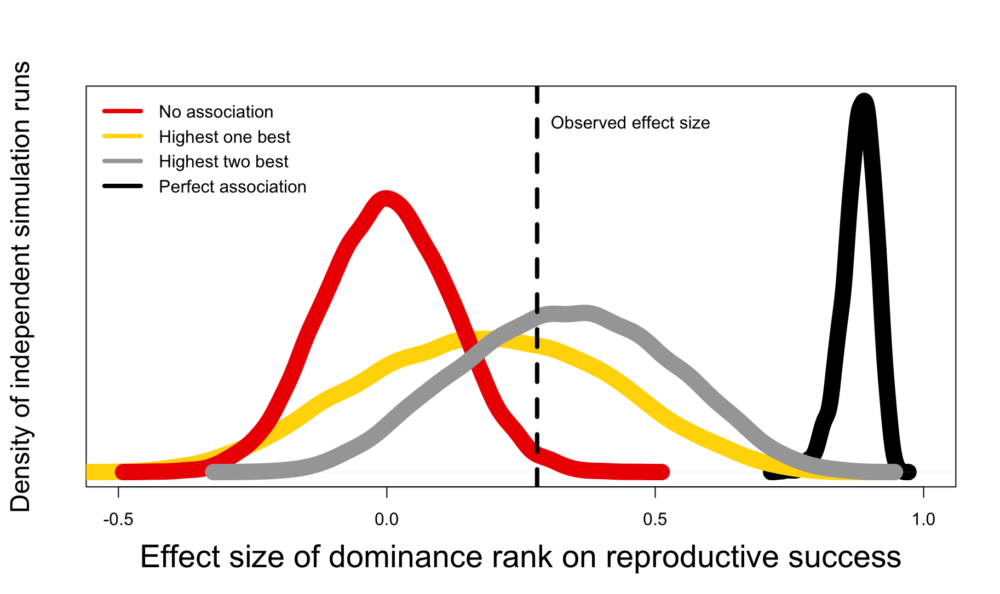

##### Affiliations 
1. Indian Institute of Science Education and Research Kolkata 
2. Department of Human Behavior, Ecology & Culture; Max Planck Institute for Evolutionary Anthropology Leipzig
3. Institut des Sciences de l’Evolution de Montpellier, Centre National de la Recherche Scientifique, Université de Montpellier  

Correspondence: * dieter_lukas@eva.mpg.de

```{r setup, include=FALSE}
options(width=60)
knitr::opts_chunk$set(echo = TRUE)
knitr::opts_chunk$set(tidy.opts=list(width.cutoff=60), tidy=TRUE)

# This Rmarkdown file contains both the manuscript and the associated code. For the code, check for these grey shaded blocks underneath the text reporting the respective results.

```


\ 
  &nbsp;
\   
  &nbsp;
\   
  &nbsp;
\   
Open... {width=2.5%} access; {width=2.5%}   [code; ](https://dx.doi.org/10.17617/3.80) {width=2.5%}   peer review;  {width=2.5%}    [data](https://doi.org/10.5063/F1PZ578P)
\ 
  &nbsp;
\   
  &nbsp;
  
  &nbsp;

{width=25%}
\
  
The background, objectives, predictions, and methods have been peer reviewed prior to analyses and received an In Principle Recommendation on 07 July 2020 by:


Matthieu Paquet (2020) The effect of dominance rank on female reproductive success in social mammals. *Peer Community in Ecology*, 100056. [10.24072/pci.ecology.100056] (https://doi.org/10.24072/pci.ecology.100056) (Reviewers: Bonaventura Majolo and one anonymous reviewer)

  &nbsp;
  
The preregistration for this article can be found here: Shivani, Huchard E., Lukas D. 2020. \ https://dieterlukas.github.io/Preregistration_MetaAnalysis_RankSuccess.html . \
Deviations from pre-registered methods are explained within the manuscript.

   
&nbsp; 

  
## Abstract

Life in social groups, while potentially providing social benefits, inevitably leads to conflict among group members. In many social mammals, such conflicts lead to the formation of dominance hierarchies, where high-ranking individuals consistently outcompete other group members. Given that competition is a fundamental tenet of the theory of natural selection, it is generally assumed that high-ranking individuals have higher reproductive success than lower-ranking individuals. Previous reviews have indicated large variation across populations on the potential effect of dominance rank on reproductive success in female mammals. Here, we perform a meta-analysis based on 444 effect sizes from 187 studies on 86 mammal species to investigate how life-history, ecology and sociality modulate the relationship between female dominance rank and fitness. As predicted, we found that (1) dominance rank is generally positively associated with reproductive success, independent of the approach different studies have taken to answer this question; and that (2) the relationship between rank and reproductive success is conditional on life-history mechanisms, with higher effects of dominance rank on reproductive output than on survival, particularly in species with high reproductive investment. Contrary to our predictions, (3) the fitness benefits to high-ranking females appear consistent across ecological conditions rather than increasing when resources decrease. Instead, we found that the social environment consistently mitigates rank differences on reproductive success by modulating female competition, with, as predicted, (4) dominant females showing higher reproductive success than subordinates in two different types of societies: first, effect sizes are highest when females live in cooperatively breeding groups composed of a single dominant female and one or more subordinate females; second, they are also elevated when females form differentiated relationships which occurs when groups are composed of unrelated females. Our findings indicate that obtaining a high ranking position in a social group consistently provides female mammals with fitness benefits, even though future studies might show lower effects given various biases in the literature we were able to access, including, but not restricted to, a publication bias. They further draw a complex landscape of the level of social inequality across mammalian societies, reflected by variation in the benefits of social dominance, which appears to be shaped by reproductive and social competition more than by ecological competition.

   
  
  
 &nbsp; 
   
## Background

In order for social groups to persist, group members need to find strategies to deal with the conflicts that inevitably occur (@ward2016sociality). In many female social mammals, conflicts and aggressive interactions are associated with the formation of different types of hierarchies. How these hierarchies form and are expressed differs across societies (@tibbetts2022establishment). In singular cooperative breeders, a single dominant breeding female suppresses reproduction in subordinate group members, who rarely fight amongst each other until an opportunity to become dominant opens (@solomon1997cooperative). In many species where multiple breeding females form stable groups, females can be arranged in stable linear hierarchies, where mothers help their daughters to inherit their rank in their matriline (@holekamp1991dominance). In another set of species, hierarchies are more flexible as a female’s rank depends on her body size, condition, or availability of coalition partners (@pusey2012magnitude). However, it has remained unclear whether and when dominant females gain substantial fitness benefits, indicating that there is selection on all females to compete for a high rank. Instead of direct selection on females to compete over high dominance rank because it provides substantial fitness benefits, selection might be on females to find a place in the hierarchy that maximizes their fitness based on their intrinsic qualities and access to social opportunities.  

The prevailing assumption is that high ranking females benefit from their dominant status because outcompeting other females provides them with priority of access to resources (@ellis1995dominance, @pusey2012magnitude). Subordinates are expected to accept their status, because despite having lower reproductive success than dominants, they have few outside options and would presumably face high costs, or have even lower success if they tried to challenge for the dominant status or to reproduce independently (@alexander1974evolution, @vehrencamp1983model). An alternative assumption however is that both dominants and subordinates gain from arranging themselves in a hierarchy to avoid the overt fighting that occurs whenever differentially aggressive individuals repeatedly interact (@west1967foundress). All individuals make a compromise, such that they all balance the potential benefits of their respective positions with the potential costs (@williams1966adaptation). 

Previous reviews have found that while high ranking female mammals frequently appear to have higher reproductive success, there are many populations where such an association has not been found (@pusey2012magnitude, @clutton2013social). Most studies that brought together such data have focused on primates and generally only provided qualitative summaries of the evidence, sometimes using a limited number of fitness proxies (@fedigan1983dominance, @ellis1995dominance, @stockley2011female). One meta-analysis across primates investigated whether life history might mediate the strength of the association between dominance and reproductive success and found that high-ranking females had higher fecundity benefits in species with a longer lifespan (@majolo2012fitness). However, there has been no study simultaneously examining the effect of life-history, social and ecological factors in modulating the benefits of social dominance. Similarly, there has been no quantitative assessment of the potential factors that may mitigate the relationship between rank and reproductive success to explain those cases where high rank is not beneficial. Here, we investigate the extent and sources of variation in the effect of dominance rank on female reproductive success across social mammals. Our study builds on the long history of research on dominance interactions (@strauss2022domarchive) by bringing together effect sizes of the relationship between rank and reproductive success from diverse mammalian societies, and we add socio-ecological predictor variables that have not been included in earlier analyses.


&nbsp; 
  
  
## Objective

In this study, we present a quantitative assessment of the strength of the relationship between female dominance rank and reproductive success in social mammals and explore factors that might mediate this relationship. Our objective is to identify the ranges of variation in the relationship between rank and reproductive success and to investigate how this relationship is influenced by differences in life-history, ecology, and sociality. We addressed our objective through the following questions, by testing the corresponding four core predictions, which each break into a number of secondary predictions (see results): 

#### **1) Does high rank generally lead to higher reproductive success for females in social mammals?**

We expected that, overall, high dominance rank has a positive effect on reproductive success, based on the previously published reviews and meta-analyses.


#### **2) What are the life history traits that mediate the benefits of rank on reproductive success?**

We expected that dominants have higher reproductive success predominantly in species in which females have the ability to quickly produce large numbers of offspring,  because reproductive competition may be most intense in those species that invest heavily in reproduction, and the consequences of such competition may be more detectable due to the potential for large variance in reproductive success among females in such species


#### **3) What are the ecological conditions that mediate the benefits of rank on reproductive success?**

We expected that differences in reproductive potential would be particularly marked where within-group contest competition for resources is expected to be largest, that is when resources are limited and monopolizable.


#### **4) What are the social circumstances that mediate the benefits of rank?**

We expected that the association between dominance rank and reproduction is stronger in species living in more stable and structured social groups, where rank differences may be pronounced, and stable over long periods.

  
  &nbsp; 
  
  
  &nbsp; 
  
  
\newpage  

## Methods

#### **Literature search** \

The literature search was performed by S & DL. We started with the references in previous major reviews and meta-analyses on the association between dominance and reproduction in female mammals (see below for inclusion criteria): @fedigan1983dominance (8 effect sizes on female primates entered), @ellis1995dominance (16 effect sizes entered / 5 not entered on female non-primates, 38 effect sizes entered / 22 not entered on female primates), @brown2002reconsidering (28 effect sizes entered / 7 not entered on female primates), @stockley2011female (12 effect sizes entered / 2 not entered on female non-primates, 11 effect sizes entered / 1 not entered on female primates), @majolo2012fitness (26 effect sizes entered / 2 not entered on female primates), @pusey2012magnitude (45 effect sizes entered / 2 not entered on female primates), and @clutton2013social (8 effect sizes entered / 1  not entered on female primates, 6 effect sizes entered / 1 not entered on female non-primates) (some effect sizes appear in multiple studies, leading to a total of 136 effect sizes) (using Pubmed, 22 May 2019 - 13 June 2019). Next, we searched Google Scholar and Google Search with the following terms: “dominance AND female AND mammal AND reproductive success OR reproduction” (04 July 2019 - 31 July 2019; 143 additional effect sizes), “rank AND female AND mammal AND reproductive success OR reproduction” (14 September 2019 - 13 November 2019; 90 additional effect sizes), and “sex ratio AND dominance AND female AND mammal” (11 February 2020 - 06 March 2020; 75 additional effect sizes). 

We checked the titles and abstracts to identify studies that observed dominance interactions and reproductive success in social groups of interacting female non-human mammals. We limited our checks to the first 1000 results for all searches as automatically sorted by the respective search engine (sorted by 'relevance' on Google Scholar). We selected studies that measured the association between dominance rank and at least one aspect of female reproductive success and reported the data or a test-statistic. For both dominance and reproductive success, we only included studies that had direct measures, not secondary indicators. For dominance, we excluded studies where authors did not explicitly determine dominance relationships and only assumed that traits such as size, presence in core areas, or reproductive success itself indicate dominance. We did however include studies where authors established dominance hierarchies, found that they are associated with some other trait such as size or condition, and subsequently used the other trait to rank individuals. For reproductive success, we similarly excluded studies that reported associations of dominance rank with traits whose links with reproductive success were indirect or had not been  tested. Studies we excluded reported, for example, associations between dominance rank and mating frequency, priority of access to food resources, or differences in ranging behaviour. We included all kinds of academic publications, from primary articles published in peer-reviewed journals through reviews, books and book chapters, and unpublished PhD theses.


#### **Variables, their definitions, and their sources**
\
**Variables coded directly from the relevant publications:**

All data from the literature search on publications reporting the effect of dominance rank on reproductive success were entered prior to the first submission of the preregistration. S and DL performed the data extraction. We initially coded eight papers independently, for which we both extracted the same values and classified the approaches in the same way. S and DL also independently went through the studies included in @majolo2012fitness and agreed on which to include and which not. After this, S and DL independently identified and coded articles, with occasional cross-checks and discussions of any border line cases. We extracted the relevant information to calculate the effect sizes and their associated variance. In addition, we coded a set of variables to characterize the methodological approach. The dataset contains 444 effect sizes from 187 studies on 86 mammalian species.

*Z-transformed effect size*: we converted all effect sizes to Z-transformed correlation coefficients (Zr). In cases where articles reported a pairwise correlation coefficient, we directly use this value. In cases where authors had used alternative statistical approaches (e.g. t-test comparison between two groups of individuals), the test statistics were converted to the statistic ‘r’ using formulas provided by @lakens2013calculating, @lajeunesse2013recovering, and @wilson2019calculator. In cases where authors reported individual-level data reflecting dominance rank and reproductive success (for example in the form of a table that listed for groups of dominants and subordinates their mean and deviation of reproductive success or for every individual their rank and reproductive success), we calculated correlation coefficients directly from a 2-by-2 frequency table (when comparing classes of high- to low-ranking individuals) or from linear regressions (when individuals had continuous ranks). In cases where studies simply stated that “all dominants bred but none of the subordinates” we assumed an error of 0.5% for both dominants not breeding and subordinates breeding to obtain the sampling variance estimates. We extracted separate effect sizes for each reported analysis: for example, if authors reported separately associations between dominance rank and mortality of offspring to 1 year and to independence, we obtained two effect sizes from this population reflecting infant survival. We Z-transformed all correlation coefficients to control for the asymptotic distribution of these values. We changed the sign of the effect sizes to make them consistent across studies. This was necessary because dominance rank was coded differently across studies, for example sometimes studies assigned dominant individuals the lowest value by starting a count from 1, whereas in other cases they were assigned the highest value to reflect the proportion of other females they are dominant over. We set the sign of effect sizes such that positive values mean that higher ranking individuals have shorter interbirth intervals, higher survival as adults and of their infants, higher infant production (e.g. larger litter sizes, higher probability of breeding), and higher lifetime reproductive success (e.g. higher total number of offspring weaned).

*Sample size*: we recorded the sample size for the relevant statistical comparison (number of females, number of offspring, number of matrilines etc.).

*Sampling variance*: we calculated the sampling variance of the effect sizes based on the correlation coefficient r and the sample size, using the formulas provided by @wilson2019calculator. The standard error, which is alternatively used in some approaches, is the square root of the sampling variance (@viechtbauer2010conducting).

*Species identity*: we recorded the common name and the latin species name as listed by the authors. We referred to the Mammal Diversity Database (@burgin2018many) to resolve instances where species attributions had been changed since the publication of the original study.  

*Study site*: we recorded the name of the study site as listed by the authors in the method section. The focus of this variable is to determine whether multiple observations are from the same species from the same study population, and we accordingly assigned different names for the study site label in case two or more different species had been studied at the same site. 
 
*Measure of reproductive success*: we recorded which aspect of reproduction dominance rank was associated with. We classified reproductive traits into six classes: 
- age at first reproduction (includes age at first birth, age at first conception, age at first menstrual cycle); 
- infant survival (includes rates of mortality of offspring prior to their independence; proportion of pregnancies carried to birth);
- survival (includes rates of mortality of females per year, age at death); 
- infant production (includes litter size, offspring weight, litter mass, number of offspring per year, probability of birth in a given year, number of surviving infants per year); 
- interbirth interval (includes time between live births, number of cycles to conception, number of litters per year); 
- lifetime reproductive success (includes total number of offspring born or surviving to independence for females who had been observed from first reproduction to death).

*Classification of rank*: we recorded the approach the authors had used to assign dominance positions to individuals, distinguishing between those based on aggressive/submissive interactions between pairs of individuals and those based on other traits such as age, size, or which female was the first to reproduce.

*Scoring of rank*: we recorded whether in the analyses individuals were assigned a specific, continuous rank position or whether individuals were classified into rank categories (dominant versus subordinates, high- versus middle- versus low-ranking).

*Duration of study*: we recorded the number of years that authors had observed the individuals (anything less than one year was assigned a value of 1).

*Population type*: we recorded whether the population was free-living, provisioned, or captive based on the authors descriptions.

*Social group size*: we recorded the average number of adult females per group in the study population, based on the information provided in the manuscripts. We relied on the definition of a social group as used by the respective authors, which might include associations of females in: singular-breeder cooperative groups (as in wolves or meerkats); stable groups of multiple breeding females (as in baboons or hyenas); or breeding associations defined by physical proximity (as in bighorn sheep or antelopes). We will have a separate coding of the social system (see below). 


**Variables extracted from the broader literature for each species/population:**

The following data were added prior to the analyses. For most of these, we extracted information from the relevant papers or publications reporting on the same population. For some of these, we used previously published species’ averages, because records from each population for each specific period during which the effect of dominance rank on reproductive success were measured were not available for a large enough sample. We list sources we used to obtain these data.

*Litter size*: the number of offspring per birth; data available for each population, we used the average as reported by the authors (based on the data in @jones2009pantheria).

*Interbirth interval*: the time in months between consecutive births; data available for a limited set of populations, we used the average as reported by the authors. Given that population specific data was available for only a very limited subset, we added species-level averages (based on the data in @jones2009pantheria).

*Maximum lifespan*: the maximum time in months that an individual of that species has been recorded to live for (based on the data in @jones2009pantheria).

*Cooperative breeding group*: whether social groups usually contain a single breeding female and additional non-breeding adult females that help to raise the offspring of the breeding female. Group membership for females is usually closed and changes occur through birth and death or fissioning of existing groups. This classification is in contrast to plural breeding groups and breeding associations (see below); data available for each population, we used the description of the social system in the population as reported by the authors.

*Plural breeding group*: whether social groups usually contain multiple breeding females that remain together for extended periods of time. It includes both groups in which females are philopatric or disperse. Females form differentiated relationships with other group members. This classification is in contrast to cooperative breeding groups and breeding associations (see above/below); data available for each population, we used the description of the social system in the population as reported by the authors.

*Breeding association*: whether social groups consist of multiple breeding females that associate either in space or by mutual attraction. Group membership is fluid and associations among individuals can rapidly change. This classification is in contrast to cooperative breeding groups and plural breeding groups (see above); data available for each population, we will use the description of the social system in the population as reported by the authors.

*Dominance system*: whether dominance rank of females appears to depend primarily on (i) their age, (ii) their physical attributes such as body size, or (iii) nepotism in the form of support from their mother or from same-aged group members. Data available from a subset of populations, to which we added data from primary reports of species-level classifications from other populations assuming that this trait is usually stable across populations within species (references listed in the data file).

*Philopatry*: whether females have the majority of their offspring in the same social groups or in the same location in which they have been born or whether females disperse to other groups or locations to reproduce; data from species-level descriptions of female behaviour (based on the data in @barsbai2021local).

*Monopolizable resources*: whether the gross dietary category of a species is based on monopolizable resources (carnivory, frugivory), or non-monopolizable resources (herbivory, or omnivory) (based on the data in @wilman2014eltontraits). 

*Environmental harshness*: whether the average climatic conditions experienced by the species are characterized by cold temperatures, low rainfall, and unpredictability (based on the data and principal components summarizing climate data in @botero2014environmental).

*Population density*: the average number of individuals per square kilometer for the species (based on the data in @jones2009pantheria).

*Average and variance in relatedness among group females*: the average and variance in relatedness measured using genetic approaches among adult females within the same group as reported for this species; data available from a subset of the populations (references listed in the data file).

*Coalition formation*: whether adult females form coalitions with other female group members to support each other during within-group aggressive interactions; data from species-level descriptions of female behaviour (based on the data in @lukas2018social).

*Sexual dimorphism in body weight*: we calculated sexual dimorphism following the two step approach of @smith1999statistics as the average weight of males divided by average weight of females if males are heavier than females and as 2 minus the average weight of females divided by the average weight of males otherwise (based on data in:@jarman1983mating, @loison1999factors, @smith2002scaling, @isaac2005potential, and @kappeler2019evolutionary)

*Male infanticide*: whether adult males in that species kill offspring (based on the data in @lukas2014evolution).

*Adult sex ratio*: the ratio of the average number of adult males divided by the sum of the average number of females and males per social group of that species. We took species' averages to reflect adaptation to likely levels of potential sexual conflict because several of the studies from which we extracted effect sizes had captive or experimental settings or only reported the number of females that were included in the study (based on the data in @barsbai2021local).


####  **Phylogeny**
\
We generated a single consensus phylogeny for the mammalian species in our sample from the most recent complete mammalian time-calibrated phylogeny (@upham2019inferring). We downloaded a credible set of 1000 trees of mammalian phylogenetic history from vertlife.org/phylosubsets/ (July 2020) and used TreeAnnotator (version 1.8.2 in BEAST: @drummond2012bayesian) to generate a maximum clade credibility (MCC) tree (median node heights and a burn in of 250 trees). We trimmed the tree to match the species in our sample (in one instance using a close relative, /Canis lupus/ instead of /Canis familiaris/ ) and converted branch lengths using functions of the package ape (@paradis2019ape).

    
#### **Analyses**
\
We performed all analyses in the statistical software R (version 4.0.3; @Rlanguage). We built separate models for each prediction. For some predictor variables,we could not find data to match to all observed effect sizes, and excluded these cases with missing data from the respective analyses. We report the sample size for each analysis. To assess the robustness of the findings and whether modeling decisions might have an influence on our results, we used a frequentist and a Bayesian approach to build the statistical models. For the frequentist approach, we fit meta-analytic multilevel mixed-effects models with moderators via linear models using the function"rma.mv" in the package metafor (@viechtbauer2010conducting), taking into account the sampling variance as measurement error and including models that account for the potential correlations among effect sizes due to shared phylogenetic history among species (@nakagawa2012methodological). For the Bayesian approach, we estimated relationships as implemented in the package rethinking using the function "ulam" (@mcelreath2020statistical) to fit with Markov chain Monte Carlo estimation in stan (@STANlanguage). We fit multilevel models that include the sampling variance as measurement error (@kurz2019rethinking) and the shared phylogenetic history as a covariance matrix. Weakly regularizing priors were used for all parameters. We drew 8000 samples from four chains, checking that for each the Gelman-Rubin convergence diagnostic 'R-hat' values are less than 1.01 indicating that the Markov chains have converged towards the final estimates. Visual inspection of trace plots and rank histograms were performed to ensure that they indicated no evidence of divergent transitions or biased posterior exploration. Posteriors from the model were used to generate estimates of the overall effect size and the influence of potential moderators. With both approaches, we determined whether a variable had a relationship with the variation in the effect of dominance rank on reproductive success when the interval (for metafor the 95% confidence interval of the estimate; for rethinking the 89% compatibility estimate of the posterior sample) of the estimated association did not cross zero (continuous variable) or of the contrast between levels did not cross zero (categorical variable), indicating that our data show a consistent positive/negative association.

In both approaches, the phylogenetic multilevel meta-analyses we used for most of our analyses takes as outcome the individual effect sizes, the z-transformed $ObservedFisher Zr_{i}$ as the *i*-th effect size (with i = 1,...,$N_{i} = \sum_{j=1}^{N_{studies}} N_r$ where $N_{r}$ is the number of effect sizes reported in the *j*-th study). They include the variance $Variance_{i}$, the sampling (measurement) error of the *i*-th effect; and the values for the respective predictor variables, $Explanatory_{i}$ associated with the *i*-th effect size. From this, we estimate $\mu$ as the meta-analytical mean (or intercept); and $\beta_{explanatory}*Explanatory$ as the slope $\beta$ between the $explanatory$ variable and the effect size values.

&nbsp; 

The meta-analysis in metafor takes the form:

$ObservedFisher Zr_{i} = \mu + \beta_{explanatory}*Explanatory_{i} +s_{k[i]} + p_{k[i]} +e_{i}$ \
$s \sim {N_{species}(0,\sigma^{2}_{s}I)}$ \
$p \sim {N_{species}(0,\sigma^{2}_{p}D_{kl})}$ \
$e \sim N_{i}(0,V)$  \

where

each effect size $ObservedFisher Zr_{i}$ is assumed to reflect the overall mean $\mu$ and the relationship with the respective predictor variable $\beta_{explanatory}*Explanatory_{i}$, plus

$s_{k}$ is the species-specific effect, which is not part of the phylogenetic effect with $s$ as 1 by the number of species $N_{species}$ vector of the $s_{k}$ values which are normally distributed around zero with species specific variance $\sigma^{2}_{s}$ and $I$ has dimensions $N_{species}$ by $N_{species}$;

$p_{k}$ is the phylogenetic effect for the *k*th species, with $p$ as 1 by $N_{species}$ column vector with the $p_{k}$ values which are assumed to follow a multivariate normal distribution with mean $0$ and variance-covariance matrix $\sigma^{2}_{p}K$, where $\sigma^{2}_{p}$ denotes between species variance due to phylogeny and D is the $N_{species}$ by $N_{species}$ correlation matrix of the distances between species $k$ and $l$ from the phylogeny; and

$e_{i}$ is the effect-size-specific residual term for the *i*-th effect size and $e$ is a 1 by $N_{i}$ vector of $e_{i}$ which is normally distributed around zero with variance mean $Variance_{i}$, the sampling (measurement) error of the *i*-th effect, and $V$ is an $N_{i}$ by $N_{i}$ matrix with the  $Variance_{i}$ values along the diagonal: 

&nbsp; 


The meta-analysis in rethinking takes the form:

$ObservedFisher Zr_{i} \sim {Normal}(TrueFisherZr_{i}, Variance_{i})$ \
$TrueFisherZr_{i} \sim MVNormal(\alpha,\sigma)$ \
$\alpha = \mu + \beta_{explanatory}*Explanatory_{i}$ \
$\mu \sim Normal(0,1)$ \
$\beta_{explanatory} \sim Normal(0,0.5)$ \
$\sigma \sim N_{i}(0,K_{kl})$ \
$K_{kl} = \eta^2 exp(-\rho^2D_{kl}^{2})$ \
$\eta^2 \sim Exponential(1)$ \
$\rho^2 \sim Exponential(1)$ \

where 

each effect size $ObservedFisher Zr_{i}$ is assumed to reflect the true effect size of that relationship $TrueFisher Zr_{i}$ that was measured with some error, with the extent of the error related to the observed $Variance_{i}$ of each effect size; 

the $TrueFisher Zr_{i}$ effect sizes come from an overall distribution, the mean $\alpha$ of which depends on $\mu$ and the relationship with the respective predictor variable $\beta_{explanatory}*Explanatory_{i}$, with the priors for $\mu$ and $\beta$ centered around zero assuming the overall effect size mean is close to zero but might be smaller or larger than zero and that the predictor variable might have no, a negative, or a positive influence; and

the variance $\sigma$ of the $TrueFisher Zr_{i}$ as a 1 by $N_{i}$ column vector with mean $0$ and variance-covariance matrix $K$ between the respective species $k$ and $l$, where the same species can appear in multiple rows/columns when there are multiple observed effect sizes from that species, that transforms the extent of the squared phylogenetic distance $D$ among species pairs $k$ and $l$, assumed to follow a Gaussian process with a multinormal prior with the parameters $\eta^2$ (maximum covariance among closely related species) and $\rho^2$ (decline in covariance as phylogenetic distance increases), whose priors are constrained to be positive.


&nbsp; 

We provide all code showing the setup of the various models and the plots, the input files containing the data and phylogeny (see the "Data and Code Availability" section for the archived versions or [the linked github repository](https://github.com/dieterlukas/FemaleDominanceReproduction_MetaAnalysis). In addition, the github repository also contains a simulated dataset with the same structure as the actual data, which we used to assess the fit of our models in the preregistration.


&nbsp; 


## **Preregistration**
\
We preregistered hypotheses, methods, and analysis plans: https://dieterlukas.github.io/Preregistration_MetaAnalysis_RankSuccess.html

The literature search was completed before the first submission of the preregistration. All variables that were coded directly from the source publications (Z transformed effect size, variance, sample size, species identity, aspect of reproductive success, classification of rank, duration of study, population type, and social group size) were also entered prior to the first submission. In July 2019, S worked with a preliminary subset of the data (143 effect sizes), and investigated publication bias, the overall mean and variance in effect sizes, and whether effect sizes differed according to which reproductive output was measured. We added the data on the following explanatory variables and started analyses in July 2020 after the preregistration passed pre-study peer review at *Peer Community In Ecology*: Paquet (2020) Peer Community in Ecology, 100056. [10.24072/pci.ecology.100056] (https://doi.org/10.24072/pci.ecology.100056)

  * litter size, litters per year, and population density for the respective species
  * cooperative vs plural vs associate breeding from the descriptions in the respective population from the articles from which we obtained the effect sizes 
  * dominance system from additional references on the species 
  * philopatry of the respective species
  * diet category of the respective species
  * environmental harshness across the range of the respective species
  * coalition formation in the respective species
  * sexual dimorphism in body weight
  * male infanticide
  * sex ratio among adult group members
  * average relatedness from the articles from which we obtained the effect sizes or additional references matching the exact population 
  * we did not collect data on variance in relatedness because it was not possible to extract this information from most studies reporting relatedness levels 


## **Changes from preregistration**
\ 
**Additional variables:**
We added data on the maximum lifespan of species to address Prediction 4.2. We realized that whether a study should be considered short- or long-term depends on the lifespan of the focal species. We used the information on the number of years a study had been conducted together with the maximum lifespan data to calculate the relative duration of a study as the number of years the study had lasted divided by the maximum lifespan of the species.

We added data on the dominance style of macaque species after noting that these species constitute a large proportion of our sample. Across macaque species, dominance interactions among females in a group have been assigned into one of four grades, ranging from egalitarian species in Grade 1 to highly despotic species in Grade 4 (@thierry2007unity). We were interested to assess the effect of dominance style on the benefits of dominance. We extracted the data on the dominance style for the species in our sample from @balasubramaniam2012hierarchical

We changed how we calculated sexual dimorphism in body weight. We had previously taken the ratio of male weight divided by female weight. A collaborator on a different project, in which we also use sexual dimorphism in body weight as a variable, alerted us to the article by @smith1999statistics which shows that this simple ratio is biased because its distribution across species is non-linear resulting in asymmetries when females are the larger sex (as example, assume a species where individuals of one sex are 10kg and individuals of the other sex are 8kg; if males are the larger sex the simple ratio would indicate that the larger sex is 25% larger [10/8=1.25]; however, if females were the larger sex it would indicate that the larger sex is only 20% larger [8/10=0.80]). We therefore switched to formula provided in this article, calculating sexual dimorphism as the average weight of males divided by average weight of females if males are heavier than females and as two minus the average weight of females divided by the average weight of males otherwise.

**Outlier check:**
Before running the analyses, we made a funnel plot of the standard error over the effect size, where we noticed three outlier data points. We realized that for these three entries (EffectRefs 425, 427, and 428) we had used the wrong formula to calculate the effect size and variance. All of these are studies of multiple groups of *Callithrix jacchus*, each with a small number of females. For these three studies, we had erroneously used the 2-by-2 frequency tables to calculate the standardized mean difference, not the correlation coefficient. We corrected the values for these three entries before performing any of the analyses.

**Sampling bias:**
The funnel plot of the complete dataset showed a strong asymmetry, indicating that our sample is biased towards including many studies with low precision and high positive effect sizes. To better illustrate this sample bias, we used a different way to plot the data (@nakagawa2021orchard) that was suggested after we had written our preregistration. We also added further analyses, based on functions in the packages 'metafor' (following @nakagawa2021methods) and 'rethinking' (following @mcelreath2020statistical), to determine the potential causes of the bias in our sample and the influence on what effects should be expected in new samples. 

**Multivariate analyses:**
We constructed the multivariate analyses after completing the univariate analyses. Specifically, one setof analyses investigates the potential difference between cooperative breeders and plural/associated breeders, and others more specific links between likely linked variables.


&nbsp; 
  
\newpage

## Results

We extracted 444 effect sizes of the relationship between dominance rank and reproductive success of female mammals from 187 studies on 86 species during our literature search (Figure 1). More than half of the effect sizes are from primate species (253 effect sizes), with macaques (109) and baboons (76) a particular focus for this research. About two thirds (283) of the reports are from wild populations; rank was predominantly determined on the basis of aggressive interactions (407) rather than on other measures such as age or size (37); and it was about equally frequent that researchers classified rank categorically as dominant versus subordinate (251) than continuously from highest to lowest (193). Most of the reported effects link dominance rank to infant production (198) followed by infant survival (113), with fewer effects reported on interbirth intervals (46), lifetime reproductive success (34), survival (30), or age at first reproduction (23).

---


**Figure 1.** Phylogenetic distribution of the effect sizes in our dataset. Most effect sizes came from studies of primates (green: 254 effect sizes from 35 different species), followed by ungulates (blue: 74 effect sizes from 21 different species), rodents (yellow: 63 effect sizes from 17 species), and carnivores (purple: 51 effect sizes from 12 species), plus a single effect size each from hyraxes (red) and marsupials (aqua). Effect sizes (averaged when multiple values exist for a given species) vary even among closely related species, though there are slight differences among Orders (e.g. carnivores generally have high effect sizes, for more details see below).

---


```{r ranksuccess_loaddata, eval=FALSE, warning=FALSE, results='asis', echo=FALSE}
options(width=60)

# These commands will load the relevant data and prepare all the files for the:

# meta analyses of effect of rank on reproductive success in female social mammals


# First, load necessary libraries. Some of these libraries have specific installation requirements (orchaRd and rethinking), please check their respective websites.

library(metafor)
library(ape)
library(geiger)
library(dplyr)
library(readr)
library(orchaRd)
library(patchwork)
library(ggplot2)
library(rethinking)
library(cowplot)
library(cmdstanr)

# We tell the rethinking package to rely on the cmdstanr package to run the STAN code:
set_ulam_cmdstan(TRUE)


# Loading the data
# The data are provided in the repositories listed in the 'data and code availability' section. For ease, they are here directly loaded from the associated github repository:

# Load input data from GitHub
inputdata<-read_csv(url("https://raw.githubusercontent.com/dieterlukas/FemaleDominanceReproduction_MetaAnalysis/trunk/Inputfiles/InputData_MetaAnalysis_FemaleDominanceReproduction.csv"))
inputdata<-data.frame(inputdata)
dat<-inputdata

# The following variables are part of the dataset
#  [1] "EffectRef"                       "StudyRef"                        "Latin"                     # [4] "SpeciesRef"                      "MeasureType_Category"            "SampleSize"                 # [7] "R_value"                         "Fishers_Z_r"                     "Variance"                   # [10] "No_of_years"                     "Populationtype"                  "GroupSize"                 # [13] "StudyPopulation"                 "Rank_Cont_Cat"                   "RankDetermined"            # [16] "LitterSize"                      "LittersPerYear"                  "CooperativeBreeding"       # [19] "PluralBreeding"                  "AssociatedBreeding"              "DominanceSystem"           # [22] "Philopatry"                      "DietCategory"                    "EnvironmentalHarshness"    # [25] "PopulationDensity"               "AverageRelatedness"              "CoalitionFormation"        # [28] "maleinfanticide"                 "sexratio_socialgroup"            "SexualDimorphism_Weight"   # [31] "BreedingSystem"                  "MaximumLifespan"                 "SpeciesIncluded"           # [34] "EffectSize_StatisticalMethod"    "EffectSize_ReportedStatistic"    "EffectSize_ReportedValue"  # [37] "Reference_DominanceSucccess"     "Reference_DominanceSucccess_doi" "Reference_DominanceSystem" # [40] "Reference_DominanceSystem_doi"   "Reference_Relatedness"           "Reference_Relatedness_doi"  

# Load the consensus tree for the 86 species in the actual dataset
mammaltree<-read.nexus(url("https://raw.githubusercontent.com/dieterlukas/FemaleDominanceReproduction_MetaAnalysis/trunk/Inputfiles/CombinedTree_MetaAnalysis_RankSuccess.nex"))

# In order to link the phylogenetic history to the data, we create covariance matrices reflecting the shared phylogenetic history of pairs of species in a distance matrix. This transformation resembles that changes in effect sizes occur over evolutionary time like in a Brownian motion model across all the branches of the phylogenetic tree. For transformations that reflect potentially alternative evolutionary histories, see below.
phylo_cor <- vcv(mammaltree, cor = T)
Dmat<-cophenetic(mammaltree)

# Setting up the data for the phylogenetic models in rethinking
spp_obs<-unique(dat$Latin)
spp_obs<-matrix(nrow=length(spp_obs))
rownames(spp_obs)<-unique(dat$Latin)
dat$SpeciesIncluded<-dat$Latin


# Some descriptive statistics of the dataset: 

# How many effect sizes are there for macaques and baboons?
table(dat$Latin)[grep("Macaca",names(table(dat$Latin)))]
table(dat$Latin)[grep("Papio",names(table(dat$Latin)))]
table(dat$Latin)[grep("Theropithecus",names(table(dat$Latin)))]

# How many effect sizes are there for each of the different methodological approaches?
table(dat$Populationtype)
table(dat$RankDetermined)
table(dat$Rank_Cont_Cat)
table(dat$MeasureType_Category)


# Plot the phylogeny

safe_colorblind_palette <- c("#88CCEE", "#CC6677", "#DDCC77", "#117733", "#332288", "#AA4499", 
                             "#44AA99", "#999933", "#882255", "#661100", "#6699CC", "#888888")
tree2 <- groupClade(mammaltree, c(89,92, 108,143,163))
treeplot<-ggtree(tree2, aes(color=group)) + 
  scale_color_manual(values=safe_colorblind_palette[1:6])

effectsizedata<-as.data.frame((inputdata %>% group_by(Latin) %>% summarize(mean(Fishers_Z_r)) ))
colnames(effectsizedata)<-c("Species","Fishers_Z_r")

p2 <- facet_plot(treeplot, panel="Average effect size", data=effectsizedata, geom=geom_point, aes(x=Fishers_Z_r), cex=3,color=c(rep(safe_colorblind_palette[1],1),rep(safe_colorblind_palette[2],1),rep(safe_colorblind_palette[6],12),rep(safe_colorblind_palette[5],21),rep(safe_colorblind_palette[3],17),rep(safe_colorblind_palette[4],35)))

p2+theme_tree2()


# Assess phylogenetic distribution of the data
rodenttree<-extract.clade(mammaltree,node=92) # 17 species
nrow(inputdata[inputdata$Latin %in% rodenttree$tip.label,]) # 63 observations

primatetree<-extract.clade(mammaltree,node=108) # 35 species
nrow(inputdata[inputdata$Latin %in% primatetree$tip.label,])  # 254 observations

ungulatetree<-extract.clade(mammaltree,node=143) # 21 species
nrow(inputdata[inputdata$Latin %in% ungulatetree$tip.label,]) # 74 observations

carnivoretree<-extract.clade(mammaltree,node=163) # 12 species
nrow(inputdata[inputdata$Latin %in% carnivoretree$tip.label,]) # 51 observations


```


  &nbsp;

#### **1) Does high rank generally lead to higher reproductive success for females in social mammals?**

  &nbsp;
  
*Prediction 1.1: Publication bias does not influence our sample of effect sizes.*

We did not predict a publication bias, and accordingly no relationship between effect sizes and sample size. A publication bias would be indicated if our sample does not contain many studies showing small effect sizes with small sample sizes. Most studies set out to test if high dominance might lead to both benefits and costs and therefore are likely to report also small effect sizes, and previous meta-analyses did not detect signals of publication bias (e.g. @majolo2012fitness).
  
\
**Result 1.1: Our sample shows several biases**
\
A visual inspection of an orchard plot of the raw data of the range of effect sizes indicates a sample bias, showing that extreme effect sizes tend to be of low precision and that there is an overrepresentation of positive effect sizes (Figure 2). 

\
There are potentially (at least) three sources of sample bias, the first being 'publication bias' with studies with low effect sizes (not reaching traditional levels of significance) not ending-up in the published literature, the second being 'study system bias' with research focusing on populations where it is easy to detect effects (e.g. cooperative breeders), and the third being 'study time bias' with studies performed over shorter time frames generally being more imprecise. We added further post-hoc analyses to investigate these patterns individually here, and in combined models after identifying which study systems might show different effect sizes (section R5.1).

\newpage

---


**Figure 2.** Orchard plot displaying the spread of the 444 effect sizes in our sample (each dot represents a single effect size, the size of the dot indicates the precision). Overall, most studies report a positive association between dominance rank and reproductive success (darker circle in the center indicates the mean, thick black edge right next to circle indicates precision interval, thin black lines extending from darker circle the confidence interval of the estimate). Our sample does show bias, with effect sizes not distributed symmetrically around the center but showing an overrepresentation of highly positive values.

---


```{r ranksuccess_publicationbias, eval=FALSE, warning=FALSE, results='asis', echo=FALSE}
options(width=60)

# The orchard and funnel plots are based on the estimate from a baseline model in metafor. In this model, we assess the different effect sizes (Fishers_Z_r) based on their sampling variance (Variance), assuming that each effect size might have been sampled with some error (1|EffectRef).
meta_simple <- rma.mv(yi=Fishers_Z_r, V=Variance, data=dat, method="REML", random=list(~1|EffectRef))

#We buid the orchard plot based on the same base model, using the respective command from the orchardr package. The following builds on the full raw code underlying the function to modify some of the relevant parameters, building a new function (lines 397-493) that we can subsequently call to generate the plot

orchard_plot_basic <- function(object, mod = "Int", xlab, N = "none", alpha = 0.5, angle = 90, cb = TRUE, k = TRUE, transfm = c("none", "tanh")) {
  
  ## evaluate choices
  transfm <- match.arg(transfm) # if not specified it takes the first choice
  
  if(any(class(object) %in% c("rma.mv", "rma.uni", "rma"))){
    if(mod != "Int"){
      object <- mod_results(object, mod)
    } else{
      object <- mod_results(object, mod = "Int")
    }
  }
  
  mod_table <- object$mod_table
  levels(mod_table$name)<-c("Intrcpt","Spread of effect sizes")
  mod_table[mod_table$name %in% "Intrcpt"]$name<-factor("Spread of effect sizes")
  
  data <- object$data
  
  data[data$moderator %in% "Intrcpt",]$moderator<-"Spread of effect sizes"
  
  data$moderator <- factor(data$moderator, levels = mod_table$name, labels = mod_table$name)
  
  data$scale <- (1/sqrt(data[,"vi"]))
  legend <- "Precision (1/SE)"
  
  if(any(N != "none")){
    data$scale <- N
    legend <- "Sample Size (N)"
  }
  
  if(transfm == "tanh"){
    cols <- sapply(mod_table, is.numeric)
    mod_table[,cols] <- Zr_to_r(mod_table[,cols])
    data$yi <- Zr_to_r(data$yi)
    label <- xlab
  }else{
    label <- xlab
  }
  
  mod_table$K <- as.vector(by(data, data[,"moderator"], function(x) length(x[,"yi"])))
  
  # the number of groups in a moderator & data points
  group_no <- nrow(mod_table)
  #data_no <- nrow(data)
  
  # colour blind friendly colours with grey
  cbpl <- c("#E69F00","#009E73", "#F0E442", "#0072B2", "#D55E00", "#CC79A7", "#56B4E9", "#999999")
  
  # Make the orchard plot
  plot <- ggplot2::ggplot(data = mod_table, aes(x = estimate, y = name)) +
    # pieces of fruit (bee-swarm and bubbles)
    ggbeeswarm::geom_quasirandom(data = data, aes(x = yi, y = moderator, size = scale, colour = moderator), groupOnX = FALSE, alpha=alpha) +
    # 95 %prediction interval (PI): twigs
    ggplot2::geom_errorbarh(aes(xmin = lowerPR, xmax = upperPR),  height = 0, show.legend = FALSE, size = 0.5, alpha = 0.6) +
    # 95 %CI: branches
    ggplot2::geom_errorbarh(aes(xmin = lowerCL, xmax = upperCL),  height = 0, show.legend = FALSE, size = 1.2) +
    ggplot2::geom_vline(xintercept = 0, linetype = 2, colour = "black", alpha = alpha) +
    # creating dots for truncks
    ggplot2::geom_point(aes(fill = name), size = 3, shape = 21) +
    # putting labels
    #ggplot2::annotate('text', x = (max(data$yi) + (max(data$yi)*0.10)), y = (seq(1, group_no, 1)+0.3),
    #                 label= paste("italic(k)==", mod_table$K), parse = TRUE, hjust = "right", size = 3.5) +
    ggplot2::theme_bw() +
    ggplot2::guides(fill = "none", colour = "none") +
    ggplot2::theme(legend.position= c(1, 0), legend.justification = c(1, 0)) +
    ggplot2::theme(legend.title = element_text(size = 11)) +
    ggplot2::theme(legend.direction="horizontal") +
    ggplot2::theme(legend.background = element_blank()) +
    ggplot2::labs(x = label, y = "", size = legend) +
    ggplot2::theme(axis.text.y = element_text(size = 14, colour ="black",
                                              hjust = 0.5,
                                              angle = angle)) +
    ggplot2::theme(axis.text.x = element_text(size = 14, colour ="black",
                                              hjust = 0.5,
                                              angle = 0)) + 
    ggplot2::theme(axis.title.x = element_text(size = 18, colour ="black", face = "bold",
                                              hjust = 0.5,
                                              vjust = -0.5,
                                              angle = 0))
  # putting colours in
  if(cb == TRUE){
    plot <- plot +
      scale_fill_manual(values=cbpl) +
      scale_colour_manual(values=cbpl)
  }
  
  # putting k in
  if(k == TRUE){
    plot <- plot +
      ggplot2::annotate('text', x = (max(data$yi) + (max(data$yi)*0.10)), y = (seq(1, group_no, 1)+0.3),
                        label= paste("italic(k)==", mod_table$K), parse = TRUE, hjust = "right", size = 4.5)
  }
  
  return(plot)
}


# We use the customized function to generate the orchard plot shown in Figure 2

orchard_plot_basic(meta_simple, mod="Int", xlab = "Effect size (Fisher's Z r)", 
             transfm = "none") +
        theme(axis.text = element_text(size = 24, colour ="black", face = "bold",
                                              hjust = 0.5,
                                              vjust = -0.5,
                                              angle = 90))+
        theme(axis.text.y = element_text(size = 15, colour ="black",
                                              hjust = 0.5,
                                              vjust = 1.5,
                                              angle = 90))
```

  &nbsp;

We applied tests for 'publication bias' that expect a standard distribution of p-values (@preston2004adjusting) to our data, which suggest that effect sizes with a p-value smaller than 0.05 are about four times more likely to be reported than effect sizes with a p-value larger than 0.50. 

```{r ranksuccess_effectsizeselection, eval=FALSE, warning=FALSE, results='asis', echo=FALSE}
options(width=60)

# The estimation of whether non-significant effect sizes are missing from our sample is based on the full dataset, again using metafor to link the effect sizes Fishers_Z_r to their variance Variance:
meta_basic <- rma(yi=Fishers_Z_r, vi=Variance, data=dat)

# We use two different selection processes to reflect whether studies with specific p-values are more or less likely to be represented in our sample - a halfnormal curve and a stepwise function. We directly plot the resulting likelihood curves to check whether certain p-values are selectively more present in our dataset than others
plot(selmodel(meta_basic,type="halfnorm"))
plot(selmodel(meta_basic,type="stepfun",steps=c(0.005,0.01,0.025,0.05,0.1,0.5,0.9,0.95,1)))


```

Studies with smaller sample sizes have a higher risk to report inflated effect sizes due to a higher likelihood of Type I and Type II errors. In our dataset, the average effect sizes at smaller sample sizes are more extreme than those at larger sample sizes (effect sizes range from -0.89 to +1.33 for studies with a sample size of 20 or smaller, while for studies with sample sizes larger than 20 they range from -0.37 to +1.24). However, it is not just that the spread of values is larger for studies with smaller sample sizes, but the positive bias in effect sizes we observe decreases with the sample size of studies (metafor estimate 95% confidence interval lower -0.03 to upper -0.02, rethinking estimate 89% compatibility estimate of posterior sample lower -0.09 to upper -0.04) (Figure 3). This supports a 'publication bias', where studies with small sample sizes that did not show a positive effect are missing from the literature. However, the estimate of the intercept and slope of this model linking effect size to sample size shows that, across the range of sample sizes, the estimate of the overall effect size does not go below zero (see line in Figure 3). This indicates that females with higher rank have higher reproductive success across the range of sample sizes.

  &nbsp;
  
---


**Figure 3.** Relationship between the effect size of dominance rank on female reproductive success and the sample size of the study. Studies with smaller sample sizes show more extreme effect sizes, and also indications of potential publication bias as there are more extremely positive values than what would be expected based on the average effect sizes of studies with larger sample sizes.

---

```{r ranksuccess_samplesize, eval=FALSE, warning=FALSE, results='asis', echo=FALSE}
options(width=60)

# First, we estimate the association between the effect sizes and the sample size using metafor.
# To the baseline model, we add sample size as a potential predictor of the effect size. Given that the sample size can vary widely, we standardize these values (subtract the mean and then divide by the standard deviation). 

publication.bias.model_simple <- rma.mv(Fishers_Z_r, Variance,
                            mod=~standardize(SampleSize),
                                      method="REML",
                                      test="t", 
                                      data=dat)

# To view the output of the model, simply call it: 
publication.bias.model_simple


# Next, we repeat the same analysis using rethinking. The model expects the data to be in a specific format, so we first set set up the dataframe to look at the influence of the sample size on the observed effect sizes

dat_list_samplesize <- list(
  N_spp = nrow(dat), # the number of observed effect sizes for which the true effects are estimated
  Z_obs = dat$Fishers_Z_r, # the effect size values
  Z_sd = dat$Variance, # their associated variances
  SampleSize = standardize(dat$SampleSize) # the sample size for each effect size, again standardized
 )


#We run the model assuming that the sampling variance reflects an error in the measurements of the true effect sizes. The model has a specific notation (see methods). With a Bayesian approach, we usually want sufficient samples to see that the inferences have converged. Here, we run 4 separate estimations (chains) for 8000 iterations each (iter, half of which are warmup, the other half samples). For speed, we run the 4 chains separately each on one of 4 cores of the computer (you can check how many your computer has with the command detectCores() from the package paralles (should be loaded as part of the above packages). This model should take ~1 minute to run on a desktop computer.

rethinking_samplesize <- ulam(
    alist(
        Z_obs ~dnorm ( Z_true , Z_sd),
        vector[N_spp]:Z_true ~ dnorm( mu , sigma_sq ),
        mu <- a+y*SampleSize,
        a~dnorm(0,1),
        y~dnorm(0,1),
        sigma_sq~dexp(1)
    ) , data=dat_list_samplesize , chains=4 , cores=4 , log_lik=TRUE ,iter=8000)

# We display the summary of the estimation.  When calling the following command, you will see a message that some parameters are not being displayed. These reflect the estimations of the model of the likely relationship between each observed effect size and the likely underlying true effect size. For our purposes, the values displayed here are sufficient. We first check that the number of effective samples is not too small (n_eff) and that Rhat, an indicator of the convergence of the Markov chains to the target distribution, is 1.00 or just slightly above. If that is the case, we take the 89% compatibility interval of the estimation of 'y', the association between the effect size and the sample size, as an indicator of whether there is likely an association. Here, you should see that the both the upper (5.5%) and lower (94.5%) borders of that compatibility are smaller than zero. This suggests that effect sizes are smaller when sample sizes are larger:
precis(rethinking_samplesize)


# We now generate the plot for Figure 3

#Plot for effect size vs sample size
# Link the effect sizes to the predictor variables
meta_samplesize <- rma.mv(yi=Fishers_Z_r, V=Variance, data=dat, mods=~ standardize(SampleSize))
samplesize.plotting<- predict(meta_samplesize)

# Create a data frame that in addition to the observed values has the information on the estimated relationship
newdat <- data.frame(N.final = dat$SampleSize,
                                           ES = dat$Fishers_Z_r,
                                           ESVar = dat$Variance,
                                           fit = samplesize.plotting$pred,
                                           upper = samplesize.plotting$ci.ub,
                                           lower = samplesize.plotting$ci.lb,
                                           stringsAsFactors = FALSE)
newdat$precision <- sqrt(1/(newdat$ESVar))
newdat$N.final <- as.numeric(newdat$N.final)
newdat <- newdat[order(newdat$N.final),]

# Set up the figure using again modified code from orchard to specify specific settings
figure_samplesize <- ggplot(newdat, aes(x = N.final, y = ES)) + 
  theme(axis.text.y = element_text(size = 11.5, colour = "black"), 
        axis.text.x = element_text(size = 12.5, colour = "black",face="bold"), 
        panel.background = element_rect(fill = "white"),
        axis.title.y  = element_text(size=16, vjust = 0.5,face="bold"),
        axis.title.x  = element_text(size=20, vjust = 0.5,face="bold"),
        panel.border = element_rect(colour = "black", fill=NA, size = 0.5)) +
  scale_x_continuous(limits = c(0, 1000)) +
  scale_y_continuous(limits = c(-1.1,1.5), expand = c(0, 0), breaks=c(-1.0, -0.5, 0, 0.5, 1)) +
  geom_hline(yintercept = 0, linetype = 1, colour = "black", alpha = 0.4, size = 0.25) +
  geom_hline(yintercept = 0, linetype = 2, colour = "black", alpha = 0.6, size = 0.25) +
  geom_hline(yintercept = 0.5, linetype = 1, colour = "black", alpha = 0.25, size = 0.25) +
  geom_hline(yintercept = -0.5, linetype = 1, colour = "black", alpha = 0.25, size = 0.25) +
  geom_hline(yintercept = 1, linetype = 1, colour = "black", alpha = 0.25, size = 0.25) +
  geom_hline(yintercept = -1, linetype = 1, colour = "black", alpha = 0.25, size = 0.25) +
  geom_point(shape = 21, color = "goldenrod3", fill = "#e6be78", alpha = 0.8, cex = 0.35*(newdat$precision)) +
  geom_ribbon(aes(ymin = lower, ymax = upper, x = N.final), fill = "black", alpha=0.1) +
  geom_smooth(aes(y = fit, x = N.final), color = "black", size = 0.5) +
  labs(x = "Sample size",
       y = "Effect size (Fisher's Z r)") +
  annotate("text", x = 900, y = 1.35, size = 4, label = "italic(k) == 444", parse = TRUE)+ geom_point(aes(x=905, y=-0.8), shape = 21, color = "goldenrod3", fill = "#e6be78", cex=0.35*15) +
  geom_point(aes(x=850, y=-0.8), shape = 21, color = "goldenrod3", fill = "#e6be78", cex = 0.35*5) +
  annotate("text", x = 750, y = -0.8, size = 4, label = "Precision (1/SE)") +
  annotate("text", x = 875, y = -0.8, size = 4, label = "5") +
  annotate("text", x = 935, y = -0.8, size = 4, label = "15")


# Display the figure
figure_samplesize


```


  &nbsp;
 
The base analyses also indicate that at least part of the sample bias might result from 'study system bias', because they reveal substantially more differences (high heterogeneity) among studies than what would be expected by chance if all studies reflected a single underlying effect(total heterogeneity / total variability: 73.37%). Given the diversity of studies in our sample, we did not expect that the effect sizes represent a sample from a single distribution: for example, studies of offspring mortality tend to have larger sample sizes (because each mother can have multiple offspring) and we predict different effect sizes for these studies. Sections R2 - R4 present the specific analyses for each prediction to assess each of the factors potentially leading to differences between effect size estimates, and we combine them in section R5.1.
  
  &nbsp;
 
Finally, including the study duration (in years) as a predictor of the effect sizes also indicates that our sample shows 'study time bias'. Effect sizes are lower when studies have been conducted for longer (metafor estimate 95% confidence interval lower -0.01 to upper 0.00, rethinking estimate 89% compatibility estimate of posterior sample lower -0.05 to upper 0.00), but in particular the variance is reduced once a study has been running for 10 or more years (Figure 4). 


---


**Figure 4.** Relationship between the measured size of the effect of dominance rank on female reproductive success and study duration. Studies that have been conducted for 10 or more years tend to have higher precision (larger circle) and tend to be closer to the overall mean.

---


```{r ranksuccess_numberofyears, eval=FALSE, warning=FALSE, results='asis', echo=FALSE}
options(width=60)

#Determine whether the duration of the study population influences effect sizes, assuming that measurements from the same population and the same species are not independent and that each measurement might have a unique approach (confound with same study means that model does not converge when including 1|StudyRef as additional random variable).
meta_numberofyears <- rma.mv(yi=Fishers_Z_r, V=Variance, data=dat, mods=~ No_of_years, random=list(~Populationtype|SpeciesRef))
meta_numberofyears


# Setting up the data for the stan model
dat_list_noyears <- list(
  N_spp = nrow(dat),
  Z_obs = dat$Fishers_Z_r,
  Z_sd = dat$Variance,
  Pop = as.integer(as.factor((dat$StudyPopulation))),
  Species = as.integer(dat$SpeciesRef),
  Study = as.integer(as.factor(dat$StudyRef)),
  NoYears = standardize(dat$No_of_years)
)

#We run the model assuming that the sampling variance reflects an error in the measurements of the true effect sizes. In the formulation of rethinking, there is no distinction between random and fixed predictor variables, so all appear in the same line. For the number of years, we expect a linear effect, while for the other variables we assume that they are non-ordered categories which each might have their own shifted intercept. For this, we do however assume that the average and maximum deviation for each population/species/study follow a normal distribution. This is helpful because it can pool information from cases where we have multiple effect sizes from the same population/species/study to those cases where there are only few. We achieve this by setting adaptive priors that reflect those overarching distributions.   

rethinking_noyears <- ulam(
    alist(
        Z_obs ~dnorm ( Z_true , Z_sd),
        vector[N_spp]:Z_true ~ dnorm( mu , sigma_sq ),
        mu <- a+y*NoYears + p[Pop] + b[Species] + c[Study],
        a~dnorm(0,1),
        y~dnorm(0,1),
        sigma_sq~dexp(1),
      ## adaptive priors
        p[Pop] ~ dnorm( 0 , sigma_pop ),
        b[Species] ~ dnorm( 0 , sigma_spec ),
        c[Study] ~dnorm(0, sigma_study),
      ## hyper-priors
        sigma_pop ~ dexp(1),
        sigma_spec ~ dexp(1),
        sigma_study ~ dexp(1)
    ) , data=dat_list_noyears , chains=4 , cores=4 , log_lik=TRUE ,iter=8000)
precis(rethinking_noyears,depth=2)[445:447,]


# We generate the plot for Figure 4
meta_numberofyears <- rma.mv(yi=Fishers_Z_r, V=Variance, data=dat, mods=~ No_of_years, random=list(~Populationtype|SpeciesRef))
meta_numberofyears

years.plotting<- predict(meta_numberofyears)
years.plotting
newdat <- data.frame(N.final = dat$No_of_years,
                                           ES = dat$Fishers_Z_r,
                                           ESVar = dat$Variance,
                                           fit = years.plotting$pred,
                                           upper = years.plotting$ci.ub,
                                           lower = years.plotting$ci.lb,
                                           stringsAsFactors = FALSE)
newdat$precision <- sqrt(1/(newdat$ESVar))
newdat$N.final <- as.numeric(newdat$N.final)
newdat <- newdat[order(newdat$N.final),]
figure_no_of_years <- ggplot(newdat, aes(x = N.final, y = ES)) + 
  theme(axis.text.y = element_text(size = 12.5, colour = "black"), 
        axis.text.x = element_text(size = 12.5, colour = "black"), 
        panel.background = element_rect(fill = "white"),
        axis.title.y  = element_text(size=16, vjust = 0.5,face="bold"),
        axis.title.x  = element_text(size=20, vjust = 0.5,face="bold"),
        panel.border = element_rect(colour = "black", fill=NA, size = 0.5)) +
  scale_x_continuous(limits = c(0, 45)) +
  scale_y_continuous(limits = c(-1.5,1.5), expand = c(0, 0), breaks=c(-1.0, -0.5, 0, 0.5, 1)) +
  geom_hline(yintercept = 0, linetype = 1, colour = "black", alpha = 0.4, size = 0.25) +
  geom_hline(yintercept = 0, linetype = 2, colour = "black", alpha = 0.6, size = 0.25) +
  geom_hline(yintercept = 0.5, linetype = 1, colour = "black", alpha = 0.25, size = 0.25) +
  geom_hline(yintercept = -0.5, linetype = 1, colour = "black", alpha = 0.25, size = 0.25) +
  geom_hline(yintercept = 1, linetype = 1, colour = "black", alpha = 0.25, size = 0.25) +
  geom_hline(yintercept = -1, linetype = 1, colour = "black", alpha = 0.25, size = 0.25) +
  geom_point(shape = 21, color = "goldenrod3", fill = "#e6be78", alpha = 0.8, cex = 0.35*(newdat$precision)) +
  geom_ribbon(aes(ymin = lower, ymax = upper, x = N.final), fill = "black", alpha=0.1) +
  geom_smooth(aes(y = fit, x = N.final), color = "black", size = 0.5) +
  labs(x = "Number of years study was performed",
       y = "Effect size (Fisher's Z r)") +
  annotate("text", x = 44, y = 1.35, size = 4, label = "italic(k) == 444", parse = TRUE)+ geom_point(aes(x=43, y=-1.35), shape = 21, color = "grey36", fill = "grey50", cex=0.35*15) +
  geom_point(aes(x=40, y=-1.35), shape = 21, color = "grey36", fill = "grey50", cex = 0.35*5) +
  annotate("text", x = 35, y = -1.35, size = 4, label = "Precision (1/SE)") +
  annotate("text", x = 41, y = -1.35, size = 4, label = "5") +
  annotate("text", x = 45, y = -1.35, size = 4, label = "15")


# Display the plot
figure_no_of_years


```


  &nbsp;
  
*Prediction 1.2: Overall, high dominance rank will be associated with higher reproductive success.*

We predicted that, taking into account the power of the different studies, the combined effect of high rank on reproductive success will be positive. Previous studies that summarized existing evidence (e.g. @majolo2012fitness, @pusey2012magnitude) found that high ranking females generally have higher reproductive success than low ranking females.

\

**Result 1.2: Positive overall effect of higher rank on reproductive success**
\
We constructed an intercept-only meta-analytic base model to test for a general effect of dominance rank on reproductive success. Across our sample, there is consistent evidence that females with higher dominance rank have higher reproductive success (metafor estimate of overall effect size lower +0.22 to upper +0.27, rethinking estimate lower +0.26 to upper +0.30; the metafor estimate here and in the additional models is lower than the rethinking estimate because the statistical approach of the former expects the data to be more symmetrical than they are (see Figure 2 for the bias) while the rethinking approach pools information from the available heterogeneous data, such that the metafor estimate is closer to the median of the raw data of 0.23 and the rethinking estimate closer to the mean of 0.29). This overall effect means, for example, that in groups with two individuals dominants would have 0-6 offspring while subordinates would have 0-4 offspring (see Discussion). Yet there is large variation in our sample, with effect sizes ranging from -0.89 to +1.33 (Figure 2).


```{r ranksuccess_overalleffect, eval=FALSE, warning=FALSE, results='asis', echo=FALSE}
options(width=60)

#base model in metafor: determine the overall effect size, accounting for the measurement error as reflected by the sampling variance
meta_simple <- rma.mv(yi=Fishers_Z_r, V=Variance, data=dat, method="REML", random=list(~1|EffectRef))
meta_simple


#base model in rethinking: determine the overall effect size
#We create the structured data file for the model 
dat_list_simple <- list(
  N_spp = nrow(dat),
  Z_obs = dat$Fishers_Z_r,
  Z_sd = dat$Variance
)

#We run the model assuming that the sampling variance (Z_sd) reflects an error in the measurements of the true effect sizes (Z_true) giving the effect sizes in the sample (Z_obs). The inferred values for mu reflect the overall estimates for the effect size and the values for sigma the associated variance in the sample.
rethinking_simple <- ulam(
  alist(
    Z_obs ~dnorm ( Z_true , Z_sd),
    vector[N_spp]:Z_true ~ dnorm( mu , sigma_sq ),
    mu ~ normal(0,1),
    sigma_sq~dexp(1)
  ),data=dat_list_simple)
precis(rethinking_simple)

```


  &nbsp;

*Prediction 1.3: Effect sizes from the same population and the same species will be similar.*

We predicted that studies that have been conducted on the same species, and in particular at the same site, will report similar effects of dominance rank on reproductive success. For some long-term studies, multiple studies have been performed using slightly different methods and/or data from different years which might include the same set of individuals leading to very similar effect size estimates. For studies of the same species from different sites, we expected similarities because many aspects of the life-history and social system that will shape the relationship between rank and reproductive success will be conserved.
  
\
**Result 1.3: Similarity of effect sizes from the same study and from the same species**
\
To the base model, we added random effects to account for non-independence due to effect sizes originating from within the same study, from studies performed on the same population and on the same species. The estimate of the overall effect size did not change in this model accounting for non-independence (metafor estimate of overall effect size when accounting for non-independence lower +0.22 to upper +0.31, rethinking estimate lower +0.26 to upper +0.35) from the overall effect estimated in the base model. Effect sizes from the same species and the same study, but not from the same population, tend to be similar to each other. The absence of a population effect could be because the ‘study’ and ‘population’ effects are likely to be confounded, as there are very few observations  of the same population but from different studies in our dataset. Alternatively, it could be that effects do not vary much across populations of the same species, which is also indicated by the absence of differences between wild and captive populations (see below), with differences among studies of the same species mostly due to differences in the choice of measurement.


```{r ranksuccess_samesource, eval=FALSE, warning=FALSE, results='asis', echo=FALSE}

#Determine the overall effect size in a model that assumes that measurements from the same study, the same population, and the same species are not independent and that each measurement might have a unique approach.
meta_randomfactors <- rma.mv(yi=Fishers_Z_r, V=Variance, data=dat, method="REML", random=list(~1|StudyRef,~1|StudyPopulation,~1|SpeciesRef,~1|EffectRef))
meta_randomfactors

#Check potential dependence from each of the random factors separately
#model with species as random term
meta_species <- rma.mv(yi=Fishers_Z_r, V=Variance, data=dat, slab=StudyRef, random=~1|SpeciesRef)
meta_species 

#model with study as random term
meta_study <- rma.mv(yi=Fishers_Z_r, V=Variance, data=dat, slab=EffectRef, random=~ 1|StudyRef)
meta_study 

#model with population as random term
meta_population <- rma.mv(yi=Fishers_Z_r, V=Variance, data=dat, slab=EffectRef, random=~ 1|StudyPopulation)
meta_population 


# Setting up the data for the stan model
dat_list_moderators <- list(
  N_spp = nrow(dat),
  Z_obs = dat$Fishers_Z_r,
  Z_sd = dat$Variance,
  Pop = as.integer(as.factor((dat$StudyPopulation))),
  Species = as.integer(dat$SpeciesRef),
  Study = as.integer(as.factor(dat$StudyRef))
)

#We run the model assuming that the sampling variance reflects an error in the measurements of the true effect sizes

rethinking_moderators_hyperprior <- ulam(
    alist(
        Z_obs ~dnorm ( Z_true , Z_sd),
        vector[N_spp]:Z_true ~ dnorm( mu , sigma_sq ),
        mu <- a + p[Pop] + b[Species] + c[Study],
        a~dnorm(0,1),
        sigma_sq~dexp(1),
      ## adaptive priors
        p[Pop] ~ dnorm( 0 , sigma_pop ),
        b[Species] ~ dnorm( 0 , sigma_spec ),
        c[Study] ~dnorm(0, sigma_study),
      ## hyper-priors
        sigma_pop ~ dexp(1),
        sigma_spec ~ dexp(1),
        sigma_study ~ dexp(1)
    ) , data=dat_list_moderators , chains=4 , cores=4 , log_lik=TRUE ,iter=8000)
precis(rethinking_moderators_hyperprior)

```


  &nbsp;
  
*Prediction 1.4: Closely related species will show similar effects of dominance rank on reproductive success.*

We predicted that effect sizes of the relationship between dominance rank and reproductive success will be more similar among closely related species (@chamberlain2012does) because methodological approaches can be specific to specific Orders (e.g. ungulates are studied differently than primates) and because closely related species share life history, social and ecological traits that might shape the influence of rank on reproductive success.

\  
  
**Result 1.4: Effect sizes from species in the same Order are similar**
\
To the random effects model, we added a covariance structure to reflect potential similarities in effect sizes arising from closely related species showing similar effects due to their shared phylogenetic history. Both statistical approaches indicate that closely related species tend to have effect sizes that are more similar than those of distantly related species. The metafor approach suggests that about 25% of the variation in effect sizes is associated with covariation among species. The rethinking approach shows high uncertainty in the estimates (Figure 5), reflecting the high heterogeneity in the underlying data with high variation within species and different measures taken among closely related species. It suggests that species of the same genus tend to have similar effect sizes and that shared phylogenetic history might also explain similarities in effect sizes among species in the same Order, but covariance estimates are close to zero for species pairs that are more distantly related (Figure 5; the highest standardized distance between any pair of species in the same Order is 0.40).

\newpage

---


**Figure 5.** Relationship between the phylogenetic distance between pairs of species and the similarity of their effect sizes (solid black line represents mean estimate of rethinking model, grey lines represent variation in the estimate). Species that are closely related and share most of their phylogenetic history (standardized phylogenetic distance close to zero) show intermediate levels of covariance in their effect sizes of dominance rank on female reproductive success. The covariance drops to low values at a standardized phylogenetic distance of around 0.4, the level separating species that are part of the same Order.

---


```{r ranksuccess_phylogeny, eval=FALSE, warning=FALSE, results='asis', echo=FALSE}

# In metafor, we include the phylogenetic relatedness as a covariance matrix. In addition, we assume that values from the same species also might be similar, even if phylogenetic relatedness does not explain similarity in effect sizes

metafor_phylogenetic <- rma.mv(Fishers_Z_r, Variance,
                                      mod =~1,
                                      random=list(~ 1 | SpeciesIncluded, # linking the species to the phylogeny
                                                  ~ 1 | Latin, # observations from the same species might be similar to each other, even if those from closely related species are not
                                                  ~ 1 | StudyRef),  # accounting for observations from the same publication
                                      R = list(SpeciesIncluded = phylo_cor), # reflecting the phylogenetic relatedness through the covariance matrix
                                      method="REML",
                                      test="t",  
                                      data=dat)

# Display the result. The influence of phylogenetic similarity is shown with the estimator for sigma^2.1 factor SpeciesIncluded. 

metafor_phylogenetic


# For the metatfor approach, we can reflect potentially different evolutionary histories by transforming the branch length of the phylogenetic tree prior to calculating the covariances (the shared phylogenetic histories amongst all pairs of species). As an example, here we assume that changes occurred whenever populations split into two lineages, independent of the time these two lineages have been separated for. Raising the power to a value larger than one will approach a situation  more like the Gaussian model where all species on the same side of the tree are assumed to be different from all species on the other side of the tree.
phylo_branch <- compute.brlen(mammaltree, method = "Grafen", power = 1)
phylo_cor_grafen <- vcv(phylo_branch, cor = T)

metafor_phylogenetic <- rma.mv(Fishers_Z_r, Variance,
                                      mod =~1,
                                      random=list(~ 1 | SpeciesIncluded, # linking the species to the phylogeny
                                                  ~ 1 | Latin, # observations from the same species might be similar to each other, even if those from closely related species are not
                                                  ~ 1 | StudyRef),  # accounting for observations from the same publication
                                      R = list(SpeciesIncluded = phylo_cor_grafen), # reflecting the phylogenetic relatedness through the covariance matrix
                                      method="REML",
                                      test="t",  
                                      data=dat)

# Display the result. The influence of phylogenetic similarity is shown with the estimator for sigma^2.1 factor SpeciesIncluded. 

metafor_phylogenetic


#For the stan model, we also transform the phylogeny into a distance matrix that reflects the shared history among species. 

# There are three approaches for the linking the phylogenetic distance to the expected similarity in the effect sizes: first assuming a Brownian Motion model of evolution, second a model that includes the parameter Pagel's lambda to account for potential changes in the rate of evolution, and third a model that estimates the relationship more flexibly (see below). 

dat_list_phylogenetic <- list(
  N_spp = nrow(dat),
  Z_obs = dat$Fishers_Z_r,
  Z_sd = dat$Variance, 
  G = runif(n=nrow(dat),0,1)
)

# We convert the phylogenetic distance assuming either a Brownian model or with branch lengths transformed such that deeper branches are less influential
Rbm<-corBrownian( phy = mammaltree )
Rlambda<-corPagel(0.75,phy=mammaltree,fixed=FALSE)
VCV_bm <- vcv(Rbm)
VCV_pagel<-vcv(Rlambda)
dat_list_phylogenetic$V <- VCV_bm[ dat$Latin,dat$Latin ]
dat_list_phylogenetic$R <-dat_list_phylogenetic$V / max(VCV_bm)
dat_list_phylogenetic$R<-dat_list_phylogenetic$R*0.99
diag(dat_list_phylogenetic$R)<-1
dat_list_phylogenetic$V_pagel <- VCV_pagel[ dat$Latin,dat$Latin ]
dat_list_phylogenetic$R_pagel <-dat_list_phylogenetic$V_pagel / max(VCV_pagel)
dat_list_phylogenetic$R_pagel <-dat_list_phylogenetic$R_pagel*0.99
diag(dat_list_phylogenetic$R_pagel)<-1


# A note: the stan models that include the shared phylogenetic history among species can take a long time to run. These models that do not have any additional predictor variables take 1 hour or more to finish on a desktop computer.

# First we run the model assuming that changes occur with regular rates
rethinking_phylogenetic_brownian <- ulam(
  alist(
    Z_obs ~dnorm ( Z_true , Z_sd),
    vector[N_spp]:Z_true ~ multi_normal( mu , SIGMA ),
    mu <- a+bG*G,
    matrix[N_spp,N_spp]: SIGMA <- R * sigma_sq,
    a~normal(0,1),
    bG~normal(0,0.5),
    sigma_sq~exponential(1)
  ),data=dat_list_phylogenetic,cmdstan=T)
precis(rethinking_phylogenetic_brownian)

# Next, we run the model with the transformed branch lengths that assume that the rate of change has increased
rethinking_phylogenetic_pagel <- ulam(
  alist(
    Z_obs ~dnorm ( Z_true , Z_sd),
    vector[N_spp]:Z_true ~ multi_normal( mu , SIGMA ),
    mu <- a+bG*G,
    matrix[N_spp,N_spp]: SIGMA <- R_pagel * sigma_sq,
    a~normal(0,1),
    bG~normal(0,0.5),
    sigma_sq~exponential(1)
  ),data=dat_list_phylogenetic,cmdstan=T)
precis(rethinking_phylogenetic_pagel)


# Finally, we reflect the shared phylogenetic history as part of a Gaussian process. This assumes that there can be shifts, such potentially only closely related species are similar, while for distantly related species there is no assocation (unlike the Brownian model which assumes that similarity increases linearly with phylogenetic distance).
# In this model, similarity from shared phylogenetic history is reflected by two parameters, eta (squared) and rho (squared): eta reflects the extent of the covariance among closely related species, and rho reflects how this covariance declines as distances among species increase.
Dmat<-cophenetic(mammaltree)
dat_list_phylogenetic$Dmat<-Dmat[ dat$Latin,dat$Latin ]/max(Dmat)
rethinking_phylogenetic_gaussian <- ulam(
  alist(
    Z_obs ~dnorm ( Z_true , Z_sd),
    vector[N_spp]:Z_true ~ multi_normal( mu , SIGMA ),
    mu <- a+bG*G,
    matrix[N_spp,N_spp]: SIGMA <- cov_GPL2( Dmat, etasq, rhosq, 0.01),
    a~normal(0,1),
    bG~normal(0,0.5),
    etasq~exponential(1),
    rhosq~exponential(1)
  ),data=dat_list_phylogenetic,chains=4,cores=4)
precis(rethinking_phylogenetic_gaussian)


#To check the phylogenetic signal, we plot the estimated covariance (similarity) in effect sizes across the phylogenetic distance
#A phylogenetic signal in the plot would be shown by high covariances among species that have small phylogenetic distances and declining covariances as phylogenetic distance increases

# This will create the plot for Figure 5
post<-extract.samples(rethinking_phylogenetic_gaussian)

originalpar<-par()

op <- par(oma=c(0,2.5,0,0), mar=c(4.5,4.5,3.2,4.2), mfrow=c(1,1))
plot(NULL,xlim=c(0,max(dat_list_phylogenetic$Dmat)),ylim=c(0,3.5),xlab="Standardized phylogenetic distance between species",ylab="Covariance in effect sizes between species",bty="n",cex.lab=1.5)
for (i in 1:50) curve(post$etasq[i]*exp(-post$rhosq[i]*x^2),add=TRUE,col="grey75")
valuesacross<-rep(NA,101)
for (x in 0:100) {
  valueshere<-rep(NA,500)
  for ( i in 1:500 ) {
  
    valueshere[i]<-post$etasq[i]*exp(-post$rhosq[i]*(x/100)^2) 
  } 
  valuesacross[x+1]<-mean(valueshere)
  }
lines(x=seq(from = 0, to =1, by=0.01), y= valuesacross, lwd=7)
par<-originalpar

```

  &nbsp;
  
*Prediction 1.5: Effect sizes depend on the approach used (wild vs captive populations / agonistic interactions vs physical signs of rank / linear rank vs classes).*

We expected that some of the variation in effect size across studies arises from methodological differences: 

(i) we predicted lower effect sizes for studies of captive populations compared to wild populations: while the absence of stochastic events in captivity might mean that dominance is more consistently associated with certain benefits, the effects of high dominance rank on reproductive success will be reduced because of lower competition over resources; 
(ii) we predicted lower effect sizes for studies where rank was measured based on agonistic interactions rather than on size or age because size and age are frequently directly associated with differences in female reproduction and clear differences between dominants and subordinates may indicate the existence of castes that tend to be associated with strong reproductive monopolization (@lukas2018social); and 
(iii) we predicted different effect sizes for studies classifying individuals into two or three rank categories compared to linear ranking depending on the social system. In cases where there is usually a single dominant female (singular cooperative breeders, such as meerkats), using a linear regression between each individuals' rank and its reproductive success will likely estimate a lower effect size because such an approach assumes differences in rank or reproductive success among the subordinates when there are none. In contrast, grouping individuals into categories to compare dominants to subordinates will capture actual differences more accurately. In cases where several females breed (plural breeders, such as hyenas) and are ordered in a linear hierarchy, a linear regression will exploit the full information available on individual differences in rank and reproductive success, whereas grouping individuals will lead to a loss of resolution, at a risk of underestimating the differences between highest and lowest ranking individuals. We performed simulations to determine the extent to which this choice of approach skews the effect sizes and found that it can lead to differences of more than 35% between the true and the estimated effect sizes. For illustration, we include this simulation in our code.  

\
**Result 1.5: Effect sizes are higher when studies used physical signs to classify individuals into categorical rank categories, but do not depend on whether they were measured in captive or in wild populations**
\
To the base model, we added random effects reflecting the differences in approaches across studies (dominance ranks classified continuous/categorical; dominance determined through agonism/correlate; population type wild/provisioned/captive).

(i) Effect sizes did not clearly differ depending on whether studies were conducted with captive (metafor estimate lower +0.24 to upper +0.30, rethinking estimate lower +0.27 to upper +0.37; n=138 effect sizes), provisioned (metafor estimate lower +0.21 to upper +0.33, rethinking estimate lower +0.14 to upper +0.41; n=23 effect sizes), or wild (metafor estimate lower +0.22 to upper +0.34; n=283 effect sizes) individuals, and this does not change when we nest the population type within species (indicating that effect sizes do not differ between captive, provisioned, and wild populations of the same species).

(ii) Studies which determined the rank of females based on agonistic interactions have lower effect sizes (metafor estimate lower +0.22 to upper +0.26, rethinking estimate lower +0.24 to upper +0.32; n=407 effect sizes) than studies which used other correlates (body size, age, etc.) to assign dominance ranks (metafor estimate lower +0.43 to upper +0.55, rethinking estimate lower +0.41 to upper +0.63; n=37 effect sizes). These 37 effect sizes where rank was assigned based on correlates are from cooperative breeders and/or studies in which groups consisted of mothers and their daughters.

(iii) Studies which measured dominance rank categorically by classifying individuals as either dominants or subordinates report higher effect sizes (metafor estimate lower +0.29 to upper +0.35, rethinking estimate lower +0.31 to upper +0.41; n=251 effect sizes) than studies assigning individuals continuous ranks (metafor estimate lower +0.16 to upper +0.22, rethinking estimate lower +0.17 to upper +0.28; n=193 effect sizes). In essentially all studies of cooperative breeders (31 of 32 effect sizes), comparisons were between the single dominant female and a class of the remaining subordinate females, which may contribute to higher effect sizes for studies using categorical measures of rank (see section R5.2.1).


```{r ranksuccess_approach, eval=FALSE, warning=FALSE, results='asis', echo=FALSE}

#Determine whether how rank was classified (continuous or categorical) influences effect sizes, assuming that measurements from the same study, the same population, and the same species are not independent and that each measurement might have a unique approach.
meta_rankmeasurement <- rma.mv(yi=Fishers_Z_r, V=Variance, data=dat, mods=~ Rank_Cont_Cat, random=list(~1|StudyRef,~1|StudyPopulation,~1|SpeciesRef,~1|EffectRef))
meta_rankmeasurement

#Determine whether how rank was determined (agonism or another correlate) influences effect sizes, assuming that measurements from the same study, the same population, and the same species are not independent and that each measurement might have a unique approach.
meta_rankdetermined <- rma.mv(yi=Fishers_Z_r, V=Variance, data=dat, mods=~ RankDetermined, random=list(~1|StudyRef,~1|StudyPopulation,~1|SpeciesRef,~1|EffectRef))
meta_rankdetermined

#Determine whether the type of study population (wild, provisioned, captive) influences effect sizes, assuming that measurements from the same population and the same species are not independent and that each measurement might have a unique approach (confound with same study means that model does not converge when including 1|StudyRef as additional random variable).
meta_populationtype <- rma.mv(yi=Fishers_Z_r, V=Variance, data=dat, mods=~ Populationtype, random=list(~1|StudyPopulation,~1|SpeciesRef))
meta_populationtype


#Determine whether the type of study population (wild, provisioned, captive) influences effect sizes, assuming that measurements from the same population and the same species are not independent and that each measurement might have a unique approach (confound with same study means that model does not converge when including 1|StudyRef as additional random variable).
meta_populationtype <- rma.mv(yi=Fishers_Z_r, V=Variance, data=dat, mods=~ Populationtype, random=list(~Populationtype|SpeciesRef))
meta_populationtype


# Setting up the data for the stan model
dat_list_rankmeasured <- list(
  N_spp = nrow(dat),
  Z_obs = dat$Fishers_Z_r,
  Z_sd = dat$Variance,
  Pop = as.integer(as.factor((dat$StudyPopulation))),
  Species = as.integer(dat$SpeciesRef),
  Study = as.integer(as.factor(dat$StudyRef)),
  Rankmeasured = as.integer(as.factor(dat$Rank_Cont_Cat))
)

#We run the model assuming that the sampling variance reflects an error in the measurements of the true effect sizes

rethinking_rankmeasured <- ulam(
    alist(
        Z_obs ~dnorm ( Z_true , Z_sd),
        vector[N_spp]:Z_true ~ dnorm( mu , sigma_sq ),
        mu <- a[Rankmeasured] + p[Pop] + b[Species] + c[Study],
        a[Rankmeasured]~dnorm(0,1),
        sigma_sq~dexp(1),
      ## adaptive priors
        p[Pop] ~ dnorm( 0 , sigma_pop ),
        b[Species] ~ dnorm( 0 , sigma_spec ),
        c[Study] ~dnorm(0, sigma_study),
      ## hyper-priors
        sigma_pop ~ dexp(1),
        sigma_spec ~ dexp(1),
        sigma_study ~ dexp(1)
    ) , data=dat_list_rankmeasured , chains=4 , cores=4 , log_lik=TRUE ,iter=8000)
precis(rethinking_rankmeasured,depth=2)[445:447,]


# Setting up the data for the stan model
dat_list_rankdetermined <- list(
  N_spp = nrow(dat),
  Z_obs = dat$Fishers_Z_r,
  Z_sd = dat$Variance,
  Pop = as.integer(as.factor((dat$StudyPopulation))),
  Species = as.integer(dat$SpeciesRef),
  Study = as.integer(as.factor(dat$StudyRef)),
  Rankdetermined = as.integer(as.factor(dat$RankDetermined))
)

#We run the model assuming that the sampling variance reflects an error in the measurements of the true effect sizes

rethinking_rankdetermined <- ulam(
    alist(
        Z_obs ~dnorm ( Z_true , Z_sd),
        vector[N_spp]:Z_true ~ dnorm( mu , sigma_sq ),
        mu <- a[Rankdetermined] + p[Pop] + b[Species] + c[Study],
        a[Rankdetermined]~dnorm(0,1),
        sigma_sq~dexp(1),
      ## adaptive priors
        p[Pop] ~ dnorm( 0 , sigma_pop ),
        b[Species] ~ dnorm( 0 , sigma_spec ),
        c[Study] ~dnorm(0, sigma_study),
      ## hyper-priors
        sigma_pop ~ dexp(1),
        sigma_spec ~ dexp(1),
        sigma_study ~ dexp(1)
    ) , data=dat_list_rankdetermined , chains=4 , cores=4 , log_lik=TRUE ,iter=8000)
precis(rethinking_rankdetermined,depth=2)[445:447,]


# Setting up the data for the stan model
dat_list_populationtype <- list(
  N_spp = nrow(dat),
  Z_obs = dat$Fishers_Z_r,
  Z_sd = dat$Variance,
  Pop = as.integer(as.factor((dat$StudyPopulation))),
  Species = as.integer(dat$SpeciesRef),
  Study = as.integer(as.factor(dat$StudyRef)),
  Populationtype = as.integer(as.factor(dat$Populationtype))
)

#We run the model assuming that the sampling variance reflects an error in the measurements of the true effect sizes

rethinking_populationtype <- ulam(
    alist(
        Z_obs ~dnorm ( Z_true , Z_sd),
        vector[N_spp]:Z_true ~ dnorm( mu , sigma_sq ),
        mu <- a[Populationtype] + p[Pop] + b[Species] + c[Study],
        a[Populationtype]~dnorm(0,1),
        sigma_sq~dexp(1),
      ## adaptive priors
        p[Pop] ~ dnorm( 0 , sigma_pop ),
        b[Species] ~ dnorm( 0 , sigma_spec ),
        c[Study] ~dnorm(0, sigma_study),
      ## hyper-priors
        sigma_pop ~ dexp(1),
        sigma_spec ~ dexp(1),
        sigma_study ~ dexp(1)
    ) , data=dat_list_populationtype , chains=4 , cores=4 , log_lik=TRUE ,iter=8000)
precis(rethinking_populationtype,depth=2)[445:447,]


rethinking_populationtype_nested <- ulam(
    alist(
        Z_obs ~dnorm ( Z_true , Z_sd),
        vector[N_spp]:Z_true ~ dnorm( mu , sigma_sq ),
        mu <- g[Populationtype] + alpha[Species,Populationtype],
        transpars> matrix[Species,3]:alpha <-
            compose_noncentered( sigma_species , L_Rho_species , z_species ),
        matrix[3,Species]:z_species~normal(0,1),
        g[Populationtype]~normal(0,1),
        vector[3]:sigma_species~dexp(1),
        cholesky_factor_corr[3]:L_Rho_species ~ lkj_corr_cholesky( 2 ),
        gq> matrix[3,3]:Rho_species <<- Chol_to_Corr(L_Rho_species),
        sigma_sq~dexp(1)
    ) , data=dat_list_populationtype , chains=4 , cores=4 , log_lik=TRUE ,iter=18000)
precis(rethinking_populationtype_nested,depth=2)[445:451,]


# Setting up the data for the stan model
dat_list_noyears <- list(
  N_spp = nrow(dat),
  Z_obs = dat$Fishers_Z_r,
  Z_sd = dat$Variance,
  Pop = as.integer(as.factor((dat$StudyPopulation))),
  Species = as.integer(dat$SpeciesRef),
  Study = as.integer(as.factor(dat$StudyRef)),
  NoYears = standardize(dat$No_of_years)
)

#We run the model assuming that the sampling variance reflects an error in the measurements of the true effect sizes

rethinking_noyears <- ulam(
    alist(
        Z_obs ~dnorm ( Z_true , Z_sd),
        vector[N_spp]:Z_true ~ dnorm( mu , sigma_sq ),
        mu <- a+y*NoYears + p[Pop] + b[Species] + c[Study],
        a~dnorm(0,1),
        y~dnorm(0,1),
        sigma_sq~dexp(1),
      ## adaptive priors
        p[Pop] ~ dnorm( 0 , sigma_pop ),
        b[Species] ~ dnorm( 0 , sigma_spec ),
        c[Study] ~dnorm(0, sigma_study),
      ## hyper-priors
        sigma_pop ~ dexp(1),
        sigma_spec ~ dexp(1),
        sigma_study ~ dexp(1)
    ) , data=dat_list_noyears , chains=4 , cores=4 , log_lik=TRUE ,iter=8000)
precis(rethinking_noyears,depth=2)[445:447,]


```


  &nbsp;
  
#### **2) What are the life history traits that mediate the benefits of rank on reproductive success?**

  &nbsp;
  
*Prediction 2.1: High dominance rank will benefit females more than their offspring.*

We predicted that high rank is more likely to be associated with higher reproductive success in studies that measured female age at first reproduction, number of offspring born per year or across a lifetime, or female survival rather than the survival of their offspring. While in cooperatively breeding species reproductive suppression might impact offspring survival, in plural breeders offspring survival is more likely to be influenced by factors that are outside of the control of females, such as infanticide by new males (@cheney2004factors). 

\
**Result 2.1: Dominance rank has weakest effects on offspring survival and highest effects on lifetime reproductive success**
\
To the base model, we added a predictor variable reflecting the six classes of measures of reproductive success.

Dominance rank appears to have the highest effect on age at first conception (metafor estimate lower +0.32 to upper +0.43, rethinking estimate lower +0.33 to upper +0.52; n=23 effect sizes), followed by life time reproductive success (metafor estimate lower +0.27 to upper +0.40, rethinking estimate lower +0.31 to upper +0.47; n=34 effect sizes), interbirth interval (metafor estimate lower +0.25 to upper +0.37, rethinking estimate lower +0.28 to upper +0.37; n=46 effect sizes), infant production (metafor estimate lower +0.21 to upper +0.33, rethinking estimate lower +0.23 to upper +0.38; n=198 effect sizes), adult survival (metafor estimate lower +0.18 to upper +0.31, rethinking estimate lower +0.18 to upper +0.34; n=30 effect sizes), and the lowest effect on infant survival (metafor estimate lower +0.14 to upper +0.25, rethinking estimate lower +0.15 to upper +0.26; n=113 effect sizes). Effects of dominance rank on survival are lower than on other measures of female fitness (contrasts between infant survival and age at first conception/life time reproductive success/interbirth interval/infant production do not cross zero; contrasts between adult survival and age at first conception/life time reproductive success/interbirth interval do not cross zero). Effect sizes for life time reproductive success are slightly higher (but contrasts overlap zero) than for its components (adult survival, interbirth interval, infant production). However, there does not appear to be a straightforward additive (or multiplicative) combination of these individual effects (Figure 6).


---

 
**Figure 6.** Raw effect sizes of dominance rank on reproductive success are generally higher for cooperative breeders (a) than for plural breeders (b), and differ according to the measure of reproductive success. In general, dominance appears to have stronger effects on reproductive output (lifetime reproductive success, age at first conception, infant production, inter-birth intervals) than on survival (both of the adult females themselves and of their infants). The differences between measures of reproductive success change slightly when accounting for similarity among observations from the same and related species, but the ordering remains the same. As in previous figures, each dot represents a single effect size, with the size of the dot indicating the precision (legend bottom right). For each measure of reproductive success, the darker circle in the middle represents the estimated mean effect, with the bold lines representing the confidence interval of the mean effect and the thinner lines the prediction estimate of the model.

---


```{r ranksuccess_measure, eval=FALSE, warning=FALSE, results='asis', echo=FALSE}

#Determine whether effect sizes are different for the different life history measures.
meta_measuretype <- rma.mv(yi=Fishers_Z_r, V=Variance, data=dat, mods=~ MeasureType_Category, random=list(~1|StudyRef,~1|StudyPopulation,~1|SpeciesRef,~1|EffectRef))
meta_measuretype


metafor_phylogenetic_measuretype <- rma.mv(Fishers_Z_r, Variance,
                                      mod =~MeasureType_Category,
                                      random=list(~ 1 | SpeciesIncluded, # linking the species to the phylogeny
                                                  ~ 1 | Latin, # observations from the same species might be similar to each other, even if those from closely related species are not
                                                  ~ 1 | StudyRef),  # accounting for observations from the same publication
                                      R = list(SpeciesIncluded = phylo_cor), # reflecting the phylogenetic relatedness
                                      method="REML",
                                      test="t",  
                                      data=dat)
metafor_phylogenetic_measuretype


# Setting up the data for the stan model
dat_list_measuretype <- list(
  N_spp = nrow(dat),
  Z_obs = dat$Fishers_Z_r,
  Z_sd = dat$Variance,
  Pop = as.integer(as.factor((dat$StudyPopulation))),
  Species = as.integer(dat$SpeciesRef),
  Study = as.integer(as.factor(dat$StudyRef)),
  Measuretype = as.integer(as.factor(dat$MeasureType_Category))
)

#We run the model assuming that the sampling variance reflects an error in the measurements of the true effect sizes

rethinking_rankmeasured <- ulam(
    alist(
        Z_obs ~dnorm ( Z_true , Z_sd),
        vector[N_spp]:Z_true ~ dnorm( mu , sigma_sq ),
        mu <- a[Measuretype] + b[Species] + c[Study],
        a[Measuretype]~dnorm(0,1),
        sigma_sq~dexp(1),
      ## adaptive priors
        b[Species] ~ dnorm( 0 , sigma_spec ),
        c[Study] ~dnorm(0, sigma_study),
      ## hyper-priors
        sigma_spec ~ dexp(1),
        sigma_study ~ dexp(1)
    ) , data=dat_list_measuretype , chains=4 , cores=4 , log_lik=TRUE ,iter=8000)
precis(rethinking_rankmeasured,depth=2)[445:451,]

plot(precis( rethinking_rankmeasured , depth=2 , pars="a" ))
# The output shows the estimated means and intervals for each of the six different life history measures:
# a[1]: age at first conception, a[2]: interbirth interval, a[3]: infant survival, a[4]: infant production, a[5]: lifetime reproductive success, a[6]: adult survival

# Next, we can assess whether some life history measures have higher or lower values than the others by computing the pairwise contrasts. These are based on the samples from the posterior, where we estimate whether values for one life history measure are consistently larger or smaller than those for another life history measure. The numbers (a[,1]...a[,6]) are the same is in the list above. So this first contrast is between interbirth interval and age at first conception:
posterior<-extract.samples(rethinking_rankmeasured)
difference_rankmeasured<-posterior$a[,2]-posterior$a[,1]
precis(as.numeric(difference_rankmeasured))
# does *not* overlap zero

difference_rankmeasured<-posterior$a[,3]-posterior$a[,1]
precis(as.numeric(difference_rankmeasured))
# does *not* overlap zero

difference_rankmeasured<-posterior$a[,4]-posterior$a[,1]
precis(as.numeric(difference_rankmeasured))
# does *not* overlap zero

difference_rankmeasured<-posterior$a[,5]-posterior$a[,1]
precis(as.numeric(difference_rankmeasured))
# does overlap zero

difference_rankmeasured<-posterior$a[,6]-posterior$a[,1]
precis(as.numeric(difference_rankmeasured))
# does *not* overlap zero

difference_rankmeasured<-posterior$a[,3]-posterior$a[,2]
precis(as.numeric(difference_rankmeasured))
# does *not* overlap zero

difference_rankmeasured<-posterior$a[,4]-posterior$a[,2]
precis(as.numeric(difference_rankmeasured))
# does overlap zero

difference_rankmeasured<-posterior$a[,5]-posterior$a[,2]
precis(as.numeric(difference_rankmeasured))
# does overlap zero

difference_rankmeasured<-posterior$a[,6]-posterior$a[,2]
precis(as.numeric(difference_rankmeasured))
# does overlap zero

difference_rankmeasured<-posterior$a[,4]-posterior$a[,3]
precis(as.numeric(difference_rankmeasured))
# does *not* overlap zero

difference_rankmeasured<-posterior$a[,5]-posterior$a[,3]
precis(as.numeric(difference_rankmeasured))
# does *not* overlap zero

difference_rankmeasured<-posterior$a[,6]-posterior$a[,3]
precis(as.numeric(difference_rankmeasured))
# does overlap zero

difference_rankmeasured<-posterior$a[,5]-posterior$a[,4]
precis(as.numeric(difference_rankmeasured))
# does overlap zero

difference_rankmeasured<-posterior$a[,6]-posterior$a[,4]
precis(as.numeric(difference_rankmeasured))
# does overlap zero

difference_rankmeasured<-posterior$a[,6]-posterior$a[,5]
precis(as.numeric(difference_rankmeasured))
# does overlap zero


# Next, we setup up the plot for figure 6. We first set up the two parts of the plot, the effect sizes for each life history for cooperative breeders and for plural/associated breeders, and next combine them:

# Cooperative breeders:
meta_measuretype_cooperative <- rma.mv(yi=Fishers_Z_r, V=Variance, data=dat[dat$BreedingSystem=="1",], mods=~ -1+ MeasureType_Category, random=list(~1|StudyRef,~1|StudyPopulation,~1|SpeciesRef,~1|EffectRef))


orchard_plot_cooperative <- function(object, mod = "Int", N = "none", alpha = 0.5, angle = 90, cb = TRUE, k = TRUE, transfm = c("none", "tanh")) {
  
  ## evaluate choices
  transfm <- match.arg(transfm) # if not sepcificed it takes the first choice
  
  if(any(class(object) %in% c("rma.mv", "rma.uni", "rma"))){
    if(mod != "Int"){
      object <- mod_results(object, mod)
    } else{
      object <- mod_results(object, mod = "Int")
    }
  }
  
  mod_table <- object$mod_table
  
  data <- object$data
  data$moderator <- factor(data$moderator, levels = mod_table$name, labels = mod_table$name)
  
  data$scale <- (1/sqrt(data[,"vi"]))
  legend <- "Precision (1/SE)"
  
  if(any(N != "none")){
    data$scale <- N
    legend <- "Sample Size (N)"
  }
  
  if(transfm == "tanh"){
    cols <- sapply(mod_table, is.numeric)
    mod_table[,cols] <- Zr_to_r(mod_table[,cols])
    data$yi <- Zr_to_r(data$yi)
    label <- xlab
  }else{
    label <- xlab
  }
  
  mod_table$K <- as.vector(by(data, data[,"moderator"], function(x) length(x[,"yi"])))
  
  # the number of groups in a moderator & data points
  group_no <- nrow(mod_table)
  #data_no <- nrow(data)
  
  # colour blind friendly colours with grey
  cbpl <- c("#E69F00","#009E73", "#F0E442", "#0072B2", "#D55E00", "#CC79A7", "#56B4E9", "#999999")
  
  # Make the orchard plot
  plot <- ggplot2::ggplot(data = mod_table, aes(x = estimate, y = name)) +
    # pieces of fruit (bee-swarm and bubbles)
    ggbeeswarm::geom_quasirandom(data = data, aes(x = yi, y = moderator, size = scale, colour = moderator), groupOnX = FALSE, alpha=alpha) +
    # 95 %prediction interval (PI): twigs
    ggplot2::geom_errorbarh(aes(xmin = lowerPR, xmax = upperPR),  height = 0, show.legend = FALSE, size = 0.5, alpha = 0.6) +
    # 95 %CI: branches
    ggplot2::geom_errorbarh(aes(xmin = lowerCL, xmax = upperCL),  height = 0, show.legend = FALSE, size = 1.2) +
    ggplot2::geom_vline(xintercept = 0, linetype = 2, colour = "black", alpha = alpha) +
    # creating dots for truncks
    ggplot2::geom_point(aes(fill = name), size = 3, shape = 21) +
    # putting labels
    #ggplot2::annotate('text', x = (max(data$yi) + (max(data$yi)*0.10)), y = (seq(1, group_no, 1)+0.3),
    #                 label= paste("italic(k)==", mod_table$K), parse = TRUE, hjust = "right", size = 3.5) +
    ggplot2::theme_bw() +
    ggplot2::guides(fill = "none", colour = "none") +
    ggplot2::theme(legend.position= c(1, 0), legend.justification = c(1, 0)) +
    ggplot2::theme(legend.title = element_text(size = 11)) +
    ggplot2::theme(legend.direction="horizontal") +
    ggplot2::theme(legend.background = element_blank())  +
    ggplot2::labs(x = label, y = "", size = legend)
  # putting colours in
  if(cb == TRUE){
    plot <- plot +
      scale_fill_manual(values=cbpl) +
      scale_colour_manual(values=cbpl)
  }
  
  # putting k in
  if(k == TRUE){
    plot <- plot +
      ggplot2::annotate('text', x = (max(data$yi) + (max(data$yi)*0.10)), y = (seq(1, group_no, 1)+0.3),
                        label= paste("italic(k)==", mod_table$K), parse = TRUE, hjust = "right", size = 3.5)
  }
  
  return(plot)
}


plot1<-orchard_plot_cooperative(meta_measuretype_cooperative)+xlim(-3.0,1.5)+theme(axis.line=element_blank(),axis.text.x=element_blank(),axis.text.y = element_blank(),axis.title.x = element_blank(),axis.title.y=element_blank())+ theme(plot.margin = unit(c(1,1,0,15), "lines"))+annotate('text', x = -2, y = 1:3, label = c("Infant production","Infant survival","Adult survival"),fontface="bold",size=5,col=c("#E69F00", "#009E73","#F0E442"))+coord_cartesian(ylim = c(0.5, 3),xlim=c(-1.0,1.5), clip = "off")


#For plural and associative breeders
meta_measuretype_social<- rma.mv(yi=Fishers_Z_r, V=Variance, data=dat[dat$BreedingSystem!="1",], mods=~ -1+ MeasureType_Category, random=list(~1|StudyRef,~1|StudyPopulation,~1|SpeciesRef,~1|EffectRef))

orchard_plot_plural <- function(object, mod = "Int", N = "none", alpha = 0.5, angle = 90, cb = TRUE, k = TRUE, transfm = c("none", "tanh")) {
  ## evaluate choices
  transfm <- match.arg(transfm) # if not sepcificed it takes the first choice
  if(any(class(object) %in% c("rma.mv", "rma.uni", "rma"))){
    if(mod != "Int"){
      object <- mod_results(object, mod)
    } else{
      object <- mod_results(object, mod = "Int")
    }
  }
  mod_table <- object$mod_table
  data <- object$data
  data$moderator <- factor(data$moderator, levels = mod_table$name, labels = mod_table$name)
  data$scale <- (1/sqrt(data[,"vi"]))
  legend <- "Precision (1/SE)"
  if(any(N != "none")){
    data$scale <- N
    legend <- "Sample Size (N)"
  }
  if(transfm == "tanh"){
    cols <- sapply(mod_table, is.numeric)
    mod_table[,cols] <- Zr_to_r(mod_table[,cols])
    data$yi <- Zr_to_r(data$yi)
    label <- xlab
  }else{
    label <- xlab
  }
  mod_table$K <- as.vector(by(data, data[,"moderator"], function(x) length(x[,"yi"])))
  # the number of groups in a moderator & data points
  group_no <- nrow(mod_table)
  #data_no <- nrow(data)
  
  # colour blind friendly colours with grey
  cbpl <- c("#D55E00","#E69F00","#009E73",   "#CC79A7", "#56B4E9", "#F0E442", "#999999")
  
  # Make the orchard plot
  plot <- ggplot2::ggplot(data = mod_table, aes(x = estimate, y = name)) +
    # pieces of fruit (bee-swarm and bubbles)
    ggbeeswarm::geom_quasirandom(data = data, aes(x = yi, y = moderator, size = scale, colour = moderator), groupOnX = FALSE, alpha=alpha) +
    # 95 %prediction interval (PI): twigs
    ggplot2::geom_errorbarh(aes(xmin = lowerPR, xmax = upperPR),  height = 0, show.legend = FALSE, size = 0.5, alpha = 0.6) +
    # 95 %CI: branches
    ggplot2::geom_errorbarh(aes(xmin = lowerCL, xmax = upperCL),  height = 0, show.legend = FALSE, size = 1.2) +
    ggplot2::geom_vline(xintercept = 0, linetype = 2, colour = "black", alpha = alpha) +
    # creating dots for truncks
    ggplot2::geom_point(aes(fill = name), size = 3, shape = 21) +
    # putting labels
    #ggplot2::annotate('text', x = (max(data$yi) + (max(data$yi)*0.10)), y = (seq(1, group_no, 1)+0.3),
    #                 label= paste("italic(k)==", mod_table$K), parse = TRUE, hjust = "right", size = 3.5) +
    ggplot2::theme_bw() +
    ggplot2::guides(fill = "none", colour = "none") +
    ggplot2::theme(legend.position= c(1, 0), legend.justification = c(1, 0)) +
    ggplot2::theme(legend.title = element_text(size = 11)) +
    ggplot2::theme(legend.direction="horizontal") +
    ggplot2::theme(legend.background = element_blank()) +
    ggplot2::labs(x = label, y = "", size = legend) +
    ggplot2::theme(axis.text.y = element_text(size = 14, colour ="black",
                                              hjust = 0.5,
                                              angle = angle)) +
    ggplot2::theme(axis.text.x = element_text(size = 14, colour ="black",
                                              hjust = 0.5,
                                              angle = 0)) + 
    ggplot2::theme(axis.title.x = element_text(size = 18, colour ="black", face = "bold",
                                               hjust = 0.5,
                                               vjust = -0.5,
                                               angle = 0))
  # putting colours in
  if(cb == TRUE){
    plot <- plot +
      scale_fill_manual(values=cbpl) +
      scale_colour_manual(values=cbpl)
  }
  # putting k in
  if(k == TRUE){
    plot <- plot +
      ggplot2::annotate('text', x = (max(data$yi) + (max(data$yi)*0.10)), y = (seq(1, group_no, 1)+0.3),
                        label= paste("italic(k)==", mod_table$K), parse = TRUE, hjust = "right", size = 3.5)
  }
  
  return(plot)
}


plot2<-orchard_plot_plural(meta_measuretype_social)+xlim(-3.0,1.5)+theme(axis.line=element_blank(),axis.text.x=element_blank(),axis.text.y = element_blank(),axis.title.x = element_blank(),axis.title.y=element_blank())+ theme(plot.margin = unit(c(0,1,5,15), "lines"))+annotate('text', x = 1, y = -0.4, label = "1.0",fontface="bold",size=4)+annotate('text', x = 2, y = -0.4, label = "2.0",fontface="bold",size=4) +annotate('text', x = 0.0, y = -0.4, label = "0.0",fontface="bold",size=4)+annotate('text', x = 0.5, y = -0.4, label = "0.5",fontface="bold",size=4)+annotate('text', x = 1.5, y = -0.4, label = "1.5",fontface="bold",size=4)+annotate('text', x = -0.5, y = -0.4, label = "-0.5",fontface="bold",size=4)+annotate('text', x = -1.0, y = -0.4, label = "-1.0",fontface="bold",size=4)+annotate('text', x = 0.25, y = -1.0, label = "Effect size (Fisher's Z r)",fontface="bold",size=6)+annotate('text', x = -2, y = 1:7, label = c("Age at first conception","Infant production","Infant survival","Inter-birth interval","Lifetime success","Adult survival",""),fontface="bold",size=5,col=c("#D55E00","#E69F00","#009E73",   "#CC79A7", "#56B4E9", "#F0E442", "#999999"))+coord_cartesian(ylim = c(0.5, 6.5), xlim=c(-1,1.5),clip = "off")


# Combine the two plots into the single figure:
plot_grid(plot1,
          plot2,
          labels = c('Fig A) Cooperative breeders','Fig B) Plural breeders'),
          label_x = 0.0,
          hjust = -0.05,
          ncol = 1,
          rel_heights = c(1,2))

```


\newpage

*Prediction 2.2: Dominance will have stronger effects on immediate reproductive success in species in which females produce many offspring over a short time period.*

One key mechanism that has been proposed is that females with high dominance rank have priority of access to resources during periods when these resources are limited, which in turn can increase their reproductive success. Accordingly, we predicted stronger effects of rank on measures of immediate reproductive success in species in which females have higher energetic investment into reproduction, with larger litter sizes and shorter interbirth intervals (@lukas2019evolution), as there is a higher potential for variation in reproductive success (@stockley2003female). In contrast, in long-lived species in which females produce only single offspring at long intervals, high-ranking females are expected to have less opportunity to translate short-term resource access into immediate reproductive success but might store energy to potentially increase their own survival or lifetime reproductive success (@lemaitre2020female). 

  
**Results 2.2: Stronger effects in species with larger litter sizes and more litters per year**
\
Effects of dominance on reproductive success are higher in species with larger litter sizes (metafor estimate of litter size lower +0.03 to upper +0.05, rethinking estimate lower +0.05 to upper +0.09; n=444 effect sizes) and with more litters per year (metafor estimate of litters per year lower +0.04 to upper +0.08, rethinking estimate lower +0.06 to upper +0.11; n=444 effect sizes). Effect sizes in species where females produce single offspring are on average 0.25 while effect sizes in species where females produce litters are on average 0.34, and effect sizes in species where females produce one or fewer litters per year are on average 0.25 while effect sizes in species where females produce multiple litters each year are on average 0.45. The association of the effect sizes with the number of litters per year remained when accounting for the phylogenetic relatedness among species, but the association with litter size did not, suggesting that it might be influenced by other characteristics that differ among species with variable litter sizes.


```{r ranksuccess_litters, eval=FALSE, warning=FALSE, results='asis', echo=FALSE}

#model assessing the influence of different litter group sizes on the measured effect sizes, with study reference as random term


meta_littersize <- rma.mv(yi=Fishers_Z_r, V=Variance, mods=~ LitterSize, data=dat, method="REML", random=list(~1|StudyRef,~1|SpeciesRef))
meta_littersize

metafor_phylogenetic_littersize <- rma.mv(Fishers_Z_r, Variance,
                                      mod =~LitterSize,
                                      random=list(~ 1 | SpeciesIncluded, # linking the species to the phylogeny
                                                  ~ 1 | Latin, # observations from the same species might be similar to each other, even if those from closely related species are not
                                                  ~ 1 | StudyRef),  # accounting for observations from the same publication
                                      R = list(SpeciesIncluded = phylo_cor), # reflecting the phylogenetic relatedness
                                      method="REML",
                                      test="t",  
                                      data=dat)
metafor_phylogenetic_littersize


#A non-phylogenetic model to determine the influence of litter size on the variation in effect sizes
#We create the structured data file for the model 
dat_list_groupsize <- list(
  N_spp = nrow(dat),
  Fishers_Z_r = dat$Fishers_Z_r,
  Variance = dat$Variance, 
  LitterSize_s = standardize(dat$LitterSize)
)

dat$LitterSize_s<-standardize(dat$LitterSize)

#We run the model
rethinking_groupsize <- ulam(
  alist(
    Fishers_Z_r ~dnorm ( Z_true , Variance),
    vector[N_spp]:Z_true ~ dnorm( mu , sigma_sq ),
    mu <- a+bG*LitterSize_s,
    a~normal(0,1),
    bG~normal(0,0.5),
    sigma_sq~dexp(1)
  ),data=dat_list_groupsize)
precis(rethinking_groupsize)


#calculate and plot values at the minimum group size, 2,10,50,100 females, and the maximum group size
groupsize.seq <-  c(-1,-0.84895,-0.415,1.753,4.4635,8)
pred_dat <- list( LitterSize_s = groupsize.seq)
mu <- link( rethinking_groupsize , data=pred_dat )
mu.mean <- apply( mu , 2 , mean )
mu.PI <- apply( mu , 2 , PI , prob=0.89 )
plot( Fishers_Z_r ~ G , dat , col=col.alpha(rangi2,0.5) ,xaxt="n")
at <- c(-0.84895,-0.415,1.753,4.4635)
labels <- at*sd(dat$LitterSize) + mean(dat$LitterSize)
axis( side=1 , at=at , labels=round(labels,1) )
lines( groupsize.seq , mu.mean )
shade( mu.PI , groupsize.seq )


dat_list_phylogenetic_littersize <- list(
  N_spp = nrow(dat),
  Z_obs = dat$Fishers_Z_r,
  Z_sd = dat$Variance, 
  L = standardize(standardize(log(dat$LitterSize)))
)

dat_list_phylogenetic_littersize$Dmat<-Dmat[ dat$Latin,dat$Latin ]/max(Dmat)
rethinking_phylogenetic_gaussian_littersize <- ulam(
  alist(
    Z_obs ~dnorm ( Z_true , Z_sd),
    vector[N_spp]:Z_true ~ multi_normal( mu , SIGMA ),
    mu <- a+bL*L,
    matrix[N_spp,N_spp]: SIGMA <- cov_GPL2( Dmat, etasq, rhosq, 0.01),
    a~normal(0,1),
    bL~normal(0,0.5),
    etasq~exponential(1),
    rhosq~exponential(1)
  ),data=dat_list_phylogenetic_littersize)
precis(rethinking_phylogenetic_gaussian_littersize)


#model assessing the influence of different litters per year on the measured effect sizes, with study reference as random term


meta_littersperyear <- rma.mv(yi=Fishers_Z_r, V=Variance, mods=~ LittersPerYear, data=dat, method="REML", random=list(~1|StudyRef,~1|SpeciesRef))
meta_littersperyear

metafor_phylogenetic_littersperyear <- rma.mv(Fishers_Z_r, Variance,
                                      mod =~LittersPerYear,
                                      random=list(~ 1 | SpeciesIncluded, # linking the species to the phylogeny
                                                  ~ 1 | Latin, # observations from the same species might be similar to each other, even if those from closely related species are not
                                                  ~ 1 | StudyRef),  # accounting for observations from the same publication
                                      R = list(SpeciesIncluded = phylo_cor), # reflecting the phylogenetic relatedness
                                      method="REML",
                                      test="t",  
                                      data=dat)
metafor_phylogenetic_littersperyear


#A non-phylogenetic model to determine the influence of litters per year on the variation in effect sizes
#We create the structured data file for the model 
dat_list_littersperyear <- list(
  N_spp = nrow(dat),
  Z_obs = dat$Fishers_Z_r,
  Z_sd = dat$Variance, 
  L = standardize(dat$LittersPerYear)
)

#We run the model
rethinking_littersperyear <- ulam(
  alist(
    Z_obs ~dnorm ( Z_true , Z_sd),
    vector[N_spp]:Z_true ~ dnorm( mu , sigma_sq ),
    mu <- a+bL*L,
    a~normal(0,1),
    bL~normal(0,0.5),
    sigma_sq~dexp(1)
  ),data=dat_list_littersperyear)
precis(rethinking_littersperyear)


dat_list_phylogenetic_littersperyear <- list(
  N_spp = nrow(dat),
  Z_obs = dat$Fishers_Z_r,
  Z_sd = dat$Variance, 
  L = standardize(standardize(log(dat$LittersPerYear)))
)

dat_list_phylogenetic_littersperyear$Dmat<-Dmat[ dat$Latin,dat$Latin ]/max(Dmat)
rethinking_phylogenetic_gaussian_littersperyear <- ulam(
  alist(
    Z_obs ~dnorm ( Z_true , Z_sd),
    vector[N_spp]:Z_true ~ multi_normal( mu , SIGMA ),
    mu <- a+bL*L,
    matrix[N_spp,N_spp]: SIGMA <- cov_GPL2( Dmat, etasq, rhosq, 0.01),
    a~normal(0,1),
    bL~normal(0,0.5),
    etasq~exponential(1),
    rhosq~exponential(1)
  ),data=dat_list_phylogenetic_littersperyear)
precis(rethinking_phylogenetic_gaussian_littersperyear)


```


  &nbsp;
  

#### **3) What are the ecological conditions that mediate the benefits of rank on reproductive success?**
  
  &nbsp;

*Prediction 3.1: Positive effects of high dominance rank on reproductive success will be stronger in populations in which females feed on resources that are more monopolizable.*

We predicted that high rank will have stronger effects on reproductive success in fruit- and meat-eaters compared to herbivores or omnivores. One of the main expected benefits of high rank is priority of access to resources, which should be more relevant in populations in which resources can be monopolized (@fedigan1983dominance).
    
\
**Result 3.1: Effects of dominance rank on reproductive are independent of diet**
\
Effect sizes are larger in carnivores (0.35; n=72 effect sizes) than in omnivores (0.28; n=227 effect sizes),  herbivores (0.25; n=117 effect sizes), or frugivores (0.21; n=28 effect sizes) (estimated difference carnivores versus omnivores rethinking lower -0.14 to upper -0.01, difference carnivores versus herbivores rethinking lower -0.16 to upper -0.03, difference carnivores versus frugivores rethinking lower -0.24 to upper -0.02; estimates for all other comparisons cross 0). Carnivores are no longer estimated to have different effect sizes when the phylogenetic relatedness among species is taken into account, potentially due to the higher prevalence of cooperative breeding in carnivores.


```{r ranksuccess_diet, eval=FALSE, warning=FALSE, results='asis', echo=FALSE}

#model assessing the influence of diet categories on the measured effect sizes, with study reference as random term


meta_diet <- rma.mv(yi=Fishers_Z_r, V=Variance, mods=~ DietCategory, data=dat, method="REML", random=list(~1|StudyRef,~1|SpeciesRef))
meta_diet

metafor_phylogenetic_diet <- rma.mv(Fishers_Z_r, Variance,
                                      mod =~DietCategory,
                                      random=list(~ 1 | SpeciesIncluded, # linking the species to the phylogeny
                                                  ~ 1 | Latin, # observations from the same species might be similar to each other, even if those from closely related species are not
                                                  ~ 1 | StudyRef),  # accounting for observations from the same publication
                                      R = list(SpeciesIncluded = phylo_cor), # reflecting the phylogenetic relatedness
                                      method="REML",
                                      test="t",  
                                      data=dat)
metafor_phylogenetic_diet


#A non-phylogenetic STAN model to determine the influence of diet on the variation in effect sizes
#We create the structured data file for the model, first filtering out entries with missing data on the predictor variable 

dietdat<-dat[is.na(dat$DietCategory)==F,]

dat_list_diet <- list(
  N_spp = nrow(dietdat),
  Z_obs = dietdat$Fishers_Z_r,
  Z_sd = dietdat$Variance, 
  D = as.integer(as.factor(dietdat$DietCategory))
)

#We run the model
rethinking_diet <- ulam(
  alist(
    Z_obs ~dnorm ( Z_true , Z_sd),
    vector[N_spp]:Z_true ~ dnorm( mu , sigma_sq ),
    mu <- a+b[D],
    a~normal(0,1),
    b[D]~normal(0,0.5),
    sigma_sq~dexp(1)
  ),data=dat_list_diet)
precis(rethinking_diet,depth=2)[444:450,]
posterior<-extract.samples(rethinking_diet)

# We calculate the estimated mean for each diet category, and the contrasts among them

# b[1]: carnivores 0.35
precis(rethinking_diet,depth=2)[445,1]+precis(rethinking_diet,depth=2)[446,1]

# b[2]: frugivore 0.21
precis(rethinking_diet,depth=2)[445,1]+precis(rethinking_diet,depth=2)[447,1]

# b[3]: herbivore 0.25
precis(rethinking_diet,depth=2)[445,1]+precis(rethinking_diet,depth=2)[448,1]

# b[4]: omnivore 0.28
precis(rethinking_diet,depth=2)[445,1]+precis(rethinking_diet,depth=2)[449,1]

difference_diet<-posterior$b[,2]-posterior$b[,1]
precis(difference_diet)

difference_diet<-posterior$b[,3]-posterior$b[,1]
precis(difference_diet)

difference_diet<-posterior$b[,4]-posterior$b[,1]
precis(difference_diet)


#A phylogenetic STAN model to determine the influence of diet on the variation in effect sizes

dat_list_phylogenetic_associatedbreeding <- list(
  N_spp = nrow(dat),
  Z_obs = dat$Fishers_Z_r,
  Z_sd = dat$Variance, 
  P = dat$AssociatedBreeding+1
)

dat_list_phylogenetic_associatedbreeding$Dmat<-Dmat[ dat$Latin,dat$Latin ]/max(Dmat)
rethinking_phylogenetic_gaussian_associatedbreeding <- ulam(
  alist(
    Z_obs ~dnorm ( Z_true , Z_sd),
    vector[N_spp]:Z_true ~ multi_normal( mu , SIGMA ),
    mu <- a+b[P],
    matrix[N_spp,N_spp]: SIGMA <- cov_GPL2( Dmat, etasq, rhosq, 0.01),
    a~normal(0,1),
    b[P]~normal(0,0.5),
    etasq~exponential(1),
    rhosq~exponential(1)
  ),data=dat_list_phylogenetic_associatedbreeding)
precis(rethinking_phylogenetic_gaussian_associatedbreeding)


```


  &nbsp;
  
*Prediction 3.2: Effects of dominance rank on reproductive success will be more pronounced in populations living in harsher environments.*

We predicted that the effect of rank on reproductive success will be stronger in populations in which resources are limited because they live in harsh and unpredictable environments. Previous studies have shown that cooperatively breeding species are more likely to occur in such environments (@lukas2017climate), but we also expect stronger effects among plural breeding populations living in harsh environments.   

\
**Result 3.2: Effect sizes are not higher in harsher environments**
\
We found no evidence for an association between environmental harshness and the effect of dominance rank on reproductive success (metafor estimate lower -0.3 to upper +0.4, rethinking estimate lower -0.6 to upper +0.1; no change when accounting for shared phylogenetic history; n=259 effect sizes).


```{r ranksuccess_harshness, eval=FALSE, warning=FALSE, results='asis', echo=FALSE}

#model assessing the influence of environmental harshness on the measured effect sizes, with study reference as random term


meta_harshness <- rma.mv(yi=Fishers_Z_r, V=Variance, mods=~ EnvironmentalHarshness, data=dat, method="REML", random=list(~1|StudyRef,~1|SpeciesRef))
meta_harshness

metafor_phylogenetic_harshness <- rma.mv(Fishers_Z_r, Variance,
                                      mod =~EnvironmentalHarshness,
                                      random=list(~ 1 | SpeciesIncluded, # linking the species to the phylogeny
                                                  ~ 1 | Latin, # observations from the same species might be similar to each other, even if those from closely related species are not
                                                  ~ 1 | StudyRef),  # accounting for observations from the same publication
                                      R = list(SpeciesIncluded = phylo_cor), # reflecting the phylogenetic relatedness
                                      method="REML",
                                      test="t",  
                                      data=dat)
metafor_phylogenetic_harshness


#A non-phylogenetic stan model to determine the influence of environmental harshness on the variation in effect sizes
#We create the structured data file for the model 

harshnessdat<-dat[is.na(dat$EnvironmentalHarshness)==F,]

dat_list_harshness <- list(
  N_spp = nrow(harshnessdat),
  Z_obs = harshnessdat$Fishers_Z_r,
  Z_sd = harshnessdat$Variance, 
  H = standardize(harshnessdat$EnvironmentalHarshness)
)

#We run the model
rethinking_harshness <- ulam(
  alist(
    Z_obs ~dnorm ( Z_true , Z_sd),
    vector[N_spp]:Z_true ~ dnorm( mu , sigma_sq ),
    mu <- a+b*H,
    a~normal(0,1),
    b~normal(0,0.5),
    sigma_sq~dexp(1)
  ),data=dat_list_harshness)
precis(rethinking_harshness,depth=2)[260:262,]


#A phylogenetic stan model to determine the influence of environmental harshness on the variation in effect sizes


dat_list_phylogenetic_associatedbreeding <- list(
  N_spp = nrow(dat),
  Z_obs = dat$Fishers_Z_r,
  Z_sd = dat$Variance, 
  P = dat$AssociatedBreeding+1
)

dat_list_phylogenetic_associatedbreeding$Dmat<-Dmat[ dat$Latin,dat$Latin ]/max(Dmat)
rethinking_phylogenetic_gaussian_associatedbreeding <- ulam(
  alist(
    Z_obs ~dnorm ( Z_true , Z_sd),
    vector[N_spp]:Z_true ~ multi_normal( mu , SIGMA ),
    mu <- a+b[P],
    matrix[N_spp,N_spp]: SIGMA <- cov_GPL2( Dmat, etasq, rhosq, 0.01),
    a~normal(0,1),
    b[P]~normal(0,0.5),
    etasq~exponential(1),
    rhosq~exponential(1)
  ),data=dat_list_phylogenetic_associatedbreeding)
precis(rethinking_phylogenetic_gaussian_associatedbreeding)


```


  &nbsp;

*Prediction 3.3: Effects of dominance rank on reproductive success will be more pronounced in populations with high densities of individuals.*

We predicted that the effect of rank on reproductive success will be stronger in populations in which more individuals share a limited amount of space. At higher population densities, social groupings and interactions are more likely and competition over resources is expected to be stronger.

\
**Results 3.3: Higher population density is associated with stronger effects of dominance rank on reproductive success**
\
Effect sizes are higher in populations with higher densities of individuals (metafor lower +0.04 to upper +0.08, rethinking lower +0.05 to upper +0.10; n=346 effect sizes), even when including phylogenetic relatedness.


```{r ranksuccess_density, eval=FALSE, warning=FALSE, results='asis', echo=FALSE}

#model assessing the influence of population density on the measured effect sizes, with study reference as random term

densitydat<-dat[is.na(dat$PopulationDensity)==F,]
densitydat$PopulationDensity<-standardize(densitydat$PopulationDensity)


meta_density <- rma.mv(yi=Fishers_Z_r, V=Variance, mods=~ PopulationDensity, data=densitydat, method="REML", random=list(~1|StudyRef,~1|SpeciesRef))
meta_density

metafor_phylogenetic_density <- rma.mv(Fishers_Z_r, Variance,
                                      mod =~PopulationDensity,
                                      random=list(~ 1 | SpeciesIncluded, # linking the species to the phylogeny
                                                  ~ 1 | Latin, # observations from the same species might be similar to each other, even if those from closely related species are not
                                                  ~ 1 | StudyRef),  # accounting for observations from the same publication
                                      R = list(SpeciesIncluded = phylo_cor), # reflecting the phylogenetic relatedness
                                      method="REML",
                                      test="t",  
                                      data=densitydat)
metafor_phylogenetic_density


#A non-phylogenetic stan model to determine the influence of population density on the variation in effect sizes
#We create the structured data file for the model 

densitydat<-dat[is.na(dat$PopulationDensity)==F,]

dat_list_density <- list(
  N_spp = nrow(densitydat),
  Z_obs = densitydat$Fishers_Z_r,
  Z_sd = densitydat$Variance, 
  P = standardize(densitydat$PopulationDensity)
)

#We run the model
rethinking_density <- ulam(
  alist(
    Z_obs ~dnorm ( Z_true , Z_sd),
    vector[N_spp]:Z_true ~ dnorm( mu , sigma_sq ),
    mu <- a+b*P,
    a~normal(0,1),
    b~normal(0,0.5),
    sigma_sq~dexp(1)
  ),data=dat_list_density)
precis(rethinking_density,depth=2)[346:348,]

#A phylogenetic stan model to determine the influence of population density on the variation in effect sizes

dat_list_phylogenetic_density <- list(
  N_spp = nrow(densitydat),
  Z_obs = densitydat$Fishers_Z_r,
  Z_sd = densitydat$Variance, 
  P = standardize(densitydat$PopulationDensity)
)

dat_list_phylogenetic_density$Dmat<-Dmat[ densitydat$Latin,densitydat$Latin ]/max(Dmat)
rethinking_phylogenetic_gaussian_density <- ulam(
  alist(
    Z_obs ~dnorm ( Z_true , Z_sd),
    vector[N_spp]:Z_true ~ multi_normal( mu , SIGMA ),
    mu <- a+b*P,
    matrix[N_spp,N_spp]: SIGMA <- cov_GPL2( Dmat, etasq, rhosq, 0.01),
    a~normal(0,1),
    b~normal(0,0.5),
    etasq~exponential(1),
    rhosq~exponential(1)
  ),data=dat_list_phylogenetic_density)
precis(rethinking_phylogenetic_gaussian_density)


```


  &nbsp;

#### **4) What are the social circumstances that mediate the benefits of rank?**

  &nbsp;

*Prediction 4.1: Benefits of rank will be most pronounced in cooperatively breeding species.*

We predicted that rank effects on reproduction will be higher in cooperative breeders, where the dominant female is often the only breeding female because she suppresses the reproduction of subordinate females (@digby2006role), compared to plural breeders, where aggressive behaviour is more targeted and limited to access over specific resources. 

\
**Result 4.1: Cooperative breeders have larger effect sizes than plural breeders**
\
Effect sizes of cooperative breeders (average 0.58; n=52 effect sizes) are higher than those observed in plural (average 0.25; n=324 effect sizes) or associated breeders (average 0.23; n=68 effect sizes) (estimates for difference cooperative breeder vs plural breeder metafor lower -0.40 to upper -0.30, rethinking lower -0.41 to upper -0.27; cooperative breeder vs associated breeder metafor lower -0.47 to upper -0.35, rethinking lower -0.45 to upper -0.26; plural breeder vs associated breeder metafor lower -0.07 to upper +0.05, rethinking lower -0.07 to upper +0.05). Cooperative breeders are still estimated to have higher effect sizes than species with other breeding systems when accounting for phylogenetic relatedness, but the differences are slightly reduced (Figure 6).


```{r ranksuccess_breedingsystem, eval=FALSE, warning=FALSE, results='asis', echo=FALSE}

#model assessing the influence of the breeding system on the measured effect sizes, with study reference as random term


meta_breedingsystem <- rma.mv(yi=Fishers_Z_r, V=Variance, mods=~ as.factor(BreedingSystem), data=dat, method="REML", random=list(~1|StudyRef,~1|SpeciesRef))
meta_breedingsystem

metafor_phylogenetic_breedingsystem <- rma.mv(Fishers_Z_r, Variance,
                                      mod =~BreedingSystem,
                                      random=list(~ 1 | SpeciesIncluded, # linking the species to the phylogeny
                                                  ~ 1 | Latin, # observations from the same species might be similar to each other, even if those from closely related species are not
                                                  ~ 1 | StudyRef),  # accounting for observations from the same publication
                                      R = list(SpeciesIncluded = phylo_cor), # reflecting the phylogenetic relatedness
                                      method="REML",
                                      test="t",  
                                      data=dat)
metafor_phylogenetic_breedingsystem


#A non-phylogenetic stan model to determine the influence of the breeding system on the variation in effect sizes
#We create the structured data file for the model 
dat_list_breedingsystem <- list(
  N_spp = nrow(dat),
  Z_obs = dat$Fishers_Z_r,
  Z_sd = dat$Variance, 
  B = dat$BreedingSystem
)

#We run the model
rethinking_breedingsystem <- ulam(
  alist(
    Z_obs ~dnorm ( Z_true , Z_sd),
    vector[N_spp]:Z_true ~ dnorm( mu , sigma_sq ),
    mu <- a+b[B],
    a~normal(0,1),
    b[B]~normal(0,0.5),
    sigma_sq~dexp(1)
  ),data=dat_list_breedingsystem)
precis(rethinking_breedingsystem,depth=2)[445:448,]
posterior<-extract.samples(rethinking_breedingsystem)
difference_breedingsystem<-posterior$b[,2]-posterior$b[,1]
precis(difference_breedingsystem)

mu <- link( rethinking_rankmeasured )
# summarize samples across cases
mu_mean <- apply( mu , 2 , mean )

plot(dat$Fishers_Z_r~dat$BreedingSystem,col="red",cex=2,xaxt="n",ann=F)
lines(x=c(1,1),y=c(min(mu_mean[dat$BreedingSystem==1])+0.28,max(mu_mean[dat$BreedingSystem==1])+0.28),lwd=4)
lines(x=c(2,2),y=c(min(mu_mean[dat$BreedingSystem==2])-0.05,max(mu_mean[dat$BreedingSystem==1])-0.05),lwd=4)
lines(x=c(3,3),y=c(min(mu_mean[dat$BreedingSystem==3])-0.07,max(mu_mean[dat$BreedingSystem==1])-0.07),lwd=4)
mtext("Cooperative",side=1,line=0,at=1)
mtext("breeder",side=1,line=1,at=1)
mtext("Plural",side=1,line=0,at=2)
mtext("breeder",side=1,line=1,at=2)
mtext("Associated",side=1,line=0,at=3)
mtext("breeder",side=1,line=1,at=3)
mtext("Fisher Zr",side=2,line=1.5,at=0.25)


#A phylogenetic stan model to determine the influence of the breeding system on the variation in effect sizes

dat_list_phylogenetic_breedingsystem <- list(
  N_spp = nrow(dat),
  Z_obs = dat$Fishers_Z_r,
  Z_sd = dat$Variance, 
  B = dat$BreedingSystem
)


dat_list_phylogenetic_breedingsystem$Dmat<-Dmat[ dat$Latin,dat$Latin ]/max(Dmat)
rethinking_phylogenetic_gaussian_breedingsystem <- ulam(
  alist(
    Z_obs ~dnorm ( Z_true , Z_sd),
    vector[N_spp]:Z_true ~ multi_normal( mu , SIGMA ),
    mu <- a+b[B],
    matrix[N_spp,N_spp]: SIGMA <- cov_GPL2( Dmat, etasq, rhosq, 0.01),
    a~normal(0,1),
    b[B]~normal(0,0.5),
    etasq~exponential(1),
    rhosq~exponential(1)
  ),data=dat_list_phylogenetic_breedingsystem)
precis(rethinking_phylogenetic_gaussian_breedingsystem,depth=2)[445:448,]
posterior<-extract.samples(rethinking_phylogenetic_gaussian_breedingsystem)
difference_breedingsystem<-posterior$b[,2]-posterior$b[,1]
precis(difference_breedingsystem)


```

  &nbsp;
  
*Prediction 4.2: For plural-breeders, the time-scales at which the reproductive benefits of dominance accrue depend on how individuals achieve high rank.*

We predicted that in populations of plural breeders in which groups contain multiple breeding females, the way in which these females compete over dominance will influence the potential benefits of high rank. In populations in which female rank depends primarily on age, high ranking females will have higher reproductive success for short periods of time because changes in rank are expected to occur regularly, and because high rank may only be reached towards the end of their reproductive life (@thouless1986conflict). In societies in which female rank depends primarily on size or condition, rank effects on reproductive success are expected to be expressed on intermediate time frames, as individuals may not be able to maintain a larger relative size or condition over lifetime but they are expected to acquire rank relatively early in their reproductive life (@giles2015dominance, @huchard2016competitive). In societies in which female rank primarily depends on nepotism, and ranks are often inherited and stable across a female’s lifetime, we predicted that effects of rank on reproductive success will be strongest when measured over long periods because small benefits might add up to substantial differences among females (@frank1986social) whereas stochastic events might reduce differences between females on shorter time scales (@cheney2004factors).   
\

**Result 4.2: Overall, effect sizes do not differ according to how dominants achieve or maintain their high ranks**
\
Effect sizes are higher in species in which condition plays a major role in determining which females are dominant rather than subordinate (average effect size 0.38; n=94 effect sizes), compared to species in which age (average effect size 0.31; n=100 effect sizes) or nepotism (average effect size 0.24; n=243 effect sizes) influence dominance rank (estimates for difference condition vs age: metafor lower +0.05 to upper +0.17, rethinking lower +0.01 to upper +0.16; condition vs nepotism: metafor lower +0.07 to +0.20, rethinking lower +0.08 to +0.20; age vs nepotism: metafor lower -0.07 to upper +0.03, rethinking lower -0.01 to upper +0.12). Species with different dominance systems are no longer estimated to be different when including the phylogenetic similarity.

Our initial prediction focused on whether the time-scales at which the reproductive benefits of dominance accrue depend on how individuals achieve high rank. However, we realized that there was no straightforward way to assess this prediction. The species in our dataset have vastly different lifespans and associated inter-birth intervals, so the time-scale needs to be considered on a relative rather than an absolute scale. The values for the relative duration of a study (number of years studied divided by the maximum lifespan of the species) show that 90% of effect sizes are from studies that lasted less than 10% of the lifespan of the species (median 3%). In all of the 19 species in which studies spanned more than 10% of the lifespan, females acquire rank by nepotism. We did not find any consistent pattern of relationship between effect size and study duration dependent on the system of dominance acquisition.  


```{r ranksuccess_dominancesystem, eval=FALSE, warning=FALSE, results='asis', echo=FALSE}

#model assessing the influence of the dominance system on the measured effect sizes, with study reference as random term


meta_associatedbreeding <- rma.mv(yi=Fishers_Z_r, V=Variance, mods=~ DominanceSystem, data=dat, method="REML", random=list(~1|StudyRef,~1|SpeciesRef))
meta_associatedbreeding

metafor_phylogenetic_associatedbreeding <- rma.mv(Fishers_Z_r, Variance,
                                      mod =~DominanceSystem,
                                      random=list(~ 1 | SpeciesIncluded, # linking the species to the phylogeny
                                                  ~ 1 | Latin, # observations from the same species might be similar to each other, even if those from closely related species are not
                                                  ~ 1 | StudyRef),  # accounting for observations from the same publication
                                      R = list(SpeciesIncluded = phylo_cor), # reflecting the phylogenetic relatedness
                                      method="REML",
                                      test="t",  
                                      data=dat)
metafor_phylogenetic_associatedbreeding


#A non-phylogenetic stan model to determine the influence of the dominance system on the variation in effect sizes
#We create the structured data file for the model 

dominancedat<-dat[is.na(dat$DominanceSystem)==F,]

dat_list_dominance <- list(
  N_spp = nrow(dominancedat),
  Z_obs = dominancedat$Fishers_Z_r,
  Z_sd = dominancedat$Variance, 
  D = as.integer(as.factor(dominancedat$DominanceSystem))
)

#We run the model
rethinking_dominance <- ulam(
  alist(
    Z_obs ~dnorm ( Z_true , Z_sd),
    vector[N_spp]:Z_true ~ dnorm( mu , sigma_sq ),
    mu <- a+b[D],
    a~normal(0,1),
    b[D]~normal(0,0.5),
    sigma_sq~dexp(1)
  ),data=dat_list_dominance)
precis(rethinking_dominance,depth=2)[438:442,]
posterior<-extract.samples(rethinking_dominance)
difference_dominance<-posterior$b[,2]-posterior$b[,1]
precis(difference_dominance)


#A phylogenetic stan model to determine the influence of the dominance system on the variation in effect sizes

dat_list_phylogenetic_associatedbreeding <- list(
  N_spp = nrow(dat),
  Z_obs = dat$Fishers_Z_r,
  Z_sd = dat$Variance, 
  P = dat$AssociatedBreeding+1
)

dat_list_phylogenetic_associatedbreeding$Dmat<-Dmat[ dat$Latin,dat$Latin ]/max(Dmat)
rethinking_phylogenetic_gaussian_associatedbreeding <- ulam(
  alist(
    Z_obs ~dnorm ( Z_true , Z_sd),
    vector[N_spp]:Z_true ~ multi_normal( mu , SIGMA ),
    mu <- a+b[P],
    matrix[N_spp,N_spp]: SIGMA <- cov_GPL2( Dmat, etasq, rhosq, 0.01),
    a~normal(0,1),
    b[P]~normal(0,0.5),
    etasq~exponential(1),
    rhosq~exponential(1)
  ),data=dat_list_phylogenetic_associatedbreeding)
precis(rethinking_phylogenetic_gaussian_associatedbreeding)


dominancedat<-dat[is.na(dat$DominanceSystem)==F,]
dominancedat_years<-dominancedat[dominancedat$CooperativeBreeding==0,]
dominancedat_years<-dominancedat_years[is.na(dominancedat_years$MaximumLifespan)==F,]

dominancedat_years$relativeduration<-dominancedat_years$No_of_years/(10^(dominancedat_years$MaximumLifespan))

dat_list_dominance <- list(
  N_spp = nrow(dominancedat_years),
  Z_obs = dominancedat_years$Fishers_Z_r,
  Z_sd = dominancedat_years$Variance, 
  D = as.integer(as.factor(dominancedat_years$DominanceSystem)),
  Y = standardize(dominancedat_years$relativeduration)
)

rethinking_dominance_years <- ulam(
  alist(
    Z_obs ~dnorm ( Z_true , Z_sd),
    vector[N_spp]:Z_true ~ dnorm( mu , sigma_sq ),
    mu <- a+b[D]*Y,
    a~normal(0,1),
    b[D]~normal(0,0.5),
    sigma_sq~dexp(1)
  ),data=dat_list_dominance)
precis(rethinking_dominance_years,depth=2)[304:308,]

```


  &nbsp;
  

*Prediction 4.3: For plural-breeding macaques, effect sizes of dominance rank on reproductive success are larger in species characterized as more despotic than in species characterized as more egalitarian.*
\
We added an analysis after the preregistration, focusing on variation in dominance style among macaques. Macaque species have been assigned to a four-grade social style according to the relationships among females. Grade 1 species, the most despotic, are characterized by steep dominance hierarchies and more asymmetries in social interactions among breeding females, whereas grade 4 species show more frequent counter-aggression from subordinates towards dominants and less bias in social interactions. We expected that the steeper hierarchies in more despotic species would lead to larger differences in access to resources, and accordingly higher reproductive success for dominant females.

**Result 4.3: Among macaques, effect sizes do not differ according to how the dominance style among females has been characterized**
\
Differences in dominance styles among macaques are not associated with the effect of dominance rank on reproductive success (metafor estimates effect sizes of species in Grade 1 to be different from species in Grade 2 lower +0.05 to upper +0.12 but no differences for the five other pairwise Grade comparisons; rethinking estimates for all comparisons overlap zero; n = 109 effect sizes from 9 species). Egalitarian species do not show lower effects of dominance rank on reproductive success than other species and the sample size is too small to determine whether despotic species differ from other species (Figure 7). 


  &nbsp;
  
---


**Figure 7.** The effect of dominance rank on female reproductive success is similar across macaque species with different dominance styles. Relationships among female group members in species of grade 1 (bottom dark grey) are generally considered egalitarian, while grade 4 (top light grey) is assigned to species in which relationships are deemed highly despotic. Species with different dominance styles are not estimated to be different (all posterior contrasts overlap zero).

---

```{r ranksuccess_macaquedominance, eval=FALSE, warning=FALSE, results='asis', echo=FALSE}


macaquespecies<-unique(dat$Latin)[grep("Macaca",unique(dat$Latin))]
macaquedominancestyles<-as.data.frame(c("Grade3","Grade1","Grade1","Grade3","Grade2","Grade3","Grade3","Grade2","Grade4") )
colnames(macaquedominancestyles)<-"dominancestyle"
macaquedominancestyles$Latin<-macaquespecies
macaquedata<-dat[dat$Latin %in% macaquespecies,]
macaquedata<-left_join(macaquedata,macaquedominancestyles,by="Latin")


#A non-phylogenetic stan model to determine the influence of the dominance system on the variation in effect sizes
dat_list_macaques <- list(
  N_spp = nrow(macaquedata),
  Z_obs = macaquedata$Fishers_Z_r,
  Z_sd = macaquedata$Variance, 
  D = as.integer(as.factor(macaquedata$dominancestyle))
)

#We run the model
rethinking_macaques <- ulam(
  alist(
    Z_obs ~dnorm ( Z_true , Z_sd),
    vector[N_spp]:Z_true ~ dnorm( mu , sigma_sq ),
    mu <- a+b[D],
    a~normal(0,1),
    b[D]~normal(0,0.5),
    sigma_sq~dexp(1)
  ),data=dat_list_macaques)
precis(rethinking_macaques,depth=2)[110:115,]
posterior<-extract.samples(rethinking_macaques)

# We calculate the differences between the different grades (1-4)
difference_macaques<-posterior$b[,2]-posterior$b[,1]
precis(difference_macaques)
difference_macaques<-posterior$b[,3]-posterior$b[,1]
precis(difference_macaques)
difference_macaques<-posterior$b[,4]-posterior$b[,1]
precis(difference_macaques)
difference_macaques<-posterior$b[,3]-posterior$b[,2]
precis(difference_macaques)
difference_macaques<-posterior$b[,4]-posterior$b[,2]
precis(difference_macaques)
difference_macaques<-posterior$b[,4]-posterior$b[,3]
precis(difference_macaques)


# Set up the plot for figure 7
meta_macaques <- rma.mv(yi=Fishers_Z_r, V=Variance, mods=~ factor(dominancestyle)-1, data=macaquedata, method="REML")

orchard_plot_macaques <- function(object, mod = "Int", xlab, N = "none", alpha = 0.5, angle = 90, cb = TRUE, k = TRUE, transfm = c("none", "tanh")) {
 ## evaluate choices
  transfm <- match.arg(transfm) # if not sepcificed it takes the first choice
	if(any(class(object) %in% c("rma.mv", "rma.uni", "rma"))){
		if(mod != "Int"){
			object <- mod_results(object, mod)
		} else{
			object <- mod_results(object, mod = "Int")
			}
	}
	mod_table <- object$mod_table
  data <- object$data
  data$moderator <- factor(data$moderator, levels = mod_table$name, labels = mod_table$name)
	data$scale <- (1/sqrt(data[,"vi"]))
	legend <- "Precision (1/SE)"
	if(any(N != "none")){
		  data$scale <- N
		  legend <- "Sample Size (N)"
	}
	if(transfm == "tanh"){
		                   cols <- sapply(mod_table, is.numeric)
		mod_table[,cols] <- Zr_to_r(mod_table[,cols])
		                data$yi <- Zr_to_r(data$yi)
		                  label <- xlab
	}else{
		label <- xlab
	}
	 mod_table$K <- as.vector(by(data, data[,"moderator"], function(x) length(x[,"yi"])))
	 # the number of groups in a moderator & data points
	 group_no <- nrow(mod_table)
	 #data_no <- nrow(data)

	# colour blind friendly colours with grey
cbpl <- c("#D55E00","#E69F00","#009E73",   "#CC79A7", "#56B4E9", "#F0E442", "#999999")

	# Make the orchard plot
  plot <- ggplot2::ggplot(data = mod_table, aes(x = estimate, y = name)) +
    # pieces of fruit (bee-swarm and bubbles)
    ggbeeswarm::geom_quasirandom(data = data, aes(x = yi, y = moderator, size = scale, colour = moderator), groupOnX = FALSE, alpha=alpha) +
    # 95 %prediction interval (PI): twigs
    ggplot2::geom_errorbarh(aes(xmin = lowerPR, xmax = upperPR),  height = 0, show.legend = FALSE, size = 0.5, alpha = 0.6) +
    # 95 %CI: branches
    ggplot2::geom_errorbarh(aes(xmin = lowerCL, xmax = upperCL),  height = 0, show.legend = FALSE, size = 1.2) +
    ggplot2::geom_vline(xintercept = 0, linetype = 2, colour = "black", alpha = alpha) +
    # creating dots for truncks
    ggplot2::geom_point(aes(fill = name), size = 3, shape = 21) +
    # putting labels
    #ggplot2::annotate('text', x = (max(data$yi) + (max(data$yi)*0.10)), y = (seq(1, group_no, 1)+0.3),
    #                 label= paste("italic(k)==", mod_table$K), parse = TRUE, hjust = "right", size = 3.5) +
    ggplot2::theme_bw() +
    ggplot2::guides(fill = "none", colour = "none") +
    ggplot2::theme(legend.position= c(1, 0), legend.justification = c(1, 0)) +
    ggplot2::theme(legend.title = element_text(size = 11)) +
    ggplot2::theme(legend.direction="horizontal") +
    ggplot2::theme(legend.background = element_blank()) +
    ggplot2::labs(x = label, y = "", size = legend) +
    ggplot2::theme(axis.text.y = element_text(size = 18, colour ="black",
                                              hjust = 0.5,
                                              angle = angle)) +
    ggplot2::theme(axis.text.x = element_text(size = 14, colour ="black",
                                              hjust = 0.5,
                                              angle = 0)) + 
    ggplot2::theme(axis.title.x = element_text(size = 18, colour ="black", face = "bold",
                                              hjust = 0.5,
                                              vjust = -0.5,
                                              angle = 0)) 
	  # putting colours in
	  if(cb == TRUE){
	    plot <- plot +
	      scale_fill_manual(values=cbpl) +
	      scale_colour_manual(values=cbpl)
	  }
				     # putting k in
          if(k == TRUE){
                plot <- plot +
                  ggplot2::annotate('text', x = (max(data$yi) + (max(data$yi)*0.10)), y = (seq(1, group_no, 1)+0.3),
                  label= paste("italic(k)==", mod_table$K), parse = TRUE, hjust = "right", size = 3.5)
          }
	  return(plot)
}


# Display the plot
orchard_plot_macaques(meta_macaques,mod = "dominancestyle", xlab="Effect size (Fisher's r)",cb=FALSE)+ theme(axis.text.y = element_text(size=8))+scale_y_discrete(labels=c("Grade1","Grade2","Grade3","Grade4"))+
	      scale_fill_manual(values=c("grey10","grey35","grey60","grey90")) +
	      scale_colour_manual(values=c("grey10","grey35","grey60","grey90"))+
        theme(axis.text = element_text(size = 24, colour ="black", face = "bold",
                                              hjust = 0.5,
                                              vjust = -0.5,
                                              angle = 90))+
        theme(axis.text = element_text(size = 24, colour ="black", face = "bold",
                                              hjust = 0.5,
                                              vjust = -0.5,
                                              angle = 90))+
        theme(axis.text.y = element_text(size = 15, colour ="black",
                                              hjust = -0.5, 
                                              vjust = 0.5,
                                              angle = 0))


```


  &nbsp;

*Prediction 4.4: Dominance rank will have stronger effects on reproductive success in populations in which females are philopatric in comparison to populations where females disperse to breed.*

We predicted that effects of rank on reproductive success will be lower in populations in which adult females are able to leave their group and join other groups compared to populations in which females cannot breed outside their natal group. In populations in which females are philopatric, they are likely to have support from female kin which can strengthen dominance differences (@lukas2018social). In addition, in species where females can change group membership easily, females are expected to join those groups where they have the best breeding option available to them (@vehrencamp1983model). 
\

**Result 4.4: Stronger effects in populations in which females disperse to breed rather than in which females are philopatric**
\
The effects of dominance rank on reproductive success are higher in species in which females disperse and join new groups (average effect size 0.46; n=55 effect sizes) compared to species in which most females were born in the group where they breed (average effect size 0.26; n=360 effect sizes) (metafor estimate of difference lower -0.24 to upper -0.12, rethinking estimate lower -0.25 to upper -0.11), also when accounting for phylogenetic covariance (Figure 8).

---


**Figure 8.** Effect sizes of dominance rank on female reproductive success are lower in species in which females are philopatric and remain in the group/area where they have been born (top, blue dots) than in species in which females disperse to breed (bottom, grey dots).

---


```{r ranksuccess_philopatry, eval=FALSE, warning=FALSE, results='asis', echo=FALSE}

#model assessing the influence of dispersal on the measured effect sizes, with study reference as random term


meta_philopatry <- rma.mv(yi=Fishers_Z_r, V=Variance, mods=~ Philopatry, data=dat, method="REML", random=list(~1|StudyRef,~1|SpeciesRef))
meta_philopatry

metafor_phylogenetic_philopatry <- rma.mv(Fishers_Z_r, Variance,
                                      mod =~Philopatry,
                                      random=list(~ 1 | SpeciesIncluded, # linking the species to the phylogeny
                                                  ~ 1 | Latin, # observations from the same species might be similar to each other, even if those from closely related species are not
                                                  ~ 1 | StudyRef),  # accounting for observations from the same publication
                                      R = list(SpeciesIncluded = phylo_cor), # reflecting the phylogenetic relatedness
                                      method="REML",
                                      test="t",  
                                      data=dat)
metafor_phylogenetic_philopatry


#A non-phylogenetic stan model to determine the influence of dispersal on the variation in effect sizes
#We create the structured data file for the model 

philopatrydat<-dat[is.na(dat$Philopatry)==F,]

dat_list_philopatry <- list(
  N_spp = nrow(philopatrydat),
  Z_obs = philopatrydat$Fishers_Z_r,
  Z_sd = philopatrydat$Variance, 
  D = as.integer(as.factor(philopatrydat$Philopatry))
)

#We run the model
rethinking_philopatry <- ulam(
  alist(
    Z_obs ~dnorm ( Z_true , Z_sd),
    vector[N_spp]:Z_true ~ dnorm( mu , sigma_sq ),
    mu <- a+b[D],
    a~normal(0,1),
    b[D]~normal(0,0.5),
    sigma_sq~dexp(1)
  ),data=dat_list_philopatry)
precis(rethinking_philopatry,depth=2)[416:419,]
posterior<-extract.samples(rethinking_philopatry)
difference_philopatry<-posterior$b[,2]-posterior$b[,1]
precis(difference_philopatry)

#A phylogenetic stan model to determine the influence of dispersal on the variation in effect sizes
dat_list_phylogenetic_associatedbreeding <- list(
  N_spp = nrow(dat),
  Z_obs = dat$Fishers_Z_r,
  Z_sd = dat$Variance, 
  P = dat$AssociatedBreeding+1
)

dat_list_phylogenetic_associatedbreeding$Dmat<-Dmat[ dat$Latin,dat$Latin ]/max(Dmat)
rethinking_phylogenetic_gaussian_associatedbreeding <- ulam(
  alist(
    Z_obs ~dnorm ( Z_true , Z_sd),
    vector[N_spp]:Z_true ~ multi_normal( mu , SIGMA ),
    mu <- a+b[P],
    matrix[N_spp,N_spp]: SIGMA <- cov_GPL2( Dmat, etasq, rhosq, 0.01),
    a~normal(0,1),
    b[P]~normal(0,0.5),
    etasq~exponential(1),
    rhosq~exponential(1)
  ),data=dat_list_phylogenetic_associatedbreeding)
precis(rethinking_phylogenetic_gaussian_associatedbreeding)


# We set up the plot for Figure 8

meta_philopatry <- rma.mv(yi=Fishers_Z_r, V=Variance, mods=~ factor(Philopatry)-1, data=dat, method="REML", random=list(~1|StudyRef,~1|SpeciesRef))


orchard_plot_philopatry <- function(object, mod = "Int", xlab, N = "none", alpha = 0.5, angle = 90, cb = TRUE, k = TRUE, transfm = c("none", "tanh")) {
 ## evaluate choices
  transfm <- match.arg(transfm) # if not sepcificed it takes the first choice
	if(any(class(object) %in% c("rma.mv", "rma.uni", "rma"))){
		if(mod != "Int"){
			object <- mod_results(object, mod)
		} else{
			object <- mod_results(object, mod = "Int")
			}
	}
	mod_table <- object$mod_table
  data <- object$data
  data$moderator <- factor(data$moderator, levels = mod_table$name, labels = mod_table$name)
	data$scale <- (1/sqrt(data[,"vi"]))
	legend <- "Precision (1/SE)"
	if(any(N != "none")){
		  data$scale <- N
		  legend <- "Sample Size (N)"
	}
	if(transfm == "tanh"){
		                   cols <- sapply(mod_table, is.numeric)
		mod_table[,cols] <- Zr_to_r(mod_table[,cols])
		                data$yi <- Zr_to_r(data$yi)
		                  label <- xlab
	}else{
		label <- xlab
	}
	 mod_table$K <- as.vector(by(data, data[,"moderator"], function(x) length(x[,"yi"])))
	 # the number of groups in a moderator & data points
	 group_no <- nrow(mod_table)
	 #data_no <- nrow(data)

	# colour blind friendly colours with grey
cbpl <- c("#D55E00","#E69F00","#009E73",   "#CC79A7", "#56B4E9", "#F0E442", "#999999")

	# Make the orchard plot
  plot <- ggplot2::ggplot(data = mod_table, aes(x = estimate, y = name)) +
    # pieces of fruit (bee-swarm and bubbles)
    ggbeeswarm::geom_quasirandom(data = data, aes(x = yi, y = moderator, size = scale, colour = moderator), groupOnX = FALSE, alpha=alpha) +
    # 95 %prediction interval (PI): twigs
    ggplot2::geom_errorbarh(aes(xmin = lowerPR, xmax = upperPR),  height = 0, show.legend = FALSE, size = 0.5, alpha = 0.6) +
    # 95 %CI: branches
    ggplot2::geom_errorbarh(aes(xmin = lowerCL, xmax = upperCL),  height = 0, show.legend = FALSE, size = 1.2) +
    ggplot2::geom_vline(xintercept = 0, linetype = 2, colour = "black", alpha = alpha) +
    # creating dots for truncks
    ggplot2::geom_point(aes(fill = name), size = 3, shape = 21) +
    # putting labels
    #ggplot2::annotate('text', x = (max(data$yi) + (max(data$yi)*0.10)), y = (seq(1, group_no, 1)+0.3),
    #                 label= paste("italic(k)==", mod_table$K), parse = TRUE, hjust = "right", size = 3.5) +
    ggplot2::theme_bw() +
    ggplot2::guides(fill = "none", colour = "none") +
    ggplot2::theme(legend.position= c(1, 0), legend.justification = c(1, 0)) +
    ggplot2::theme(legend.title = element_text(size = 11)) +
    ggplot2::theme(legend.direction="horizontal") +
    ggplot2::theme(legend.background = element_blank()) +
    ggplot2::labs(x = label, y = "", size = legend) +
    ggplot2::theme(axis.text.y = element_text(size = 18, colour ="black",
                                              hjust = 0.5,
                                              angle = angle)) +
    ggplot2::theme(axis.text.x = element_text(size = 14, colour ="black",
                                              hjust = 0.5,
                                              angle = 0)) + 
    ggplot2::theme(axis.title.x = element_text(size = 18, colour ="black", face = "bold",
                                              hjust = 0.5,
                                              vjust = -0.5,
                                              angle = 0)) +
    ggplot2::theme(axis.title.y = element_text(size = 18, colour ="black", face = "bold",
                                              hjust = 0.5,
                                              vjust = -0.5,
                                              angle = angle)) 
	  # putting colours in
	  if(cb == TRUE){
	    plot <- plot +
	      scale_fill_manual(values=cbpl) +
	      scale_colour_manual(values=cbpl)
	  }
				     # putting k in
          if(k == TRUE){
                plot <- plot +
                  ggplot2::annotate('text', x = (max(data$yi) + (max(data$yi)*0.10)), y = (seq(1, group_no, 1)+0.3),
                  label= paste("italic(k)==", mod_table$K), parse = TRUE, hjust = "right", size = 3.5)
          }
	  return(plot)
}

s


orchard_plot_philopatry(meta_philopatry,mod = "FemalePhilopatry", xlab="Effect size (Fisher's Z r)",cb=FALSE)+ theme(axis.text.y = element_text(size=8))+scale_y_discrete(labels=c("Factor(Philopatry)FemaleDispersal"="Female dispersal","Factor(Philopatry)"="Female philopatry"))+
	      scale_fill_manual(values=c("grey20","blue")) +
	      scale_colour_manual(values=c("grey20","blue"))+
        theme(axis.text = element_text(size = 24, colour ="black", face = "bold",
                                              hjust = 0.5,
                                              vjust = -0.5,
                                              angle = 90))+
        theme(axis.text.y = element_text(size = 15, colour ="black",
                                              hjust = -0.5,
                                              vjust = 0.5,
                                              angle = 0))

```

  &nbsp;
  
*Prediction 4.5: In plural breeding species, dominance will have stronger effects on reproductive success when the number of females in the group is smaller.*

We predicted that the effect of rank on reproductive success will be stronger in plural breeding populations in which there are fewer females per group, because dominant females will be more likely to interfere in reproductive attempts when there are fewer subordinates (@clutton2010adaptive) and because increased competition in larger groups is expected to reduce reproductive success even among dominants (@van1988scramble). 

\

**Result 4.5: Effects of dominance rank on reproductive success are higher when groups contain fewer females**
\
Both approaches detect a negative association between the effect sizes and group sizes (metafor estimate of log group size lower -0.099 to upper -0.678, rethinking estimate of standardized group size lower -0.10 to upper -0.05; n=444 effect sizes). Compared to groups of 2 females, groups of 10 females show ~10% lower effect sizes and groups of ~50 females show 50% lower effect sizes. The negative association between group size and the effect sizes remains when accounting for similarity among closely related species.


```{r ranksuccess_groupsize, eval=FALSE, warning=FALSE, results='asis', echo=FALSE}

#model assessing the influence of difference on group sizes on the measured effect sizes, with study reference as random term


meta_groupsize <- rma.mv(yi=Fishers_Z_r, V=Variance, mods=~ GroupSize, data=dat, method="REML", random=list(~1|StudyRef,~1|SpeciesRef))
meta_groupsize

metafor_phylogenetic_groupsize <- rma.mv(Fishers_Z_r, Variance,
                                      mod =~GroupSize,
                                      random=list(~ 1 | SpeciesIncluded, # linking the species to the phylogeny
                                                  ~ 1 | Latin, # observations from the same species might be similar to each other, even if those from closely related species are not
                                                  ~ 1 | StudyRef),  # accounting for observations from the same publication
                                      R = list(SpeciesIncluded = phylo_cor), # reflecting the phylogenetic relatedness
                                      method="REML",
                                      test="t",  
                                      data=dat)
metafor_phylogenetic_groupsize


#A non-phylogenetic stan model to determine the influence of group size on the variation in effect sizes
#We create the structured data file for the model 
dat_list_groupsize <- list(
  N_spp = nrow(dat),
  Fishers_Z_r = dat$Fishers_Z_r,
  Variance = dat$Variance, 
  GroupSize_s = standardize(dat$GroupSize)
)

dat$GroupSize_s<-standardize(dat$GroupSize)

#We run the model
rethinking_groupsize <- ulam(
  alist(
    Fishers_Z_r ~dnorm ( Z_true , Variance),
    vector[N_spp]:Z_true ~ dnorm( mu , sigma_sq ),
    mu <- a+bG*GroupSize_s,
    a~normal(0,1),
    bG~normal(0,0.5),
    sigma_sq~dexp(1)
  ),data=dat_list_groupsize)
precis(rethinking_groupsize)


#calculate and plot values at the minimum group size, 2,10,50,100 females, and the maximum group size
groupsize.seq <-  c(-1,-0.84895,-0.415,1.753,4.4635,8)
pred_dat <- list( GroupSize_s = groupsize.seq)
mu <- link( rethinking_groupsize , data=pred_dat )
mu.mean <- apply( mu , 2 , mean )
mu.PI <- apply( mu , 2 , PI , prob=0.89 )
plot( Fishers_Z_r ~ G , dat , col=col.alpha(rangi2,0.5) ,xaxt="n")
at <- c(-0.84895,-0.415,1.753,4.4635)
labels <- at*sd(dat$GroupSize) + mean(dat$GroupSize)
axis( side=1 , at=at , labels=round(labels,1) )
lines( groupsize.seq , mu.mean )
shade( mu.PI , groupsize.seq )


#A phylogenetic stan model to determine the influence of group size on the variation in effect sizes

dat_list_phylogenetic_groupsize <- list(
  N_spp = nrow(dat),
  Z_obs = dat$Fishers_Z_r,
  Z_sd = dat$Variance, 
  G = standardize(standardize(log(dat$GroupSize)))
)

dat_list_phylogenetic_groupsize$Dmat<-Dmat[ dat$Latin,dat$Latin ]/max(Dmat)
rethinking_phylogenetic_gaussian_groupsize <- ulam(
  alist(
    Z_obs ~dnorm ( Z_true , Z_sd),
    vector[N_spp]:Z_true ~ multi_normal( mu , SIGMA ),
    mu <- a+bG*G,
    matrix[N_spp,N_spp]: SIGMA <- cov_GPL2( Dmat, etasq, rhosq, 0.01),
    a~normal(0,1),
    bG~normal(0,0.5),
    etasq~exponential(1),
    rhosq~exponential(1)
  ),data=dat_list_phylogenetic_groupsize)
precis(rethinking_phylogenetic_gaussian_groupsize)

#To check the phylogenetic signal, we plot the estimate covariance(similarity) in effect sizes as species are more distantly related
#A phylogenetic signal in the plot would be shown by high covariances among species that have small phylogenetic distances and declining covariances as phylogenetic distance increases
#For the simulated dataset, most of the estimates show a covariance of 0, and no change as phylogenetic distance increases
post<-extract.samples(rethinking_phylogenetic_gaussian)
plot(NULL,xlim=c(0,max(dat_list$Dmat)),ylim=c(0,1.5),xlab="phylogenetic distance",ylab="covariance")
for (i in 1:50) curve(post$etasq[i]*exp(-post$rhosq[i]*x^2),add=TRUE,col=grau())


```

  &nbsp;
  
*Prediction 4.6: Dominance rank will be more strongly associated with reproductive success in populations in which average relatedness among female group members is high.*

We predicted that the relationship between dominance rank and reproductive success will be more pronounced in species in which social groups primarily consist of close kin compared to groups composed of unrelated females. Groups with high levels of average kinship among females are those where groups are small, females remain philopatric (@lukas2005extent), and females have support to establish their positions (@lukas2018social), which all are expected to lead to higher benefits of high rank.

\
**Result 4.6: No association between levels of relatedness and effects of dominance rank on reproductive success**
\
Effect sizes of dominance rank on reproductive success increase with increasing levels of average relatedness among female group members (metafor estimate lower +0.31 to upper +0.59, rethinking estimate lower +0.31 to upper +0.71; n=288 effect sizes), though the association is no longer detected when including the shared phylogenetic history among species (metafor estimate lower -0.01 to upper +0.56; rethinking estimate lower -0.02 to upper +0.65).


```{r ranksuccess_relatedness, eval=FALSE, warning=FALSE, results='asis', echo=FALSE}

#model assessing the influence of difference in average realtedness on the measured effect sizes, with study reference as random term


meta_relatedness <- rma.mv(yi=Fishers_Z_r, V=Variance, mods=~ AverageRelatedness, data=dat, method="REML", random=list(~1|StudyRef,~1|SpeciesRef))
meta_relatedness

metafor_phylogenetic_relatedness <- rma.mv(Fishers_Z_r, Variance,
                                      mod =~AverageRelatedness,
                                      random=list(~ 1 | SpeciesIncluded, # linking the species to the phylogeny
                                                  ~ 1 | Latin, # observations from the same species might be similar to each other, even if those from closely related species are not
                                                  ~ 1 | StudyRef),  # accounting for observations from the same publication
                                      R = list(SpeciesIncluded = phylo_cor), # reflecting the phylogenetic relatedness
                                      method="REML",
                                      test="t",  
                                      data=dat)
metafor_phylogenetic_relatedness


#A non-phylogenetic stan model to determine the influence of average relatedness on the variation in effect sizes
#We create the structured data file for the model 

relatednessdat<-dat[is.na(dat$AverageRelatedness)==F,]

dat_list_relatedness <- list(
  N_spp = nrow(relatednessdat),
  Z_obs = relatednessdat$Fishers_Z_r,
  Z_sd = relatednessdat$Variance, 
  R = standardize(relatednessdat$AverageRelatedness)
)

#We run the model
rethinking_relatedness <- ulam(
  alist(
    Z_obs ~dnorm ( Z_true , Z_sd),
    vector[N_spp]:Z_true ~ dnorm( mu , sigma_sq ),
    mu <- a+b*R,
    a~normal(0,1),
    b~normal(0,0.5),
    sigma_sq~dexp(1)
  ),data=dat_list_relatedness)
precis(rethinking_relatedness)

#A phylogenetic stan model to determine the influence of average relatedness on the variation in effect sizes
dat_list_phylogenetic_relatedness <- list(
  N_spp = nrow(relatednessdat),
  Z_obs = relatednessdat$Fishers_Z_r,
  Z_sd = relatednessdat$Variance, 
  R = standardize(relatednessdat$AverageRelatedness)
)

dat_list_phylogenetic_relatedness$Dmat<-Dmat[relatednessdat$Latin,relatednessdat$Latin ]/max(Dmat)
rethinking_phylogenetic_gaussian_relatedness <- ulam(
  alist(
    Z_obs ~dnorm ( Z_true , Z_sd),
    vector[N_spp]:Z_true ~ multi_normal( mu , SIGMA ),
    mu <- a+b*R,
    matrix[N_spp,N_spp]: SIGMA <- cov_GPL2( Dmat, etasq, rhosq, 0.01),
    a~normal(0,1),
    b~normal(0,0.5),
    etasq~exponential(1),
    rhosq~exponential(1)
  ),data=dat_list_phylogenetic_relatedness)
precis(rethinking_phylogenetic_gaussian_relatedness)


```

  &nbsp;
  
*Prediction 4.7: Dominance rank will be more strongly associated with reproductive success in populations in which variance in relatedness among female group members is high.*

In addition to levels of average relatedness among group females, we also predicted that the relationship between dominance rank and reproductive success will be more pronounced in species in which there is high variance in relatedness, with females being closely related to some group members but not to others, as compared to species in which group females are either all related or all unrelated. In several species with female philopatry, groups are structured into matrilines (@fortunato2019lineal). Members of the same matriline tend to support each other in interactions with unrelated females, likely reinforcing differences among females. 
\

**Result 4.7: Variance in relatedness**
\
We could not assess this prediction because sufficient data was not available.

  &nbsp;
  
*Prediction 4.8: The effect of dominance on reproductive success will be less pronounced in populations in which females regularly form coalitions.*

We predicted that high ranking females will have less pronounced reproductive benefits in species in which females form strategic coalitions with others (@bercovitch1991social). Individuals have been suggested to form strategic coalitions to level the reproduction of others (@pandit2003model) and these coalitions are less likely in cooperatively breeding species (@lukas2018social). 
\

**Result 4.8: No differences in effect sizes between species in which females form coalitions to those in which they do not**
\
Species in which females form coalitions show only slightly lower effects of dominance rank on reproductive success (average 0.27; n=246 effect sizes) than species in which females do not have support during aggressive interactions (average 0.32; n=180 effect sizes) (estimate of difference metafor: lower -0.11 to upper -0.01, rethinking lower -0.09 to upper +0.01), with no difference in models accounting for similarity due to phylogenetic relatedness (metafor lower -0.10 to upper +0.07; rethinking lower -0.09 to upper +0.03).


```{r ranksuccess_coalition, eval=FALSE, warning=FALSE, results='asis', echo=FALSE}

#model assessing the influence of coalition formation on the measured effect sizes, with study reference as random term

meta_coalition <- rma.mv(yi=Fishers_Z_r, V=Variance, mods=~ CoalitionFormation, data=dat, method="REML", random=list(~1|StudyRef,~1|SpeciesRef))
meta_coalition

metafor_phylogenetic_coalition <- rma.mv(Fishers_Z_r, Variance,
                                      mod =~CoalitionFormation,
                                      random=list(~ 1 | SpeciesIncluded, # linking the species to the phylogeny
                                                  ~ 1 | Latin, # observations from the same species might be similar to each other, even if those from closely related species are not
                                                  ~ 1 | StudyRef),  # accounting for observations from the same publication
                                      R = list(SpeciesIncluded = phylo_cor), # reflecting the phylogenetic relatedness
                                      method="REML",
                                      test="t",  
                                      data=dat)
metafor_phylogenetic_coalition


#A non-phylogenetic stan model to determine the influence of coalition formation on the variation in effect sizes
#We create the structured data file for the model 

coalitiondat<-dat[is.na(dat$CoalitionFormation)==F,]

dat_list_coalition <- list(
  N_spp = nrow(coalitiondat),
  Z_obs = coalitiondat$Fishers_Z_r,
  Z_sd = coalitiondat$Variance, 
  C = as.integer(as.factor(coalitiondat$CoalitionFormation))
)

#We run the model
rethinking_coalition <- ulam(
  alist(
    Z_obs ~dnorm ( Z_true , Z_sd),
    vector[N_spp]:Z_true ~ dnorm( mu , sigma_sq ),
    mu <- a+b[C],
    a~normal(0,1),
    b[C]~normal(0,0.5),
    sigma_sq~dexp(1)
  ),data=dat_list_coalition)
precis(rethinking_coalition,depth=2)[427:430,]
posterior<-extract.samples(rethinking_coalition)
difference_coalition<-posterior$b[,2]-posterior$b[,1]
precis(difference_coalition)


#A phylogenetic stan model to determine the influence of coalition formation on the variation in effect sizes
dat_list_phylogenetic_coalition <- list(
  N_spp = nrow(coalitiondat),
  Z_obs = coalitiondat$Fishers_Z_r,
  Z_sd = coalitiondat$Variance, 
  C = as.integer(as.factor(coalitiondat$CoalitionFormation))
)

dat_list_phylogenetic_coalition$Dmat<-Dmat[coalitiondat$Latin,coalitiondat$Latin ]/max(Dmat)
rethinking_phylogenetic_gaussian_coalition <- ulam(
  alist(
    Z_obs ~dnorm ( Z_true , Z_sd),
    vector[N_spp]:Z_true ~ multi_normal( mu , SIGMA ),
    mu <- a+b[C],
    matrix[N_spp,N_spp]: SIGMA <- cov_GPL2( Dmat, etasq, rhosq, 0.01),
    a~normal(0,1),
    b[C]~normal(0,0.5),
    etasq~exponential(1),
    rhosq~exponential(1)
  ),data=dat_list_phylogenetic_coalition)
precis(rethinking_phylogenetic_gaussian_coalition)


```

  &nbsp;

*Prediction 4.9: Dominance rank will have less effect on reproductive success in populations in which there is intense inter-sexual conflict.*

We predicted that the association between high dominance rank and increased reproductive success of females will be lower in populations in which males compete intensely over reproductive opportunites because this leads to intersexual conflict that harms female fitness (@swedell2014sexual). In such populations, males tend to be aggressive towards females and males taking up tenure in a group tend to kill offspring indiscriminately or might even target offspring of high-ranking females (@cheney2004factors, @fedigan2013sexual), reducing any potential differences between high- and low-ranking females. We assessed whether high ranking females benefit less from their positions in populations in which groups show strong female-biased sex composition, or in which males commit infanticide, or with strong sexual size dimorphism (with males being larger than females).

\
**Result 4.9: Dominance rank has less effect on reproductive success in social groups with fewer males per female but not with sexual dimorphism and male infanticide**
\
Effect sizes are larger in species in which sex ratios in social groups are more balanced and lower when there are fewer males per female (metafor estimate lower +0.55 to upper +1.25, rethinking estimate lower +0.07 to upper +0.11; n=328 effect sizes), and the association remains the same when accounting for shared phylogenetic history.

Effect sizes are lower in species in which males commit infanticide (metafor estimate lower -0.20 to upper 0.00; rethinking estimate lower -0.15 to upper -0.04; n=332 effect sizes), but the relationship does not hold when accounting for phylogenetic relatedness (metafor lower -0.13 to upper +0.07, rethinking lower -0.07 to upper +0.06).

Differences in effect sizes are not associated with the extent of sexual dimorphism in body size across species (metafor estimate lower -0.17 to upper +0.11; rethinking lower -0.05 to upper +0.01; similar estimates when accounting for sharerd phylogenetic history; n=334 effect sizes).


```{r ranksuccess_sexualconflict, eval=FALSE, warning=FALSE, results='asis', echo=FALSE}

#model assessing the influence of differences in sex ratios on the measured effect sizes, with study reference as random term

meta_sexratio <- rma.mv(yi=Fishers_Z_r, V=Variance, mods=~ sexratio_socialgroup, data=dat, method="REML", random=list(~1|StudyRef,~1|SpeciesRef))
meta_sexratio

metafor_phylogenetic_sexratio <- rma.mv(Fishers_Z_r, Variance,
                                      mod =~sexratio_socialgroup,
                                      random=list(~ 1 | SpeciesIncluded, # linking the species to the phylogeny
                                                  ~ 1 | Latin, # observations from the same species might be similar to each other, even if those from closely related species are not
                                                  ~ 1 | StudyRef),  # accounting for observations from the same publication
                                      R = list(SpeciesIncluded = phylo_cor), # reflecting the phylogenetic relatedness
                                      method="REML",
                                      test="t",  
                                      data=dat)
metafor_phylogenetic_sexratio


#A non-phylogenetic stan model to determine the influence of the sex ratio on the variation in effect sizes
#We create the structured data file for the model 

sexratiodat<-dat[is.na(dat$sexratio_socialgroup)==F,]

dat_list_sexratio <- list(
  N_spp = nrow(sexratiodat),
  Z_obs = sexratiodat$Fishers_Z_r,
  Z_sd = sexratiodat$Variance, 
  S = standardize(sexratiodat$sexratio_socialgroup)
)

#We run the model
rethinking_sexratio <- ulam(
  alist(
    Z_obs ~dnorm ( Z_true , Z_sd),
    vector[N_spp]:Z_true ~ dnorm( mu , sigma_sq ),
    mu <- a+b*S,
    a~normal(0,1),
    b~normal(0,0.5),
    sigma_sq~dexp(1)
  ),data=dat_list_sexratio)
precis(rethinking_sexratio)

#A phylogenetic stan model to determine the influence of the sex ratio on the variation in effect sizes
dat_list_phylogenetic_sexratio <- list(
  N_spp = nrow(sexratiodat),
  Z_obs = sexratiodat$Fishers_Z_r,
  Z_sd = sexratiodat$Variance, 
  S = standardize(sexratiodat$sexratio_socialgroup)
)

dat_list_phylogenetic_sexratio$Dmat<-Dmat[sexratiodat$Latin,sexratiodat$Latin ]/max(Dmat)
rethinking_phylogenetic_gaussian_sexratio <- ulam(
  alist(
    Z_obs ~dnorm ( Z_true , Z_sd),
    vector[N_spp]:Z_true ~ multi_normal( mu , SIGMA ),
    mu <- a+b*S,
    matrix[N_spp,N_spp]: SIGMA <- cov_GPL2( Dmat, etasq, rhosq, 0.01),
    a~normal(0,1),
    b~normal(0,0.5),
    etasq~exponential(1),
    rhosq~exponential(1)
  ),data=dat_list_phylogenetic_sexratio)
precis(rethinking_phylogenetic_gaussian_sexratio)


################################################################################################

# Infanticide

#model assessing the influence of difference on group sizes on the measured effect sizes, with study reference as random term


meta_infanticide <- rma.mv(yi=Fishers_Z_r, V=Variance, mods=~ maleinfanticide, data=dat, method="REML", random=list(~1|StudyRef,~1|SpeciesRef))
meta_infanticide

metafor_phylogenetic_infanticide <- rma.mv(Fishers_Z_r, Variance,
                                      mod =~maleinfanticide,
                                      random=list(~ 1 | SpeciesIncluded, # linking the species to the phylogeny
                                                  ~ 1 | Latin, # observations from the same species might be similar to each other, even if those from closely related species are not
                                                  ~ 1 | StudyRef),  # accounting for observations from the same publication
                                      R = list(SpeciesIncluded = phylo_cor), # reflecting the phylogenetic relatedness
                                      method="REML",
                                      test="t",  
                                      data=dat)
metafor_phylogenetic_infanticide


#A non-phylogenetic stan model to determine the influence of infanticide on the variation in effect sizes
#We create the structured data file for the model 

infanticidedat<-dat[is.na(dat$maleinfanticide)==F,]

dat_list_infanticide <- list(
  N_spp = nrow(infanticidedat),
  Z_obs = infanticidedat$Fishers_Z_r,
  Z_sd = infanticidedat$Variance, 
  M = as.integer(as.factor(infanticidedat$maleinfanticide))
)

#We run the model
rethinking_infanticide <- ulam(
  alist(
    Z_obs ~dnorm ( Z_true , Z_sd),
    vector[N_spp]:Z_true ~ dnorm( mu , sigma_sq ),
    mu <- a+b[M],
    a~normal(0,1),
    b[M]~normal(0,0.5),
    sigma_sq~dexp(1)
  ),data=dat_list_infanticide)
precis(rethinking_infanticide,depth=2)[427:430,]
posterior<-extract.samples(rethinking_infanticide)
difference_infanticide<-posterior$b[,2]-posterior$b[,1]
precis(difference_infanticide)

#A phylogenetic stan model to determine the influence of infanticide on the variation in effect sizes
dat_list_phylogenetic_infanticide <- list(
  N_spp = nrow(infanticidedat),
  Z_obs = infanticidedat$Fishers_Z_r,
  Z_sd = infanticidedat$Variance, 
  M = as.integer(as.factor(infanticidedat$maleinfanticide))
)

dat_list_phylogenetic_infanticide$Dmat<-Dmat[infanticidedat$Latin,infanticidedat$Latin ]/max(Dmat)
rethinking_phylogenetic_gaussian_infanticide <- ulam(
  alist(
    Z_obs ~dnorm ( Z_true , Z_sd),
    vector[N_spp]:Z_true ~ multi_normal( mu , SIGMA ),
    mu <- a+b[M],
    matrix[N_spp,N_spp]: SIGMA <- cov_GPL2( Dmat, etasq, rhosq, 0.01),
    a~normal(0,1),
    b[M]~normal(0,0.5),
    etasq~exponential(1),
    rhosq~exponential(1)
  ),data=dat_list_phylogenetic_infanticide)
precis(rethinking_phylogenetic_gaussian_infanticide)

posterior<-extract.samples(rethinking_phylogenetic_gaussian_infanticide)
difference_phylo_infanticide<-posterior$b[,2]-posterior$b[,1]
precis(difference_phylo_infanticide)

################################################################################################

# Sexual dimorphism

#model assessing the influence of differences in sexual dimorphism on the measured effect sizes, with study reference as random term

meta_sexualdimorphism <- rma.mv(yi=Fishers_Z_r, V=Variance, mods=~ SexualDimorphism_Weight, data=dat, method="REML", random=list(~1|StudyRef,~1|SpeciesRef))
meta_sexualdimorphism

metafor_phylogenetic_sexualdimorphism <- rma.mv(Fishers_Z_r, Variance,
                                      mod =~SexualDimorphism_Weight,
                                      random=list(~ 1 | SpeciesIncluded, # linking the species to the phylogeny
                                                  ~ 1 | Latin, # observations from the same species might be similar to each other, even if those from closely related species are not
                                                  ~ 1 | StudyRef),  # accounting for observations from the same publication
                                      R = list(SpeciesIncluded = phylo_cor), # reflecting the phylogenetic relatedness
                                      method="REML",
                                      test="t",  
                                      data=dat)
metafor_phylogenetic_sexualdimorphism


#A non-phylogenetic stan model to determine the influence of sexual dimorphism on the variation in effect sizes
#We create the structured data file for the model 

sexualdimorphismdat<-dat[is.na(dat$SexualDimorphism_Weight)==F,]

dat_list_sexualdimorphism <- list(
  N_spp = nrow(sexualdimorphismdat),
  Z_obs = sexualdimorphismdat$Fishers_Z_r,
  Z_sd = sexualdimorphismdat$Variance, 
  S = standardize(sexualdimorphismdat$SexualDimorphism_Weight)
)

#We run the model
rethinking_sexualdimorphism <- ulam(
  alist(
    Z_obs ~dnorm ( Z_true , Z_sd),
    vector[N_spp]:Z_true ~ dnorm( mu , sigma_sq ),
    mu <- a+b*S,
    a~normal(0,1),
    b~normal(0,0.5),
    sigma_sq~dexp(1)
  ),data=dat_list_sexualdimorphism)
precis(rethinking_sexualdimorphism)


#A phylogenetic stan model to determine the influence of sexual dimorphism on the variation in effect sizes
dat_list_phylogenetic_sexualdimorphism <- list(
  N_spp = nrow(sexualdimorphismdat),
  Z_obs = sexualdimorphismdat$Fishers_Z_r,
  Z_sd = sexualdimorphismdat$Variance, 
  S = standardize(sexualdimorphismdat$SexualDimorphism_Weight)
)

dat_list_phylogenetic_sexualdimorphism$Dmat<-Dmat[sexualdimorphismdat$Latin,sexualdimorphismdat$Latin ]/max(Dmat)
rethinking_phylogenetic_gaussian_sexualdimorphism <- ulam(
  alist(
    Z_obs ~dnorm ( Z_true , Z_sd),
    vector[N_spp]:Z_true ~ multi_normal( mu , SIGMA ),
    mu <- a+b*S,
    matrix[N_spp,N_spp]: SIGMA <- cov_GPL2( Dmat, etasq, rhosq, 0.01),
    a~normal(0,1),
    b~normal(0,0.5),
    etasq~exponential(1),
    rhosq~exponential(1)
  ),data=dat_list_phylogenetic_sexualdimorphism)
precis(rethinking_phylogenetic_gaussian_sexualdimorphism)


```


  &nbsp;

  &nbsp;


#### **Summary of univariate analyses**
\
Overall, our data indicate that females of higher rank generally have higher reproductive success than females of lower rank. In terms of the approach, effect sizes of dominance rank on reproductive success were higher (i) when individuals were assigned a rank category rather than a continuous position and (ii) when rank was determined using indirect measures rather than aggressive interactions, plus (iii) variation in effect size was also influenced by differences not captured by our variables, with measures reported in the same study or from species belonging to the same taxonomic Order being more similar than expected by chance. We found no differences in effect sizes when studies were conducted in a captive rather than a wild setting. Effect sizes of dominance rank were higher for measures of reproductive output than for measures of survival, and higher for measures of maternal than offspring fitness.

We found that effect sizes of dominance rank on reproductive success are associated with seven of our single predictor variables (one in the opposite direction from what we predicted), whereas we did not find an association with another eight of the single predictor variables (Table 1). Five of the six associated predictor variables reflect variation in the social environment, while we did not find any association with any of the predictor variables reflecting the ecological environment.

  
\newpage


```{r table1, eval=TRUE, warning=FALSE, results='asis', echo=FALSE}
options(width=60)

# We built the table to be displayed as table 1 directly from the respective columns:

predictorvariable<-c("P2.1 success measure", "P2.2 litters per year", "P2.2 litter size", "P3.1 diet", "P3.2 environmental harshness", "P3.3 population density", "P4.1 cooperative breeding", "P4.2 dominance acquisition", "P4.3 dominance style", "P4.4 philopatry", "P4.5 group size", "P4.6 average relatedness","P4.8 female coalitions","P4.9 male infanticide","P4.9 sexual dimorphism", "P4.9 sex ratio")
 
predicted_effect<-c("negative (survival lower)", "positive", "positive", "positive (carnivores higher)", "positive", "positive","positive", "positive (condition higher)", "positive (despotic higher)", "positive", "negative","negative","negative", "negative", "negative", "positive")

observed_effect<-c("negative", "positive", "none", "none", "none", "positive", "positive", "none","none", "negative", "negative", "none","none","none","none", "positive")

metaforresults<-c("not available", "+0.03 - +0.05", "-0.01 - +0.03", "-0.04 - +0.03", "-0.30 - +0.40", "+0.04 - +0.08", "+0.30 - +0.40", "-0.10 - +0.12", "-0.07 - +0.03", "-0.24 - -0.12", "-0.07 - -0.01", "-0.01 - +0.56","-0.10 - +0.07","-0.13 - +0.07","-0.17 - +0.11", "+0.44 - +1.25")

rethinkingresults<-c("-0.10 - -0.01", "+0.05 - +0.09","-0.04 - +0.09", "-0.10 - +0.06", "-0.60 - +0.10", "+0.05 - +0.10", "+0.27 - +0.41", "-0.02 - +0.03", "-0.01 - +0.12", "-0.25 - -0.11", "-0.10 - -0.05", "-0.01 - +0.12","-0.09 - +0.07","-0.07 - +0.06","-0.05 - +0.01", "+0.07 - +0.11")


combined_table <- data.frame(predictorvariable, predicted_effect, observed_effect, metaforresults, rethinkingresults)

colnames(combined_table)<-c("Predictor variable","Predicted association","Observed association","Metafor 95% CI","Rethinking 89% PCI")

```

---

**Table 1.** Overview of our predictions and results of univariate analyses indicating whether **we did or did not find an association between individual variables with variation in effect sizes of dominance rank on female reproductive success**. The table presents, for each variable, which direction of association we predicted, the association we observed (estimates of the 95% confidence interval with the metafor approach and of the 89% posterior compatibility interval with the rethinking approach), and the respective estimates of the association when accounting for shared phylogenetic history among the species in our sample. Overall, our results align with 7 out of our 16 predictions.


```{r table_associated, eval=TRUE, warning=FALSE, results='asis', echo=FALSE, include=TRUE}
# Now we generate and display the table in the manuscript using the library kableExtra:

library(kableExtra)
knitr::kable(combined_table) %>%
kable_styling(full_width = T, position = "left")
```


  &nbsp;
  

  &nbsp;
  

#### **5) Potential interactions among predictor variables**
\ 

We expected potential interactions among the predictor variables because some of them might influence each other while others might potentially modulate the influence of another predictor variable on the dominance effects. Six predictions were added in the preregistration (P5.5-P5.9). We added further analyses based on the outcome of the single-factor analyses. These are listed in the changes from the preregistration section and their results are presented below.
  
  &nbsp; 

**Result 5.1: Heterogeneity and sample bias**

The sample bias, namely the over-representation of extreme effect sizes, in our data likely results from all three influences of (i) publication bias, (ii) study system bias, and (iii) study time bias. In addition to the direct indications of publication and study time bias in our sample, our univariate analyses identified many factors that could lead to study system bias. For example, while less than 5% of all mammalian species are cooperative breeders, 12% of all effect sizes in our sample come from cooperative breeders which have high positive effect sizes. 

To identify the potential interplay between the three biases, we built combined models. If biases occur because study systems with different effect sizes also have particular sample sizes and study duration (e.g. cooperative breeders tend to live in smaller groups), we should no longer detect an association between sample size, study duration and effect sizes when controlling for the different study systems. The combined models indicate that the study system factors identified in the univariate analyses are directly associated with variation in effect sizes (all their estimates do not overlap zero), as is sample size, but not the study duration. This indicates that our sample has both publication and study system bias. The lack of a direct influence of study time bias presumably occurs because sample size is associated with the number of years a study has been conducted for, indicating that large samples - both in terms of study duration and breadth - might reduce noise. 

The reduction in publication bias when accounting for the study system bias is visible when comparing the funnel plot of the raw effect sizes in relation to their precision (Figure 9a), which shows a clear asymmetry, to the funnel plot of the effect sizes adjusted for known predictors (Figure 9b), which only indicates that some large effect sizes at small precision are not balanced.


---


**Figure 9.** Funnel plots based on raw effect sizes (a) and effect sizes adjusted for known predictors (b). When accounting for the influence of which reproductive trait was measured, whether the species is a cooperative breeder or not, the number of litters per year the species produces, and the phylogenetic covariance among species, the distribution of the 444 effect sizes in our sample appears much less imbalanced (b) than the raw effect sizes (a). The mean effect size (grey dotted line in the center going upwards) is shifted close to zero when adjusting for known predictors because these predictors explain why some studies have positive effect sizes. Precision decreases for most estimates because they no longer represent the measured values, but incorporate the uncertainty as the values are inferred from the expected interaction of the predictors.

---


```{r ranksuccess_metapublicationbias, eval=FALSE, warning=FALSE, results='asis', echo=FALSE}

# We combine the various relevant predictor variables in a combined model to assess their relative influences:
publication.bias.model <- rma.mv(Fishers_Z_r, Variance,
                            mod=~MeasureType_Category+LittersPerYear+CooperativeBreeding+No_of_years+SampleSize,
                                      R = list(SpeciesIncluded = phylo_cor), #phylogenetic relatedness
                                      method="REML",
                                      test="t", # using t dist rather than z 
                                      data=dat)
publication.bias.model


# Instead of sample size, we include the standard error in the estimate as an additional predictor variable
dat$sei <- sqrt(dat$Variance)

publication.bias.model.sei <- rma.mv(Fishers_Z_r, Variance,
                            mod=~MeasureType_Category+LittersPerYear+CooperativeBreeding+CooperativeBreeding*GroupSize+No_of_years+sei,
                                      random=list(~ 1 | SpeciesIncluded, # phylo effect
                                                  ~ 1 | Latin, # non-phylo effect
                                                  ~ 1 | StudyRef), 
                                      R = list(SpeciesIncluded = phylo_cor), #phylogenetic relatedness
                                      method="REML",
                                      test="t", # using t dist rather than z 
                                      data=dat)
publication.bias.model.sei


metafor_phylogenetic_publication_bias <- rma.mv(Fishers_Z_r, Variance,
                                      mod =~MeasureType_Category+LittersPerYear+CooperativeBreeding+No_of_years,
                                      random=list(~ 1 | SpeciesIncluded, # linking the species to the phylogeny
                                                  ~ 1 | Latin, # observations from the same species might be similar to each other, even if those from closely related species are not
                                                  ~ 1 | StudyRef),  # accounting for observations from the same publication
                                      R = list(SpeciesIncluded = phylo_cor), # reflecting the phylogenetic relatedness
                                      method="REML",
                                      test="t",  
                                      data=dat)


# Next, we build the combined model in stan

# Set up the dataframe to look at the influence of the sample size on the observed effect sizes
dat_list_samplesize <- list(
  N_spp = nrow(dat),
  Z_obs = abs(dat$Fishers_Z_r),
  Z_sd = dat$Variance,
  Study = as.integer(as.factor(dat$StudyRef)),
  SampleSize = standardize(dat$SampleSize),
  Y = standardize(dat$No_of_years),
  C = dat$CooperativeBreeding+1,
  M = as.integer(as.factor(dat$MeasureType_Category)),
  L = standardize(dat$LittersPerYear)
)

#We run the model assuming that the sampling variance reflects an error in the measurements of the true effect sizes

rethinking_samplesize <- ulam(
    alist(
        Z_obs ~dnorm ( Z_true , Z_sd),
        vector[N_spp]:Z_true ~ dnorm( mu , sigma_sq ),
        mu <- a+s*SampleSize,
        a~dnorm(0,1),
        s~dnorm(0,1),
        sigma_sq~dexp(1)
    ) , data=dat_list_samplesize , chains=4 , cores=4 , log_lik=TRUE ,iter=8000)

precis(rethinking_samplesize)


# We first build the full model with the different predictor variables

rethinking_samplesize_full <- ulam(
    alist(
        Z_obs ~dnorm ( Z_true , Z_sd),
        vector[N_spp]:Z_true ~ dnorm( mu , sigma_sq ),
        mu <- a+s*SampleSize+y*Y + c[C]+m[M]+l*L,
        a~dnorm(0,1),
        s~dnorm(0,1),
        l~dnorm(0,1),
        y~dnorm(0,1),
        sigma_sq~dexp(1),
        c[C]~normal(0,0.5),
        m[M]~normal(0,0.5)
    ) , data=dat_list_samplesize , chains=4 , cores=4 , log_lik=TRUE ,iter=8000)

precis(rethinking_samplesize_full)

# We next build the full model assuming that variation in the breeding system and the life history measure follows an overall distribution 

rethinking_samplesize_full <- ulam(
    alist(
        Z_obs ~dnorm ( Z_true , Z_sd),
        vector[N_spp]:Z_true ~ dnorm( mu , sigma_sq ),
        mu <- a+s*SampleSize+y*Y + c[C]+m[M]+l*L,
        a~dnorm(0,1),
        s~dnorm(0,1),
        l~dnorm(0,1),
        y~dnorm(0,1),
        sigma_sq~dexp(1),
      ## adaptive priors
        c[C]~dnorm(0, sigma_coop),
        m[M]~dnorm(0, sigma_measure),
      ## hyper-priors
        sigma_coop ~ dexp(1),
       sigma_measure ~ dexp(1)
    ) , data=dat_list_samplesize , chains=4 , cores=4 , log_lik=TRUE ,iter=8000)

precis(rethinking_samplesize_full)


# We generate the plots for figure 9, combining the funnel plot based on the base model with that based on the full model
meta_simple <- rma.mv(yi=Fishers_Z_r, V=Variance, data=dat)

originalpar<-par()

op <- par(oma=c(0,2.5,0,0), mar=c(4.5,4.5,3.2,4.2), mfrow=c(1,2))
funnel(meta_simple, level=c(90, 95, 99), shade=c("white", "gray", "darkgray"), 
       yaxis="seinv",xlab="Effect size (Fisher's Zr)",ylab="precision (1/SE)",digits=c(1,0),xlim=c(-2,2),ylim=c(1,30))
mtext("a) Raw data",side=3,cex=1.5,line=1.0)
funnel(metafor_phylogenetic_publication_bias, level=c(90, 95, 99), shade=c("white", "gray", "darkgray"),yaxis="seinv",xlab="Effect size (Fisher's Zr)",ylab="precision (1/SE)",digits=c(1,0),xlim=c(-2,2),ylim=c(1,30))
mtext("b) Adjusted for known predictors",side=3,cex=1.5,line=1.0)


```

  &nbsp;
  


**Results 5.2: Differences between cooperative and plural/associated breeders**

In our preregistration, we had decided to first construct univariate models as reported above, testing the influence of a single variable at a time to assess support for the specific predictions. One of the main factors that we found to be associated with higher effect sizes is cooperative breeding. Cooperative breeders differ from other social organisms in many additional aspects, so we first checked whether any of the other associations we detect occur because they covary with cooperative breeding.

**Result 5.2.1: Differences in approach to study cooperative breeders**

Approaches of assigning rank depend on the breeding system of the study species, with many studies of cooperative breeders assigning rank into categories (98% categorical, 2% continuous) based on other measures (50% agonism, 50% other) while studies of plural and associated breeders often assign continuous ranks (51% categorical, 49% continuous) based on agonistic interactions (97% agonism, 3% other). Combining the variables representing the different study approaches with the variable representing the classification as cooperative breeder or not into single models indicates that the difference in effect sizes is primarily due to the stronger dominance effects in cooperative breeders (estimate of difference metafor lower +0.23 to upper +0.34, rethinking lower +0.23 to upper +0.37, n=444 effect sizes) and only very little due to the approaches the authors chose (other measure vs agonism estimate of difference metafor lower +0.02 to upper +0.15, rethinking lower -0.02 to upper +0.16; rank categorical vs continuous estimate of difference metafor lower -0.02 to upper -0.09, rethinking lower -0.07 to upper +0.03, n=444 effect sizes). 


```{r ranksuccess_rankdetermined_cooperativebreeding, eval=FALSE, warning=FALSE, results='asis', echo=FALSE}

# Descriptive statistics of the relationship between different variables

# Percentage of plural/associated breeders in which rank is classified categorical rather than continuous
(dat %>% group_by(Rank_Cont_Cat) %>% summarize(sum(AssociatedBreeding,PluralBreeding)) ) [1,2] / ( (dat %>% group_by(Rank_Cont_Cat) %>% summarize(sum(AssociatedBreeding,PluralBreeding)) ) [1,2] + (dat %>% group_by(Rank_Cont_Cat) %>% summarize(sum(AssociatedBreeding,PluralBreeding)) ) [2,2] )
# Percentage of cooperative breeders in which rank is classified categorical rather than continuous
(dat %>% group_by(Rank_Cont_Cat) %>% summarize(sum(CooperativeBreeding)) ) [1,2] / ( (dat %>% group_by(Rank_Cont_Cat) %>% summarize(sum(CooperativeBreeding)) ) [1,2] + (dat %>% group_by(Rank_Cont_Cat) %>% summarize(sum(CooperativeBreeding)) ) [2,2] )

# Percentage of plural/associated breeders in which rank is classified through agonism rather than another measure
(dat %>% group_by(RankDetermined) %>% summarize(sum(AssociatedBreeding,PluralBreeding)) ) [1,2] / ( (dat %>% group_by(RankDetermined) %>% summarize(sum(AssociatedBreeding,PluralBreeding)) ) [1,2] + (dat %>% group_by(RankDetermined) %>% summarize(sum(AssociatedBreeding,PluralBreeding)) ) [2,2] )
# Percentage of cooperative breeders in which rank is classified through agonism rather than another measure
(dat %>% group_by(RankDetermined) %>% summarize(sum(CooperativeBreeding)) ) [1,2] / ( (dat %>% group_by(RankDetermined) %>% summarize(sum(CooperativeBreeding)) ) [1,2] + (dat %>% group_by(RankDetermined) %>% summarize(sum(CooperativeBreeding)) ) [2,2] )


# Assessing whether how rank is determined (agonism vs other) remains associated with different
# effect sizes after accounting that rank is determined differently in cooperative breeders

meta_rankdetermined_cooperativebreeding <- rma.mv(yi=Fishers_Z_r, V=Variance, mods=~ CooperativeBreeding+RankDetermined, data=dat, method="REML", random=list(~1|StudyRef,~1|SpeciesRef))
meta_rankdetermined_cooperativebreeding

metafor_phylogenetic_rankdetermined_cooperativebreeding <- rma.mv(Fishers_Z_r, Variance,
                                      mod =~CooperativeBreeding+RankDetermined,
                                      random=list(~ 1 | SpeciesIncluded, # linking the species to the phylogeny
                                                  ~ 1 | Latin, # observations from the same species might be similar to each other, even if those from closely related species are not
                                                  ~ 1 | StudyRef),  # accounting for observations from the same publication
                                      R = list(SpeciesIncluded = phylo_cor), # reflecting the phylogenetic relatedness
                                      method="REML",
                                      test="t",  
                                      data=dat)
metafor_phylogenetic_rankdetermined_cooperativebreeding


#model assessing the influence of difference on group sizes on the measured effect sizes, with study reference as random term

dat_list <- list(
  N_spp = nrow(dat),
  Z_obs = dat$Fishers_Z_r,
  Z_sd = dat$Variance, 
  C = dat$CooperativeBreeding+1,
  M = as.integer(as.factor(dat$RankDetermined))
)


rethinking_rankdetermined_cooperativebreeding <- ulam(
  alist(
    Z_obs ~dnorm ( Z_true , Z_sd),
    vector[N_spp]:Z_true ~ dnorm( mu , sigma_sq ),
    mu <- a + c[C]+m[M],
    m[M] ~ dnorm(0,1),
    a~normal(0,1),
    c[C]~normal(0,0.5),
    sigma_sq~dexp(1)
  ),data=dat_list)
precis(rethinking_rankdetermined_cooperativebreeding,depth=2)[445:450,]
posterior<-extract.samples(rethinking_rankdetermined_cooperativebreeding)
difference_rankdetermined_cooperativebreeding<-posterior$m[,2]-posterior$m[,1]
precis(difference_rankdetermined_cooperativebreeding)


dat_list$Dmat<-Dmat[ dat$Latin,dat$Latin ]/max(Dmat)

rethinking_phylogenetic_gaussian_rankdetermined_cooperativebreeding <- ulam(
  alist(
    Z_obs ~dnorm ( Z_true , Z_sd),
    vector[N_spp]:Z_true ~ multi_normal( mu , SIGMA ),
    mu <- a + c[C]+m[M],
    m[M] ~ dnorm(0,1),
    matrix[N_spp,N_spp]: SIGMA <- cov_GPL2( Dmat, etasq, rhosq, 0.01),
    a~normal(0,1),
    c[C]~normal(0,0.5),
    etasq~exponential(1),
    rhosq~exponential(1)
  ),data=dat_list,chains=4)
precis(rethinking_phylogenetic_gaussian_rankdetermined_cooperativebreeding)


# Assessing whether how rank is assigned (categorical vs continuous) remains associated with different
# effect sizes after accounting that rank is assigned categorically in cooperative breeders


meta_rankcategory_cooperativebreeding <- rma.mv(yi=Fishers_Z_r, V=Variance, mods=~ CooperativeBreeding+Rank_Cont_Cat, data=dat, method="REML", random=list(~1|StudyRef,~1|SpeciesRef))
meta_rankcategory_cooperativebreeding

metafor_phylogenetic_rankcategory_cooperativebreeding <- rma.mv(Fishers_Z_r, Variance,
                                      mod =~CooperativeBreeding+Rank_Cont_Cat,
                                      random=list(~ 1 | SpeciesIncluded, # linking the species to the phylogeny
                                                  ~ 1 | Latin, # observations from the same species might be similar to each other, even if those from closely related species are not
                                                  ~ 1 | StudyRef),  # accounting for observations from the same publication
                                      R = list(SpeciesIncluded = phylo_cor), # reflecting the phylogenetic relatedness
                                      method="REML",
                                      test="t",  
                                      data=dat)
metafor_phylogenetic_rankcategory_cooperativebreeding


#model assessing the influence of difference on group sizes on the measured effect sizes, with study reference as random term

dat_list <- list(
  N_spp = nrow(dat),
  Z_obs = dat$Fishers_Z_r,
  Z_sd = dat$Variance, 
  C = dat$CooperativeBreeding+1,
  R = as.integer(as.factor(dat$Rank_Cont_Cat))
)

rethinking_rankcategory_cooperativebreeding <- ulam(
  alist(
    Z_obs ~dnorm ( Z_true , Z_sd),
    vector[N_spp]:Z_true ~ dnorm( mu , sigma_sq ),
    mu <- a + c[C]+r[R],
    r[R] ~ dnorm(0,1),
    a~normal(0,1),
    c[C]~normal(0,0.5),
    sigma_sq~dexp(1)
  ),data=dat_list)
precis(rethinking_rankcategory_cooperativebreeding,depth=2)[445:450,]
posterior<-extract.samples(rethinking_rankcategory_cooperativebreeding)
difference_rankcategory_cooperativebreeding<-posterior$r[,2]-posterior$r[,1]
precis(difference_rankcategory_cooperativebreeding)


dat_list$Dmat<-Dmat[ dat$Latin,dat$Latin ]/max(Dmat)

rethinking_phylogenetic_gaussian_rankdetermined_cooperativebreeding <- ulam(
  alist(
    Z_obs ~dnorm ( Z_true , Z_sd),
    vector[N_spp]:Z_true ~ multi_normal( mu , SIGMA ),
    mu <- a + c[C]+m[M],
    m[M] ~ dnorm(0,1),
    matrix[N_spp,N_spp]: SIGMA <- cov_GPL2( Dmat, etasq, rhosq, 0.01),
    a~normal(0,1),
    c[C]~normal(0,0.5),
    etasq~exponential(1),
    rhosq~exponential(1)
  ),data=dat_list,chains=4)
precis(rethinking_phylogenetic_gaussian_rankdetermined_cooperativebreeding)


```


**Result 5.2.2: Different life history measures and cooperative breeding**

In cooperative breeders, effects of dominance rank were only assessed on three of the six life history traits. We therefore performed separate analyses for cooperative and for plural/associated breeders to identify the life history traits showing specific increases in higher ranking females compared to others.

In cooperative breeders, effect sizes are higher for infant production (metafor estimate lower +0.49 to upper +0.72, rethinking estimate lower +0.55 to upper +0.69, n=43 effect sizes), and lower for infant survival (metafor lower +0.13 to upper +0.54, rethinking lower +0.20 to upper +0.61, n=7 effect sizes) and adult survival (metafor estimate lower +0.02 to upper +0.59, rethinking estimate lower +0.12 to upper +0.73, n=2 effect sizes) (Figure 6).

In plural/associated breeders, effect sizes are (depending on the approach) highest for lifetime reproductive success (metafor estimate lower +0.19 to upper +0.29, rethinking estimate lower +0.33 to upper +0.47, n=34 effect sizes), age at first conception (metafor lower +0.27 to upper +0.36, rethinking lower +0.25 to upper +0.43, n=23 effect sizes) and interbirth interval (metafor lower +0.23 to upper +0.34, rethinking lower +0.25 to upper +0.38, n=46 effect sizes), followed by infant production (metafor lower +0.13 to upper +0.22, rethinking lower +0.19 to upper +0.27, n=155 effect sizes) and adult survival (metafor lower +0.14 to upper +0.24, rethinking lower +0.15 to upper +0.30, n=28 effect sizes), and are lowest for infant survival (metafor lower +0.11 to upper +0.20, rethinking lower +0.11 to upper +0.20, n=106 effect sizes) (Figure 6). The two methods give slightly different estimates because there is large variation among the effect sizes within each life history trait. In particular, effect sizes of dominance rank on lifetime reproductive success can be either low or high, often for the same population. For example, an experiment with house mice reported effect sizes ranging from 0.08 to 0.80, depending on the relatedness among the group members (König 1994). For mountain gorillas living in the Virungas, one study reported no effect of dominance rank on lifetime reproductive success (0.00) (Robbins et al. 2007) while another reported the highest effect size in our sample (1.33) after excluding major sources of environmental variability on reproductive success (Robbins et al. 2011). 


```{r ranksuccess_measure_interactions, eval=FALSE, warning=FALSE, results='asis', echo=FALSE}

#analyses for cooperative breeders of the differences in effect sizes with different life history measures

cooperative<-dat[dat$CooperativeBreeding==1,]

meta_MeasureType_Category_cooperativebreeding <- rma.mv(yi=Fishers_Z_r, V=Variance, mods=~ MeasureType_Category, data=cooperative, method="REML", random=list(~1|StudyRef,~1|SpeciesRef))
meta_MeasureType_Category_cooperativebreeding

meta_MeasureType_Category_cooperativebreeding_phylogenetic <- rma.mv(Fishers_Z_r, Variance,
                                      mod =~MeasureType_Category,
                                      random=list(~ 1 | SpeciesIncluded, # linking the species to the phylogeny
                                                  ~ 1 | Latin, # observations from the same species might be similar to each other, even if those from closely related species are not
                                                  ~ 1 | StudyRef),  # accounting for observations from the same publication
                                      R = list(SpeciesIncluded = phylo_cor), # reflecting the phylogenetic relatedness
                                      method="REML",
                                      test="t",  
                                      data=cooperative)
meta_MeasureType_Category_cooperativebreeding_phylogenetic


dat_list <- list(
  N_spp = nrow(cooperative),
  Z_obs = cooperative$Fishers_Z_r,
  Z_sd = cooperative$Variance, 
  M = as.integer(as.factor(cooperative$MeasureType_Category))
)

rethinking_cooperation_measures <- ulam(
  alist(
    Z_obs ~dnorm ( Z_true , Z_sd),
    vector[N_spp]:Z_true ~ dnorm( mu , sigma_sq ),
    mu <-  m[M],
    m[M] ~ dnorm(0,1),
    sigma_sq~dexp(1)
  ),data=dat_list)
precis(rethinking_cooperation_measures,depth=2)[53:57,]

plot(precis( rethinking_cooperation_measures , depth=2 , pars="m" ))


#analyses for plural/associated breeders of the differences in effect sizes with different life history measures

notcooperative<-dat[dat$CooperativeBreeding==0,]

meta_MeasureType_Category_notcooperativebreeding <- rma.mv(yi=Fishers_Z_r, V=Variance, mods=~ MeasureType_Category, data=notcooperative, method="REML", random=list(~1|StudyRef,~1|SpeciesRef))
meta_MeasureType_Category_notcooperativebreeding

meta_MeasureType_Category_notcooperativebreeding_phylogenetic <- rma.mv(Fishers_Z_r, Variance,
                                      mod =~MeasureType_Category,
                                      random=list(~ 1 | SpeciesIncluded, # linking the species to the phylogeny
                                                  ~ 1 | Latin, # observations from the same species might be similar to each other, even if those from closely related species are not
                                                  ~ 1 | StudyRef),  # accounting for observations from the same publication
                                      R = list(SpeciesIncluded = phylo_cor), # reflecting the phylogenetic relatedness
                                      method="REML",
                                      test="t",  
                                      data=notcooperative)
meta_MeasureType_Category_notcooperativebreeding_phylogenetic


dat_list <- list(
  N_spp = nrow(notcooperative),
  Z_obs = notcooperative$Fishers_Z_r,
  Z_sd = notcooperative$Variance, 
  M = as.integer(as.factor(notcooperative$MeasureType_Category))
)

rethinking_notcooperation_measures <- ulam(
  alist(
    Z_obs ~dnorm ( Z_true , Z_sd),
    vector[N_spp]:Z_true ~ dnorm( mu , sigma_sq ),
    mu <-  m[M],
    m[M] ~ dnorm(0,1),
    sigma_sq~dexp(1)
  ),data=dat_list)
precis(rethinking_notcooperation_measures,depth=2)[393:399,]


plot(precis( rethinking_cooperation_measures , depth=2 , pars="m" ),xlim=c(0,1))

plot(precis( rethinking_notcooperation_measures , depth=2 , pars="m" ),xlim=c(0,1))


dat_list$Dmat<-Dmat[ dat$Latin,dat$Latin ]/max(Dmat)

rethinking_phylogenetic_gaussian_groupsize <- ulam(
  alist(
    Z_obs ~dnorm ( Z_true , Z_sd),
    vector[N_spp]:Z_true ~ multi_normal( mu , SIGMA ),
    mu <- a + bG*G*r[M],
    r[M] ~ dnorm(0,1),
    matrix[N_spp,N_spp]: SIGMA <- cov_GPL2( Dmat, etasq, rhosq, 0.01),
    a~normal(0,1),
    bG~normal(0,0.5),
    etasq~exponential(1),
    rhosq~exponential(1)
  ),data=dat_list,chains=4)
precis(rethinking_phylogenetic_gaussian_groupsize)
```


**Result 5.2.3: Litters per year and cooperative breeding**

Cooperative breeders tend to have higher reproductive rates than species with other breeding systems. However, the association between reproductive rate and effect sizes of dominance rank on reproductive success remains across all breeding systems (metafor estimate of cooperative breeding lower +0.22 to upper +0.58, litters per year lower 0.00 to upper +0.07, interaction lower -0.10 to update +0.04), with larger effect sizes in species producing more litters per year in cooperative (rethinking estimate lower +0.02 to upper +0.20; n=52 effect sizes) and plural (rethinking lower +0.13 to upper +0.33; n=324 effect sizes), but not associated breeders (rethinking lower -0.08 to upper +0.23; n=68 effect sizes) (estimates take into account phylogenetic relatedness).


```{r ranksuccess_littersperyear_cooperativebreeding, eval=FALSE, warning=FALSE, results='asis', echo=FALSE}

# Assessing whether variation in the number of litters per year remains associated with different
# effect sizes after accounting that cooperative breeders tend to have higher reproductive output

meta_littersperyear_cooperativebreeding <- rma.mv(yi=Fishers_Z_r, V=Variance, mods=~ CooperativeBreeding*LittersPerYear, data=dat, method="REML", random=list(~1|StudyRef,~1|SpeciesRef))
meta_littersperyear_cooperativebreeding

metafor_phylogenetic_littersperyear_cooperativebreeding <- rma.mv(Fishers_Z_r, Variance,
                                      mod =~CooperativeBreeding*LittersPerYear,
                                      random=list(~ 1 | SpeciesIncluded, # linking the species to the phylogeny
                                                  ~ 1 | Latin, # observations from the same species might be similar to each other, even if those from closely related species are not
                                                  ~ 1 | StudyRef),  # accounting for observations from the same publication
                                      R = list(SpeciesIncluded = phylo_cor), # reflecting the phylogenetic relatedness
                                      method="REML",
                                      test="t",  
                                      data=dat)
metafor_phylogenetic_littersperyear_cooperativebreeding


dat_list <- list(
  N_spp = nrow(dat),
  Z_obs = dat$Fishers_Z_r,
  Z_sd = dat$Variance, 
  B = dat$BreedingSystem,
  L = standardize(dat$LittersPerYear)
)

rethinking_littersperyear_cooperativebreeding <- ulam(
  alist(
    Z_obs ~dnorm ( Z_true , Z_sd),
    vector[N_spp]:Z_true ~ dnorm( mu , sigma_sq ),
    mu <- a + b[B]*L,
    a~normal(0,1),
    b[B]~normal(0,0.5),
    sigma_sq~dexp(1)
  ),data=dat_list)
precis(rethinking_littersperyear_cooperativebreeding,depth=2)[445:450,]

dat_list$Dmat<-Dmat[ dat$Latin,dat$Latin ]/max(Dmat)

rethinking_phylogenetic_gaussian_littersperyear_cooperativebreeding <- ulam(
  alist(
    Z_obs ~dnorm ( Z_true , Z_sd),
    vector[N_spp]:Z_true ~ multi_normal( mu , SIGMA ),
    mu <- a + b[B]*L,
    matrix[N_spp,N_spp]: SIGMA <- cov_GPL2( Dmat, etasq, rhosq, 0.01),
    a~normal(0,1),
    b[B]~normal(0,0.5),
    etasq~exponential(1),
    rhosq~exponential(1)
  ),data=dat_list,chains=4)
precis(rethinking_phylogenetic_gaussian_littersperyear_cooperativebreeding)


```


**Result 5.2.4: Group size and cooperative breeding**

In mammals, most groups of cooperative breeders have fewer females (in our data, median 2 females per group, n=52) than groups of plural/associated breeders (in our data, median 14 females per group, n=392), meaning that the negative relationship between group size and effect sizes that we describe above might arise because cooperative breeders have both smaller group sizes and larger effect sizes. In our data, both group size and cooperative breeding remain independently associated with the effect sizes of dominance rank on reproductive success. The analyses suggest an interaction (metafor estimate for cooperative breeding lower +0.16 to upper +0.39, for group size lower -0.01 to upper 0.00, interaction lower 0.00 to upper +0.03, n=444 effect sizes), with effect sizes increasing with group size in cooperative breeders (rethinking estimate lower +0.01 to upper +0.02), where a single dominant continues to monopolize reproduction as groups get larger, and declining with group sizes in other breeding systems (rethinking estimate lower -0.01 to upper 0.00), where dominants might be less able to control reproduction of other group members as groups grow larger (Figure 10).

---


**Figure 10.** The relationship between the number of females in the group and the effect of dominance on reproductive success depends on whether the species is a cooperative (olive dots show data and olive line with shading shows estimate from rethinking model) or a plural breeder (red dots show data and red line with shading shows estimate from rethinking model). In cooperative breeders, effect sizes increase with increasing group size as a single female continues to monopolize reproduction in the group, whereas effect sizes decrease with increasing group size as dominants can potentially no longer outcompete all other females.

---


**Result 5.2.5: Average relatedness and cooperative breeding**

Similarly, there appears to be an interaction between average relatedness and breeding systems (metafor estimate for cooperative breeding lower -0.06 to upper +0.44, for average relatedness lower -0.75 to upper +0.03, for interaction +0.10 - +1.51, n=288 effect sizes), with effect sizes increasing with higher levels of average relatedness in cooperative breeders (rethinking estimate lower 0.00 to upper +0.12, n=36 effect sizes) and decreasing with higher levels of average relatedness in plural/associate breeders (rethinking estimate lower -0.06 to upper 0.00, n=252 effect sizes)

**Result 5.2.6: Philopatry and cooperative breeding**

Female dispersal is more common in cooperative breeders (46%) than in plural/associated breeders (9%). Effect sizes are larger in species with female dispersal among the plural/associated breeders (rethinking estimate lower -0.19 to upper -0.02, n=363 effect sizes), but not in cooperative breeders (rethinking estimate lower -0.10 to upper +0.12, n=52 effect sizes) (metafor estimate for cooperative breeding lower +0.15 to upper +0.49, for philopatry lower -0.18 to upper +0.06, for interaction -0.18 - +0.26). This suggests that dominant females in cooperative breeders appear to maintain reproductive control independently of whether they obtained their position by queuing in the group or entering the position through immigration.

**Result 5.2.7: Coalition formation and cooperative breeding**

Coalition formation does not occur in cooperative breeders, leading to a potential confound. Restricting the analyses to plural/associated breeders, we found that effect sizes are higher in species in which females do form coalitions than in species where they do not (metafor estimate lower 0.00 to upper +0.14, rethinking estimate lower +0.01 to upper +0.11, n=374 effect sizes). This likely reflects the benefits of nepotism in matrilineal groups. For our analysis, we did not differentiate between stabilizing coalitions, which usually occur among kin to maintain matrilineal rank differences, and revolutionary coalitions, which usually occur among unrelated individuals to limit the power of others in the group.


```{r ranksuccess_social_cooperativebreeding, eval=FALSE, warning=FALSE, results='asis', echo=FALSE}

# Assessing whether there is an interaction between group size and cooperative breeding on the effect sizes

meta_groupsize_cooperativebreeding <- rma.mv(yi=Fishers_Z_r, V=Variance, mods=~ CooperativeBreeding*GroupSize, data=dat, method="REML", random=list(~1|StudyRef,~1|SpeciesRef))
meta_groupsize_cooperativebreeding

metafor_phylogenetic_groupsize_cooperativebreeding <- rma.mv(Fishers_Z_r, Variance,
                                      mod =~CooperativeBreeding+GroupSize,
                                      random=list(~ 1 | SpeciesIncluded, # linking the species to the phylogeny
                                                  ~ 1 | Latin, # observations from the same species might be similar to each other, even if those from closely related species are not
                                                  ~ 1 | StudyRef),  # accounting for observations from the same publication
                                      R = list(SpeciesIncluded = phylo_cor), # reflecting the phylogenetic relatedness
                                      method="REML",
                                      test="t",  
                                      data=dat)
metafor_phylogenetic_groupsize_cooperativebreeding

# non-phylogenetic stan model
dat_list <- list(
  N_spp = nrow(dat),
  Z_obs = dat$Fishers_Z_r,
  Z_sd = dat$Variance, 
  C = dat$CooperativeBreeding+1,
  G = standardize(dat$GroupSize)
)

rethinking_groupsize_cooperativebreeding <- ulam(
  alist(
    Z_obs ~dnorm ( Z_true , Z_sd),
    vector[N_spp]:Z_true ~ dnorm( mu , sigma_sq ),
    mu <- a + c[C]+g*G+cg[C]*G,
    a~normal(0,1),
    c[C]~normal(0,0.5),
    g~normal(0,1),
    cg[C]~normal(0,1),
    sigma_sq~dexp(1)
  ),data=dat_list)
precis(rethinking_groupsize_cooperativebreeding,depth=2)[445:450,]
posterior<-extract.samples(rethinking_groupsize_cooperativebreeding)

# phylogenetic stan model
dat_list$Dmat<-Dmat[ dat$Latin,dat$Latin ]/max(Dmat)

rethinking_phylogenetic_gaussian_groupsize_cooperativebreeding <- ulam(
  alist(
    Z_obs ~dnorm ( Z_true , Z_sd),
    vector[N_spp]:Z_true ~ multi_normal( mu , SIGMA ),
    mu <- a + c[C]+g*G+cg[C]*G,
    matrix[N_spp,N_spp]: SIGMA <- cov_GPL2( Dmat, etasq, rhosq, 0.01),
    a~normal(0,1),
    c[C]~normal(0,0.5),
    g~normal(0,1),
    cg[C]~normal(0,1),
    etasq~exponential(1),
    rhosq~exponential(1)
  ),data=dat_list,chains=4)
precis(rethinking_phylogenetic_gaussian_groupsize_cooperativebreeding)


# Generate the plot for figure 10

# First, calculate and plot values at the minimum group size, 2,10,50,100 females, and the maximum group size
# Do a panel plot with cooperative breeders versus plural/associated breeders
groupsize.seq <-  c(-1,-0.84895,-0.415,1.753,4.4635,8)
pred_dat <- list( G = groupsize.seq)
mu <- link( rethinking_groupsize_cooperativebreeding , data=data.frame(C = 1, G = pred_dat) )
mu.mean <- apply( mu , 2 , mean )
mu.PI <- apply( mu , 2 , PI , prob=0.89 )
standardized_groupsize<-standardize(dat$GroupSize)
plot( dat[dat$CooperativeBreeding==0,]$Fishers_Z_r ~ standardized_groupsize[dat$CooperativeBreeding==0] , col="#dd4444" ,xaxt="n", ann=F,bty="n",ylim=c(-1,1.5))
at <- c(-0.84895,-0.415,1.753,4.4635,7.715)
labels <- at*sd(dat$GroupSize) + mean(dat$GroupSize)
axis( side=1 , at=at , labels=round(labels,1) )
lines( groupsize.seq , mu.mean ,col="#dd4444")
shade( mu.PI , groupsize.seq, col=col.alpha("#dd4444",0.1) )

groupsize.seq_short <-  c(-1,-0.84895,-0.415,1.753,4.4635)
short_pred_dat <- list( G = groupsize.seq_short)
mu_2 <- link( rethinking_groupsize_cooperativebreeding , data=data.frame(C = 2, G = short_pred_dat) )
mu_2.mean <- apply( mu_2 , 2 , mean )
mu_2.PI <- apply( mu_2 , 2 , PI , prob=0.89 )
points( dat[dat$CooperativeBreeding==1,]$Fishers_Z_r ~ standardized_groupsize[dat$CooperativeBreeding==1] , dat , col="#2d676f" )
lines( groupsize.seq_short , mu_2.mean,col="#2d676f" )
shade( mu_2.PI , groupsize.seq_short, col=col.alpha("#2d676f",0.1) )

legend(x="topright",legend=c("Cooperative breeder","Plural breeder"),lwd=4,col=c("#2d676f","#dd4444"),bty="n")

mtext("Group size",side=1,cex=1.8,line=3.0)
mtext("Effect size (Fisher's Z r)",side=2,cex=1.5,line=2.5,las=3)


# Assessing whether female dispersal is independently associated with higher effect sizes in addition to cooperative breeding


meta_dispersal_cooperativebreeding <- rma.mv(yi=Fishers_Z_r, V=Variance, mods=~Philopatry*CooperativeBreeding , data=dat, method="REML", random=list(~1|StudyRef,~1|SpeciesRef))
meta_dispersal_cooperativebreeding

metafor_phylogenetic_dispersal_cooperativebreeding <- rma.mv(Fishers_Z_r, Variance,
                                      mod =~Philopatry*CooperativeBreeding,
                                      random=list(~ 1 | SpeciesIncluded, # linking the species to the phylogeny
                                                  ~ 1 | Latin, # observations from the same species might be similar to each other, even if those from closely related species are not
                                                  ~ 1 | StudyRef),  # accounting for observations from the same publication
                                      R = list(SpeciesIncluded = phylo_cor), # reflecting the phylogenetic relatedness
                                      method="REML",
                                      test="t",  
                                      data=dat)
metafor_phylogenetic_dispersal_cooperativebreeding


# non-phylogenetic stan model
philopatry<-dat[is.na(dat$Philopatry)==F,]

dat_list <- list(
  N_spp = nrow(philopatry),
  Z_obs = philopatry$Fishers_Z_r,
  Z_sd = philopatry$Variance, 
  P = as.integer(as.factor(philopatry$Philopatry)),
  C = philopatry$CooperativeBreeding+1
)

rethinking_philopatry_cooperativebreeding <- ulam(
    alist(
        Z_obs ~dnorm ( Z_true , Z_sd),
        vector[N_spp]:Z_true ~ dnorm( mu , sigma_sq ),
        mu <- a + p[C]*P + c[C],
        a~normal(0,1),
        p[C]~normal(0,0.5),
        c[C]~normal(0,0.5),
        sigma_sq~dexp(1)
    ),data=dat_list)
precis(rethinking_philopatry_cooperativebreeding,depth=2)[416:421,]


# phylogenetic stan model
dat_list$Dmat<-Dmat[ philopatry$Latin,philopatry$Latin ]/max(Dmat)

rethinking_phylogenetic_gaussian_philoptray_cooperativebreeding <- ulam(
  alist(
    Z_obs ~dnorm ( Z_true , Z_sd),
    vector[N_spp]:Z_true ~ multi_normal( mu , SIGMA ),
    mu <- a + p[C]*P+c[C],
    matrix[N_spp,N_spp]: SIGMA <- cov_GPL2( Dmat, etasq, rhosq, 0.01),
    a~normal(0,1),
    p[C]~normal(0,0.5),
    c[C]~normal(0,0.5),
    etasq~exponential(1),
    rhosq~exponential(1)
  ),data=dat_list,chains=4)
precis(rethinking_phylogenetic_gaussian_philoptray_cooperativebreeding,depth=2)[416:421,]


# Assessing whether there is an interaction between average relatedness and cooperative breeding


meta_relatedness_cooperativebreeding <- rma.mv(yi=Fishers_Z_r, V=Variance, mods=~AverageRelatedness*CooperativeBreeding , data=dat, method="REML", random=list(~1|StudyRef,~1|SpeciesRef))
meta_relatedness_cooperativebreeding

metafor_phylogenetic_relatedness_cooperativebreeding <- rma.mv(Fishers_Z_r, Variance,
                                      mod =~AverageRelatedness*CooperativeBreeding,
                                      random=list(~ 1 | SpeciesIncluded, # linking the species to the phylogeny
                                                  ~ 1 | Latin, # observations from the same species might be similar to each other, even if those from closely related species are not
                                                  ~ 1 | StudyRef),  # accounting for observations from the same publication
                                      R = list(SpeciesIncluded = phylo_cor), # reflecting the phylogenetic relatedness
                                      method="REML",
                                      test="t",  
                                      data=dat)
metafor_phylogenetic_relatedness_cooperativebreeding


# non-phylogenetic stan model
relatednessdat<-dat[is.na(dat$AverageRelatedness)==F,]

dat_list <- list(
  N_spp = nrow(relatednessdat),
  Z_obs = relatednessdat$Fishers_Z_r,
  Z_sd = relatednessdat$Variance, 
  R = standardize(relatednessdat$AverageRelatedness),
  C = relatednessdat$CooperativeBreeding+1
)

rethinking_relatedness_cooperativebreeding <- ulam(
    alist(
        Z_obs ~dnorm ( Z_true , Z_sd),
        vector[N_spp]:Z_true ~ dnorm( mu , sigma_sq ),
        mu <- a + r[C]*R + c[C],
        a~normal(0,1),
        r[C]~normal(0,0.5),
        c[C]~normal(0,0.5),
        sigma_sq~dexp(1)
    ),data=dat_list)
precis(rethinking_relatedness_cooperativebreeding,depth=2)[289:294,]

# phylogenetic stan model
dat_list$Dmat<-Dmat[ relatednessdat$Latin,relatednessdat$Latin ]/max(Dmat)

rethinking_phylogenetic_gaussian_relatedness_cooperativebreeding <- ulam(
  alist(
    Z_obs ~dnorm ( Z_true , Z_sd),
    vector[N_spp]:Z_true ~ multi_normal( mu , SIGMA ),
    mu <- a + r[C]*R+c[C],
    matrix[N_spp,N_spp]: SIGMA <- cov_GPL2( Dmat, etasq, rhosq, 0.01),
    a~normal(0,1),
    r[C]~normal(0,0.5),
    c[C]~normal(0,0.5),
    etasq~exponential(1),
    rhosq~exponential(1)
  ),data=dat_list,chains=4)
precis(rethinking_phylogenetic_gaussian_relatedness_cooperativebreeding,depth=2)[416:421,]


#model assessing the influence of difference on group sizes on the measured effect sizes, with study reference as random term

meta_coalition <- rma.mv(yi=Fishers_Z_r, V=Variance, mods=~ CoalitionFormation, data=dat[dat$CooperativeBreeding==0,], method="REML", random=list(~1|StudyRef,~1|SpeciesRef))
meta_coalition

metafor_phylogenetic_coalition <- rma.mv(Fishers_Z_r, Variance,
                                      mod =~CoalitionFormation,
                                      random=list(~ 1 | SpeciesIncluded, # linking the species to the phylogeny
                                                  ~ 1 | Latin, # observations from the same species might be similar to each other, even if those from closely related species are not
                                                  ~ 1 | StudyRef),  # accounting for observations from the same publication
                                      R = list(SpeciesIncluded = phylo_cor), # reflecting the phylogenetic relatedness
                                      method="REML",
                                      test="t",  
                                      data=dat[dat$CooperativeBreeding==0,])
metafor_phylogenetic_coalition


#A non-phylogenetic model to determine the influence of group size on the variation in effect sizes
#We create the structured data file for the model 

coalitiondat<-dat[is.na(dat$CoalitionFormation)==F,]
coalitiondat<-coalitiondat[coalitiondat$CooperativeBreeding==0,]

dat_list_coalition <- list(
  N_spp = nrow(coalitiondat),
  Z_obs = coalitiondat$Fishers_Z_r,
  Z_sd = coalitiondat$Variance, 
  C = as.integer(as.factor(coalitiondat$CoalitionFormation))
)

#We run the model
rethinking_coalition <- ulam(
  alist(
    Z_obs ~dnorm ( Z_true , Z_sd),
    vector[N_spp]:Z_true ~ dnorm( mu , sigma_sq ),
    mu <- a+b[C],
    a~normal(0,1),
    b[C]~normal(0,0.5),
    sigma_sq~dexp(1)
  ),data=dat_list_coalition)
precis(rethinking_coalition,depth=2)[374:378,]
posterior<-extract.samples(rethinking_coalition)
difference_coalition<-posterior$b[,2]-posterior$b[,1]
precis(difference_coalition)

# phylogenetic stan model
dat_list$Dmat<-Dmat[ coalitiondat$Latin,coalitiondat$Latin ]/max(Dmat)

rethinking_phylogenetic_gaussian_coalition <- ulam(
  alist(
    Z_obs ~dnorm ( Z_true , Z_sd),
    vector[N_spp]:Z_true ~ multi_normal( mu , SIGMA ),
    mu <- a + b[C],
    matrix[N_spp,N_spp]: SIGMA <- cov_GPL2( Dmat, etasq, rhosq, 0.01),
    a~normal(0,1),
    b[C]~normal(0,0.5),
    etasq~exponential(1),
    rhosq~exponential(1)
  ),data=dat_list,chains=4)
precis(rethinking_phylogenetic_gaussian_coalition,depth=2)[416:421,]


```


**Result 5.3: Philopatry and average relatedness**

Among plural/associated breeders, average relatedness is lower in species in which females disperse (mean r 0.03, n=16) than in species in which females are philopatric (mean r 0.10, n=228), and differences in effect sizes are mainly associated with whether females disperse or are philopatric (higher effects when females disperse than when they are philopatric, metafor estimate lower -0.11 to upper -0.03, rethinking estimate lower -0.22 to upper -0.02) rather than levels of average relatedness (metafor estimate lower +0.03 to upper +0.10, rethinking estimate lower -0.04 to upper +0.01, n=242 effect sizes).

  &nbsp;

*Prediction 5.4: Female philopatry [larger effect sizes predicted] might be associated with increased group sizes [smaller effect sizes predicted]), leading to an interaction that might influence the estimation of their respective associations the effect sizes of dominance rank on reproductive success.*

**Result 5.4: Philopatry and group size are both associated with variation effect sizes**

Group sizes of species in which females disperse tend to be smaller than group sizes of species in which females are philopatric. Both philopatry and increasing group size independently lead to lower effect sizes, but the association of philopatry is reduced compared to the single factor analysis (metafor estimate philopatry lower -0.09 to upper -0.01 group size lower -0.07 to upper -0.01, rethinking estimate philopatry lower -0.16 to upper 0.00 group size lower -0.07 to upper -0.03, n=415 effect sizes).


  &nbsp;

*Prediction 5.5: Higher population density [predicted to lead to larger effect sizes] might be associated with larger group sizes [smaller effect sizes predicted], leading to an interaction that might influence the estimation of their respective associations with the effect sizes of dominance rank on reproductive success.*

**Result 5.5: Population density and group size are both associated with variation in effect sizes**

Population density and group size have independent influences on effect sizes, but both their associations are smaller, suggesting their roles can cancel each other out (population density estimate metafor lower 0.00 to upper +0.01, rethinking lower 0.00 to upper +0.01; group size estimate metafor lower -0.03 to upper 0.01, n=346 effect sizes).


```{r ranksuccess_socialinteractions, eval=FALSE, warning=FALSE, results='asis', echo=FALSE}


# Dispersal & group size
meta_groupsize_dispersal <- rma.mv(yi=Fishers_Z_r, V=Variance, mods=~standardize(GroupSize)+standardize(as.integer(as.factor(Philopatry))) , data=dat, method="REML", random=list(~1|StudyRef,~1|SpeciesRef))
meta_groupsize_dispersal

metafor_phylogenetic_groupsize_philopatry <- rma.mv(Fishers_Z_r, Variance,
                                      mod =~GroupSize+Philopatry,
                                      random=list(~ 1 | SpeciesIncluded, # linking the species to the phylogeny
                                                  ~ 1 | Latin, # observations from the same species might be similar to each other, even if those from closely related species are not
                                                  ~ 1 | StudyRef),  # accounting for observations from the same publication
                                      R = list(SpeciesIncluded = phylo_cor), # reflecting the phylogenetic relatedness
                                      method="REML",
                                      test="t",  
                                      data=dat)
metafor_phylogenetic_groupsize_philopatry


groupsizedat<-dat[is.na(dat$GroupSize)==F,]
groupsizedat<-groupsizedat[is.na(groupsizedat$Philopatry)==F,]


dat_list <- list(
  N_spp = nrow(groupsizedat),
  Z_obs = groupsizedat$Fishers_Z_r,
  Z_sd = groupsizedat$Variance, 
  G = standardize(groupsizedat$GroupSize),
  P = as.integer(as.factor(groupsizedat$Philopatry))
)


rethinking_groupsize_philopatry <- ulam(
    alist(
        Z_obs ~dnorm ( Z_true , Z_sd),
        vector[N_spp]:Z_true ~ dnorm( mu , sigma_sq ),
        mu <- a + r*G + p[P],
        a~normal(0,1),
        r~normal(0,0.5),
        p[P]~normal(0,0.5),
        sigma_sq~dexp(1)
    ),data=dat_list)
precis(rethinking_groupsize_philopatry,depth=2)[364:369,]
posterior<-extract.samples(rethinking_groupsize_philopatry)
difference_groupsize_philopatry<-posterior$p[,2]-posterior$p[,1]
precis(difference_groupsize_philopatry)


# Dispersal & relatedness
meta_relatedness_dispersal <- rma.mv(yi=Fishers_Z_r, V=Variance, mods=~standardize(AverageRelatedness)+standardize(as.integer(as.factor(Philopatry))) , data=dat, method="REML", random=list(~1|StudyRef,~1|SpeciesRef))
meta_relatedness_dispersal

metafor_phylogenetic_relatedness_philopatry <- rma.mv(Fishers_Z_r, Variance,
                                      mod =~AverageRelatedness+Philopatry,
                                      random=list(~ 1 | SpeciesIncluded, # linking the species to the phylogeny
                                                  ~ 1 | Latin, # observations from the same species might be similar to each other, even if those from closely related species are not
                                                  ~ 1 | StudyRef),  # accounting for observations from the same publication
                                      R = list(SpeciesIncluded = phylo_cor), # reflecting the phylogenetic relatedness
                                      method="REML",
                                      test="t",  
                                      data=dat)
metafor_phylogenetic_relatedness_philopatry


relatednessdat<-dat[is.na(dat$AverageRelatedness)==F,]
relatednessdat<-relatednessdat[is.na(relatednessdat$Philopatry)==F,]


dat_list <- list(
  N_spp = nrow(relatednessdat),
  Z_obs = relatednessdat$Fishers_Z_r,
  Z_sd = relatednessdat$Variance, 
  R = standardize(relatednessdat$AverageRelatedness),
  P = as.integer(as.factor(relatednessdat$Philopatry))
)


rethinking_philopatry_relatedness <- ulam(
    alist(
        Z_obs ~dnorm ( Z_true , Z_sd),
        vector[N_spp]:Z_true ~ dnorm( mu , sigma_sq ),
        mu <- a + r*R + p[P],
        a~normal(0,1),
        r~normal(0,0.5),
        p[P]~normal(0,0.5),
        sigma_sq~dexp(1)
    ),data=dat_list)
precis(rethinking_philopatry_relatedness,depth=2)[281:285,]
posterior<-extract.samples(rethinking_philopatry_relatedness)
difference_philopatry_relatedness<-posterior$p[,2]-posterior$p[,1]
precis(difference_philopatry_relatedness)


# Population density & group size
meta_popdense_groupsize <- rma.mv(yi=Fishers_Z_r, V=Variance, mods=~standardize(GroupSize)+standardize(PopulationDensity) , data=dat, method="REML", random=list(~1|StudyRef,~1|SpeciesRef))
meta_popdense_groupsize

meta_phylogenetic_popdense_groupsize <- rma.mv(Fishers_Z_r, Variance,
                                      mod =~standardize(GroupSize)+standardize(PopulationDensity),
                                      random=list(~ 1 | SpeciesIncluded, # linking the species to the phylogeny
                                                  ~ 1 | Latin, # observations from the same species might be similar to each other, even if those from closely related species are not
                                                  ~ 1 | StudyRef),  # accounting for observations from the same publication
                                      R = list(SpeciesIncluded = phylo_cor), # reflecting the phylogenetic relatedness
                                      method="REML",
                                      test="t",  
                                      data=dat)
meta_phylogenetic_popdense_groupsize


groupsizedat<-dat[is.na(dat$PopulationDensity)==F,]
groupsizedat<-groupsizedat[is.na(groupsizedat$GroupSize)==F,]

dat_list <- list(
  N_spp = nrow(groupsizedat),
  Z_obs = groupsizedat$Fishers_Z_r,
  Z_sd = groupsizedat$Variance, 
  G = standardize(groupsizedat$GroupSize),
  P = as.integer(as.factor(groupsizedat$PopulationDensity))
)


rethinking_philopatry_relatedness <- ulam(
    alist(
        Z_obs ~dnorm ( Z_true , Z_sd),
        vector[N_spp]:Z_true ~ dnorm( mu , sigma_sq ),
        mu <- a + r*G + p*P,
        a~normal(0,1),
        r~normal(0,0.5),
        p~normal(0,0.5),
        sigma_sq~dexp(1)
    ),data=dat_list)
precis(rethinking_philopatry_relatedness,depth=2)[347:350,]


dat_list$Dmat<-Dmat[ groupsizedat$Latin,groupsizedat$Latin ]/max(Dmat)

rethinking_phylogenetic_gaussian_groupsize_popdens <- ulam(
  alist(
    Z_obs ~dnorm ( Z_true , Z_sd),
    vector[N_spp]:Z_true ~ multi_normal( mu , SIGMA ),
    mu <- a + r*G + p*P,
    matrix[N_spp,N_spp]: SIGMA <- cov_GPL2( Dmat, etasq, rhosq, 0.01),
    a~normal(0,1),
    r~normal(0,0.5),
    p~normal(0,0.5),
    etasq~exponential(1),
    rhosq~exponential(1)
  ),data=dat_list,chains=4, cores=4)
precis(rethinking_phylogenetic_gaussian_groupsize_popdens)


```

  &nbsp;

*Prediction 5.6: Smaller group sizes [larger effect sizes predicted) might be associated with more intense intersexual conflict [smaller effect sizes predicted], leading to an interaction that might influence the estimation of their respective associations with the effect sizes of dominance rank on reproductive success.*

**Result 5.6: Group size and sex ratio are both associated with variation in effect sizes**

Group size and sex ratio have independent influences on effect sizes, with similar association as observed in the single factor analyses (group size estimate metafor lower -0.01 to upper 0.00, rethinking lower -0.07 to upper -0.02; sex ratio estimate metafor lower +0.53 to upper +1.18, rethinking lower +0.06 to upper +0.11; n=346 effect sizes), while there is no support for an interaction between the two (interaction estimate metafor lower -0.02 to upper +0.02, rethinking lower -0.03 to upper 0.04).


```{r ranksuccess_groupsizesexratio_interactions, eval=FALSE, warning=FALSE, results='asis', echo=FALSE}


meta_groupsize_sexratio <- rma.mv(yi=Fishers_Z_r, V=Variance, mods=~GroupSize+sexratio_socialgroup , data=dat, method="REML", random=list(~1|StudyRef,~1|SpeciesRef))
meta_groupsize_sexratio

metafor_phylogenetic_groupsize_sexratio <- rma.mv(Fishers_Z_r, Variance,
                                      mod =~GroupSize+sexratio_socialgroup,
                                      random=list(~ 1 | SpeciesIncluded, # linking the species to the phylogeny
                                                  ~ 1 | Latin, # observations from the same species might be similar to each other, even if those from closely related species are not
                                                  ~ 1 | StudyRef),  # accounting for observations from the same publication
                                      R = list(SpeciesIncluded = phylo_cor), # reflecting the phylogenetic relatedness
                                      method="REML",
                                      test="t",  
                                      data=dat)
metafor_phylogenetic_groupsize_sexratio


metafor_phylogenetic_groupsizesexratio <- rma.mv(Fishers_Z_r, Variance,
                                      mod =~GroupSize*sexratio_socialgroup,
                                      random=list(~ 1 | SpeciesIncluded, # linking the species to the phylogeny
                                                  ~ 1 | Latin, # observations from the same species might be similar to each other, even if those from closely related species are not
                                                  ~ 1 | StudyRef),  # accounting for observations from the same publication
                                      R = list(SpeciesIncluded = phylo_cor), # reflecting the phylogenetic relatedness
                                      method="REML",
                                      test="t",  
                                      data=dat)
metafor_phylogenetic_groupsizesexratio


filtereddata<-dat[is.na(dat$sexratio_socialgroup)==F,]
filtereddata<-filtereddata[is.na(filtereddata$GroupSize)==F,]

dat_list <- list(
  N_spp = nrow(filtereddata),
  Z_obs = filtereddata$Fishers_Z_r,
  Z_sd = filtereddata$Variance, 
  G = standardize(filtereddata$GroupSize),
  S = standardize(filtereddata$sexratio_socialgroup)
)


rethinking_groupsizesexratio <- ulam(
    alist(
        Z_obs ~dnorm ( Z_true , Z_sd),
        vector[N_spp]:Z_true ~ dnorm( mu , sigma_sq ),
        mu <- a + g*G + s*S,
        a~normal(0,1),
        g~normal(0,0.5),
        s~normal(0,0.5),
        sigma_sq~dexp(1)
    ),data=dat_list)
precis(rethinking_groupsizesexratio,depth=2)[330:332,]

```

  &nbsp;
 
*Prediction 5.7: Monopolizable resources [larger effect sizes predicted] might be associated with reduced population density [smaller effect sizes predicted]), leading to an interactive influence on the strength of the effect sizes of dominance rank on reproductive success.*

**Result 5.7: As in the individual analyses, population density but not diet is associated with differences in the effect sizes**

Population density but not the diet category are associated with variation in the effect of dominance rank on reproductive success (population density estimate metafor lower 0.00 to upper +0.01, rethinking lower +0.05 to upper +0.11; diet category estimate metafor lower -0.31 to upper +0.21, rethinking lower -0.40 to upper +0.69; n=346 effect sizes), while there is no support for an interaction between the two (interaction estimate metafor lower -0.02 to upper +0.02, rethinking lower -0.03 to upper +0.04).


```{r ranksuccess_dietdensity_interactions, eval=FALSE, warning=FALSE, results='asis', echo=FALSE}

metafor_phylogenetic_diet_density <- rma.mv(Fishers_Z_r, Variance,
                                      mod =~DietCategory+PopulationDensity,
                                      random=list(~ 1 | SpeciesIncluded, # linking the species to the phylogeny
                                                  ~ 1 | Latin, # observations from the same species might be similar to each other, even if those from closely related species are not
                                                  ~ 1 | StudyRef),  # accounting for observations from the same publication
                                      R = list(SpeciesIncluded = phylo_cor), # reflecting the phylogenetic relatedness
                                      method="REML",
                                      test="t",  
                                      data=dat)
metafor_phylogenetic_diet_density


metafor_phylogenetic_dietdensity <- rma.mv(Fishers_Z_r, Variance,
                                      mod =~DietCategory*PopulationDensity,
                                      random=list(~ 1 | SpeciesIncluded, # linking the species to the phylogeny
                                                  ~ 1 | Latin, # observations from the same species might be similar to each other, even if those from closely related species are not
                                                  ~ 1 | StudyRef),  # accounting for observations from the same publication
                                      R = list(SpeciesIncluded = phylo_cor), # reflecting the phylogenetic relatedness
                                      method="REML",
                                      test="t",  
                                      data=dat)
metafor_phylogenetic_dietdensity


filtereddata<-dat[is.na(dat$DietCategory)==F,]
filtereddata<-filtereddata[is.na(filtereddata$PopulationDensity)==F,]

dat_list <- list(
  N_spp = nrow(filtereddata),
  Z_obs = filtereddata$Fishers_Z_r,
  Z_sd = filtereddata$Variance, 
  D = as.integer(as.factor(filtereddata$DietCategory)),
  P = standardize(filtereddata$PopulationDensity)
)

rethinking_diet_density <- ulam(
    alist(
        Z_obs ~dnorm ( Z_true , Z_sd),
        vector[N_spp]:Z_true ~ dnorm( mu , sigma_sq ),
        mu <- a + d[D]*P,
        a~normal(0,1),
        d[D]~normal(0,0.5),
        sigma_sq~dexp(1)
    ),data=dat_list)
precis(rethinking_diet_density,depth=2)[347:349,]

```

  &nbsp;
 
*Prediction 5.8: Environmental harshness [larger effect sizes predicted] might be associated with reduced population density [smaller effect sizes predicted]), leading to an interactive influence on the strength of the effect sizes of dominance rank on reproductive success.*

**Result 5.8: Population density but not environmental harshness remains associated with variation in effect sizes**

Population density but not environmental harshness are associated with variation in the effect of dominance rank on reproductive success (population density estimate metafor lower 0.00 to upper +0.01, rethinking lower +0.04 to upper +0.11; environmental harshness estimate metafor lower -0.10 to upper +0.07, rethinking lower -0.08 to upper +0.01; n=214 effect sizes), and there is no support for an interaction between the two (interaction estimate metafor lower -0.001 to upper +0.001, rethinking lower -0.09 to upper +0.01).


```{r ranksuccess_harshnesspopulationdensity_interactions, eval=FALSE, warning=FALSE, results='asis', echo=FALSE}

metafor_phylogenetic_harshness_density <- rma.mv(Fishers_Z_r, Variance,
                                      mod =~PopulationDensity+EnvironmentalHarshness,
                                      random=list(~ 1 | SpeciesIncluded, # linking the species to the phylogeny
                                                  ~ 1 | Latin, # observations from the same species might be similar to each other, even if those from closely related species are not
                                                  ~ 1 | StudyRef),  # accounting for observations from the same publication
                                      R = list(SpeciesIncluded = phylo_cor), # reflecting the phylogenetic relatedness
                                      method="REML",
                                      test="t",  
                                      data=dat)
metafor_phylogenetic_harshness_density


metafor_phylogenetic_harshnessdensity <- rma.mv(Fishers_Z_r, Variance,
                                      mod =~PopulationDensity*EnvironmentalHarshness,
                                      random=list(~ 1 | SpeciesIncluded, # linking the species to the phylogeny
                                                  ~ 1 | Latin, # observations from the same species might be similar to each other, even if those from closely related species are not
                                                  ~ 1 | StudyRef),  # accounting for observations from the same publication
                                      R = list(SpeciesIncluded = phylo_cor), # reflecting the phylogenetic relatedness
                                      method="REML",
                                      test="t",  
                                      data=dat)
metafor_phylogenetic_harshnessdensity


filtereddata<-dat[is.na(dat$EnvironmentalHarshness)==F,]
filtereddata<-filtereddata[is.na(filtereddata$PopulationDensity)==F,]

dat_list <- list(
  N_spp = nrow(filtereddata),
  Z_obs = filtereddata$Fishers_Z_r,
  Z_sd = filtereddata$Variance, 
  E = standardize(filtereddata$EnvironmentalHarshness),
  P = standardize(filtereddata$PopulationDensity)
)


rethinking_philopatry_densityharshness <- ulam(
    alist(
        Z_obs ~dnorm ( Z_true , Z_sd),
        vector[N_spp]:Z_true ~ dnorm( mu , sigma_sq ),
        mu <- a + p*P + e*E +pe*P*E,
        a~normal(0,1),
        p~normal(0,0.5),
        e~normal(0,0.5),
        pe~normal(0,0.5),
        sigma_sq~dexp(1)
    ),data=dat_list)
precis(rethinking_philopatry_densityharshness,depth=2)[215:218,]

```
 
  &nbsp;
  
*Prediction 5.9: Studies performed on wild versus captive individuals and using different measures of reproductive success might not only differ in the overall strength of the effect of rank on reproductive success, but also in how other variables influence this effect.*

**Result 5.9: No different influences in captive and wild populations**

Models in which both the intercept and the slopes can vary according to whether studies were performed in the wild or in captivity also showed that there are no detectable differences of the effects of dominance rank on reproductive success between populations in these settings (for the different life history measurements and for cooperative breeding). 

```{r ranksuccess_captivity_interactions, eval=FALSE, warning=FALSE, results='asis', echo=FALSE}


meta_captivity_measurement <- rma.mv(yi=Fishers_Z_r, V=Variance, mods=~MeasureType_Category*Populationtype , data=dat, method="REML", random=list(~1|StudyRef,~1|SpeciesRef))
meta_captivity_measurement

metafor_phylogenetic_captivity_measurement <- rma.mv(Fishers_Z_r, Variance,
                                      mod =~MeasureType_Category*Populationtype,
                                      random=list(~ 1 | SpeciesIncluded, # linking the species to the phylogeny
                                                  ~ 1 | Latin, # observations from the same species might be similar to each other, even if those from closely related species are not
                                                  ~ 1 | StudyRef),  # accounting for observations from the same publication
                                      R = list(SpeciesIncluded = phylo_cor), # reflecting the phylogenetic relatedness
                                      method="REML",
                                      test="t",  
                                      data=dat)
metafor_phylogenetic_captivity_measurement


meta_captivity_cooperation <- rma.mv(yi=Fishers_Z_r, V=Variance, mods=~Populationtype*CooperativeBreeding , data=dat, method="REML", random=list(~1|StudyRef,~1|SpeciesRef))
meta_captivity_cooperation

metafor_phylogenetic_captivity_measurement <- rma.mv(Fishers_Z_r, Variance,
                                      mod =~CooperativeBreeding*Populationtype,
                                      random=list(~ 1 | SpeciesIncluded, # linking the species to the phylogeny
                                                  ~ 1 | Latin, # observations from the same species might be similar to each other, even if those from closely related species are not
                                                  ~ 1 | StudyRef),  # accounting for observations from the same publication
                                      R = list(SpeciesIncluded = phylo_cor), # reflecting the phylogenetic relatedness
                                      method="REML",
                                      test="t",  
                                      data=dat)
metafor_phylogenetic_captivity_measurement


dat_list <- list(
  N_spp = nrow(dat),
  Z_obs = dat$Fishers_Z_r,
  Z_sd = dat$Variance, 
  M = as.integer(as.factor(dat$CooperativeBreeding)),
  P = as.integer(as.factor(dat$Populationtype))
)


dat_list$P[dat_list$P==3]<-2

rethinking_philopatry_cooperativebreeding <- ulam(
    alist(
        Z_obs ~dnorm ( Z_true , Z_sd),
        vector[N_spp]:Z_true ~ dnorm( mu , sigma_sq ),
        mu <- a + p[M]*P + c[M],
        a~normal(0,1),
        p[M]~normal(0,0.5),
        c[M]~normal(0,0.5),
        sigma_sq~dexp(1)
    ),data=dat_list)
precis(rethinking_philopatry_cooperativebreeding,depth=2)[445:458,]

```
  &nbsp;

  &nbsp;


#### **Summary of combined analyses**
\
The analyses of combinations of predictors of the effect size of dominance rank on reproductive success indicate that many predictors may have a direct influence. Regarding the potential influence of the study approach on inferences, we find that specific approaches are more common in some study systems, but that using different approaches does not lead to different estimates of the effect size. We also find that average relatedness might not directly mitigate effect sizes, but that it is a co-variate of the breeding system and whether females are philopatric or disperse. In addition, we find that all cooperative breeders have large effect sizes independent of further social variation, while differences in social factors, including philopatry, group size, average relatedness, and coalition formation, further mitigate effect sizes among plural breeders. 
  
  &nbsp; 
    
\newpage

## Discussion

Our results provide support for three of our four pre-registered objectives. First, we find that in social mammals, dominant females have higher reproductive success than lower-ranking females. While there appears to be a publication bias in the dataset we put together, the overall positive effect of higher rank on reproductive success is strong, thus unlikely to result only from such bias, and instead reflects a genuine biological phenomenon. Second, positive effects of dominance rank are present across all life history measures and among plural breeders, where data for all measures of reproductive success exist, are highest for life-time reproductive success. This suggests that even if dominants might face some trade-offs (e.g. higher stress levels @cavigelli2003female), obtaining a high ranking position in a social group generally leads to fitness benefits, though how females obtain these benefits (e.g. shorter interbirth intervals versus larger offspring) differs between populations. Effects are particularly pronounced in species in which females produce large numbers of offspring at once. Third, and against our predictions, we did not find that ecological factors play a major role in mediating the benefits of rank on reproduction. Fourth, the types of society females live in appear to have a particular modulating influence. Strong associations between dominance rank and reproductive success are consistently found among cooperative breeders, they are intermediate in stable groups with small numbers of unrelated breeding females, and lowest when large numbers of females associate.

Despite a consistently positive relationship between higher dominance rank and higher reproductive success, the data show some biases, namely a combination of publication bias, study system bias, and study time bias. Unlike often claimed for meta-analyses, the over-representation of positive findings in our case appears not to be primarily due to a file-drawer problem of unpublished negative findings but due to researchers targeting their efforts on particular systems. Studies of the potential mechanisms of female competition and reproductive suppression appear to have focused on societies where there are clear differences in rank and in reproductive success between dominants and subordinates. Additional studies on (or publication of existing results from) societies in which hierarchies might not be as obvious could be revealing to understand how generally selection shapes female competition. In addition, obtaining reliable reproductive success data in long-lived mammals takes particular effort, again likely limiting the systems that have been studied to investigate the effects of dominance rank. We did find that studies conducted for longer time periods, and specifically for more than 10 years, show less variance in their estimates, potentially because they also have larger sample sizes. Alternatively, or in addition, studies conducted across longer time frames might be less likely to show extreme effect size estimates because natural changes in dominance rank and events that affect all females equally (e.g. droughts or infanticide @cheney2004factors) occur relatively regularly across a multi-year study, while estimates derived over short time frames may over-estimate effect sizes. For future studies, detailed long-term investigations are not only relevant to understand the long-term consequences of the effect of dominance rank on reproduction, but also to infer the multiple mechanisms that can link rank to reproductive output (e.g. @fedigan1983dominance, @pusey1997influence, @tibbetts2022establishment). Tracing such differences in reproductive success over multiple generations will also be important to determine the selection processes shaping social evolution. 

Overall, we estimated an average effect of 0.28 of rank on reproductive success. What does this mean? First, it is important to highlight that this effect size reflects how well rank predicts reproductive success, but the effect size does not directly indicate how different the reproductive success of high-ranking females is from that of low-ranking females. While the effect of dominance has to be zero in groups where all females have exactly the same reproductive success, an effect of zero is also found in a group where there are large differences in reproductive success across females which do not align with the females' dominance rank. Just by chance, we would expect differences in reproductive success among females in a social group and these differences could be associated with traits that might be used to classify social rank. To assess whether the effects we detect are higher than such random variation, we performed simulations. For this, we simulated artificial groups of female macaques, the genus most common in our sample. We assumed that each female in each group might have an average of 2 offspring, following a Poisson distribution, so most females have 1 or 2 offspring and very few more than 8 offspring. We performed 10,000 simulations of six groups of twelve females each (the median group size in our data). When we set no association between rank and reproductive success, less than 0.1% of simulations showed an effect size as high or higher than the 0.28 we observe in the data (Figure 11). Effect sizes for a perfect association between each female's rank and her reproductive success ranged between 0.75-0.95 (mean 0.88), lower than 1 because some females of different rank will have the same number of offspring. Simulations in which the two highest ranking females always have the highest reproductive success, while rank among lower ranking females is no longer associated with success, produces effect sizes close to what we observe (mean 0.32), whereas values tend to be slightly lower if only the highest ranking female consistently has the highest success (mean 0.18). The value of the overall effect size we observe compared to those under random expectations indicates that social rank has a particular association with reproductive success beyond the random variation we expect in social groups.

---


**Figure 11.** The average effect size of dominance rank on female reproductive success we observe in our sample (0.28; dotted vertical line) is in between the effect sizes expected for social groups in which there is either no (grey line) or a perfect association (black line) between each rank and the reproductive success of females. The observed value is close to a situation in which the two highest ranking females (red line) or only the highest ranking female (yellow line) always have the highest success in a group of twelve females. Lines represent the densities of 10,000 simulated samples showing the respective effect size for each of the four associations.

```{r ranksuccess_expectationsimulations, eval=FALSE, warning=FALSE, results='asis', echo=FALSE}


# For each assumed relationship between rank and reproductive success, we generate 10,000 samples in a loop. In each simulation, there are 6 groups (values repeated six times) of 12 individuals each. Offspring numbers for each of the 12 individuals follow a poisson distribution with a mean of 2. The 12 simulated offspring numbers are sorted from highest to lowest, and thereafter assigned to individuals of different ranks.

# i) Perfect association
perfectassociation<-c()
for (i in 1:10000) {
success<-c(sort(rpois(12,2)),sort(rpois(12,2)),sort(rpois(12,2)),sort(rpois(12,2)),sort(rpois(12,2)),sort(rpois(12,2)))
dominants<-rep(c(1,2,3,4,5,6,7,8,9,10,11,12),6)
effectsize<-ifelse(summary(lm(success~dominants))$coefficients[2,1]<0,(-1*sqrt(summary(lm(success~dominants))$r.squared)), sqrt(summary(lm(success~dominants))$r.squared))
perfectassociation<-c(perfectassociation,effectsize)
}
# We can plot the histogram of the 10,000 simulated effect sizes for the perfect association between rank and reproductive success
p1<-hist(perfectassociation)
# average 0.88

# ii) Highest ranking individual has highest reproductive success, thereafter no association
highestone<-c()
for (i in 1:10000) {
success<-c(sort(rgampois(12,2,0.2)),sort(rgampois(12,2,0.2)),sort(rgampois(12,2,0.2)),sort(rgampois(12,2,0.2)),sort(rgampois(12,2,0.2)),sort(rgampois(12,2,0.2)))
dominants<-rep(c(1,sample(c(2,3,4,5,6,7,8,9,10,11,12),11)),6)
effectsize<-ifelse(summary(lm(success~dominants))$coefficients[2,1]<0,(-1*sqrt(summary(lm(success~dominants))$r.squared)), sqrt(summary(lm(success~dominants))$r.squared))
highestone<-c(highestone,effectsize)
}
p2<-hist(highestone)
# average 0.18

# iii) Highest two ranking individuals have highest reproductive success, thereafter no association
highesttwo<-c()
for (i in 1:10000) {
success<-c(sort(rgampois(12,2,0.2)),sort(rgampois(12,2,0.2)),sort(rgampois(12,2,0.2)),sort(rgampois(12,2,0.2)),sort(rgampois(12,2,0.2)),sort(rgampois(12,2,0.2)))
dominants<-rep(c(1,2,sample(c(3,4,5,6,7,8,9,10,11,12),10)),6)
effectsize<-ifelse(summary(lm(success~dominants))$coefficients[2,1]<0,(-1*sqrt(summary(lm(success~dominants))$r.squared)), sqrt(summary(lm(success~dominants))$r.squared))
highesttwo<-c(highesttwo,effectsize)
}
p4<-hist(highesttwo)
#Average 0.33


# iv) No association between rank and reproductive success
noassociation<-c()
for (i in 1:10000) {
success<-c((rgampois(12,2,0.2)),(rgampois(12,2,0.2)),(rgampois(12,2,0.2)),(rgampois(12,2,0.2)),(rgampois(12,2,0.2)),(rgampois(12,2,0.2)))
dominants<-rep(c(1,sample(c(2,3,4,5,6,7,8,9,10,11,12),11)),6)
effectsize<-ifelse(summary(lm(success~dominants))$coefficients[2,1]<0,-1*sqrt(summary(lm(success~dominants))$r.squared), sqrt(summary(lm(success~dominants))$r.squared))
noassociation<-c(noassociation,effectsize)
}
p3<-hist(noassociation)
# 84/10000 higher than 0.28


# v) Highest two ranking best, thereafter no association; here we assume that the number of offspring per individual follows a normal distribution rather than a poisson distribution
highesttwonormal<-c()
for (i in 1:10000) {
success<-c(sort(round(rnorm(12,mean=2,sd=0.5),0)),sort(round(rnorm(12,mean=2,sd=0.5),0)),sort(round(rnorm(12,mean=2,sd=0.5),0)),sort(round(rnorm(12,mean=2,sd=0.5),0)),sort(round(rnorm(12,mean=2,sd=0.5),0)),sort(round(rnorm(12,mean=2,sd=0.5),0)))
dominants<-rep(c(1,2,sample(c(3,4,5,6,7,8,9,10,11,12),10)),6)
effectsize<-ifelse(summary(lm(success~dominants))$coefficients[2,1]<0,(-1*sqrt(summary(lm(success~dominants))$r.squared)), sqrt(summary(lm(success~dominants))$r.squared))
highesttwonormal<-c(highesttwonormal,effectsize)
}
hist(highesttwonormal)


# plot the histograms in a single plot
# P1 - perfect association
plot( p1, col=rgb(0,0,0,1), xlim=c(-0.5,1),ann=F)  # first histogram
# P2   highest rank highest afterwards no link
plot( p2, col=rgb(1,1,0,1/2), xlim=c(-0.5,1), add=T)
# P3   no association
plot( p3, col=rgb(0,0,0,1/4), xlim=c(-0.5,1), add=T)
# P4  highest two ranking
plot( p4, col=rgb(1,0,0,1/2), xlim=c(-0.5,1), add=T)

abline(v=0.28,lwd=4,lty=2)

legend(x="topleft",legend=c("No association","Highest one best","Highest two best","Perfect association"),lwd=4,col=c(rgb(0,0,0,1/8),rgb(1,1,0,1/2),rgb(1,0,0,1/2),rgb(0,0,0,1)),bty="n")

legend(x=0.17,y=2800,legend=c("Observed effect size"),lwd=4,col=c("white"),bty="n")

mtext("Effect size of dominance rank on reproductive success",side=1,cex=1.8,line=3.0)
mtext("Number of independent simulation runs",side=2,cex=1.5,line=2.5,las=3)


plot(density(noassociation))


# Generate the plot for Figure 11
p1_dens<-density(perfectassociation)
p1_dens$y<-p1_dens$y/3
p2_dens<-density(highestone)
p3_dens<-density(noassociation)
p4_dens<-density(highesttwo)


plot( p1_dens, col=rgb(0,0,0,1), xlim=c(-0.5,1),ann=F,cex=3,lwd=15,yaxt="n")  # first histogram
# P2   highest rank highest afterwards no link
lines( p2_dens$x,p2_dens$y, col="gold", cex=3,lwd=15)
# P3   no association
lines( p3_dens$x,p3_dens$y, col="red2", cex=3,lwd=15)
# P4  highest two ranking
lines( p4_dens$x,p4_dens$y, col="grey65", cex=3,lwd=15)

abline(v=0.28,lwd=4,lty=2)

legend(x="topleft",legend=c("No association","Highest one best","Highest two best","Perfect association"),lwd=4,col=c("red2","gold","grey65","black"),bty="n")

legend(x=0.17,y=4.5,legend=c("Observed effect size"),lwd=4,col=c("white"),bty="n")

mtext("Effect size of dominance rank on reproductive success",side=1,cex=1.8,line=3.0)
mtext("Density of independent simulation runs",side=2,cex=1.5,line=2.5,las=3)


```

---


Among the social traits we investigated, the highest difference in the effect of rank on reproductive success was between cooperative breeders and plural/associated breeders. This result was expected given the higher reproductive skew that has been found among females in cooperative breeders (@lukas2012cooperative). The contrast between breeding systems appears due to the degree of reproductive control that dominants in cooperative breeders have. Our results also show that other social factors, in particular the number of females in the group and their relatedness, influence effect sizes in opposite directions in cooperative breeders than in plural breeders. The observation that in cooperative breeders reproductive success is shared less in species with larger numbers of subordinates and higher relatedness among them is in line with theoretical predictions that complete monopolization of reproduction can be stable if subordinates are queuing to inherit the dominant position themselves (@kokko1999social). The likely importance of reproductive control of dominant females in cooperative breeders compared to plural/associated breeders is also reflected in the effect of group size on the benefits of dominance in the different breeding systems. Similar to what has also been found in eusocial insects (@rubenstein2016discrete) and cooperatively breeding birds (@riehl2017kinship), among cooperatively breeding mammals there usually is a single breeding dominant female and large groups occur when her reproductive output is high without loss of reproductive control. In contrast, among plural/associated breeding mammals groups grow large as more females/matrilines join a group leading to reduced reproductive control of dominants. In this context, it is important to again bear in mind that we only look at the association between rank and the variation in reproductive success within groups. In cooperative breeders, increases in group size might reduce the reproductive output of dominant females even if they still monopolize reproduction (@clutton2010adaptive). In plural breeders, even though the relative difference between dominant and subordinate females might be lower in larger groups, in terms of overall fitness it might still be better to be dominant in a group of the optimal size than in a smaller group (e.g. small group where dominant has 3 versus subordinate has 2 offspring, i.e. 50% higher fitness, compared to a group where dominant has 4 while all other females have 3 offspring, i.e. 33% higher fitness). 

Among plural and associated breeders, effects of dominance rank on female reproductive success are higher when (i) females disperse, (ii) groups are smaller, and (iii) females form coalitions. These observations are somewhat opposite to the processes presumably linked to reproductive suppression in cooperative breeders. In addition, these findings also do not support accounts that focus on nepotism as a primary factor in leading to social groups with large differences among females. It appears that in situations of strong nepotism females in a group might have more similar reproductive success, with patterns such as youngest sister ascendancy potentially reducing differences among kin (@datta1988acquisition, @bergstrom2010dominance, @lea2014complex), as predicted when offspring production is costly (@cant1999costly). In species with high nepotism, differences might be predominantly among matrilines (@holekamp2012society) rather than among individuals, which our study focused on. In our sample we observe relatively strong effects of high dominance rank in plural breeders when females form social bonds with unfamiliar/unrelated individuals they encounter when joining new breeding units upon reaching maturity (e.g. @cameron2009social), such as among equids and gorillas. Groups in which females compete with and form complex bonds with unrelated females tend to be characterized by high relationship complexity (@lukas2018social). Rates of aggression tend to be high and dominance relationships are often based on age differences (@rutberg1990dominance) with rare changes in the hierarchy, such that females who obtain high ranking positions in these units are likely to gain fitness benefits for extended periods of time. Overall though, effect sizes can be high independent of how females acquire and maintain rank, as also highlighted by the similarity in effect sizes across macaque species with different dominance styles. It thus sounds as if social inequality, regardless of its sources and forms, has broadly similar consequences on the variance of reproductive success. 

Of the ecological variables we investigated, only population density was associated with differences in effect sizes of dominance rank on reproductive success, again supporting the role of social interactions in shaping fitness outcomes of dominance interactions. The observation that other ecological factors do not mitigate the strength of the fitness benefit dominant females receive might suggest that dominants are consistently able to outcompete other females in the group rather than dominance only being important under challenging conditions. While local ecological conditions, rather than the coarse species-level traits we used here, might modulate fitness benefits of high dominance rank for females, it seems unlikely that there would be a strong directional influence given that effect sizes from the same species tend to be similar, even in captive conditions. In line with this, previous work has shown that subordinate females may not always be the first to suffer under limiting conditions (@fedigan1983dominance). Instead, a number of ecological challenges, such as for example predation or drought (@cheney2004factors), particularly affect pregnant or lactating females. Accordingly, these costs are mainly carried by those females that have high reproductive output, thereby reducing variance in reproductive success and diminishing the relative benefits dominant females acquire (@altmann2003variability). 

The overall effect size of dominance rank on female reproductive success across the species in our sample is slightly higher than that reported in a previous study, though we find a similar value when we restrict our sample to primate species, the focus of the previous study (the average in our sample is 0.28 across all species, and 0.23 across primates only, versus 0.20 in a previous report for primates @majolo2012fitness). These estimates of the effects of female dominance rank are lower than those previously reported for males. The previous study on primates reports an effect of male dominance rank on fecundity of 0.71 (@majolo2012fitness), and estimates in a different study of the effect of dominance rank on males' mating success are ~0.6 (@cowlishaw1991dominance). Do these different estimates reflect that males benefit more from high dominance rank than females? We think that we cannot make such an inference at this stage. Measures of mating success might not necessarily translate in equally high skew in reproductive success (@fedigan1983dominance). Studies measuring male reproductive success also tend to cover even shorter time periods than the studies that identify female reproductive success; when sampled over similar time frame, in particular when sampled across the whole lifespan, the variances in reproductive success of males and females appear more similar (@lukas2014costs). This is partly because mammalian males often move between groups, thus are only sampled for a subset of their reproductive career. Several factors identified here as modulating the effect of dominance rank on reproductive success may also be linked to differences between females and males. For example, the benefits of dominance may be mostly reproductive in males, while they may affect both reproduction and survival in females, again potentially leading to more similar values when measured across the whole lifespan. It could be expected that sex differences in the benefits of dominance on lifetime reproductive success are largely modulated by the mating system, where males may benefit more than females in polygynous species, but not in promiscuous or monogamous ones. Overall, the benefits of rank differ qualitatively and quantitatively between males and females and only additional symmetrical meta-analyses in males can answer such a question. 

Our findings highlight that social factors can have important influences on demography and genetic evolution by leading to systematic differences in reproductive success. The effect of high dominance rank on reproductive success influences the growth and composition of social groups across generations. In particular when social rank is heritable, long-term changes are visible in the few studies which have been able to track reproductive success across multiple generations. For example, among spotted hyenas, the highest ranking female in 1979 is the ancestor of more than half of the females in the clan in 2009 (@holekamp2012society). This perspective also nicely highlights how small differences in reproductive success can add up over long time frames. While in the case of this hyena clan the highest ranking female gained the benefits, chance variation might also reduce such differences. For most populations, the effect sizes we reported are far from perfect such that dominants do not consistently have the highest reproductive success. Our data cannot resolve whether there is phenotypic selection to gain high rank (@huchard2016competitive), or whether high ranking females have higher reproductive success because they obtained this position by chance (@snyder2018pluck) in particular during extreme conditions where only few females might survive or reproduce (@lewontin1969population), or whether there are some traits that lead to both higher rank and higher reproductive success (@fedigan1983dominance). 

Our focus in this study was on the consequences of competition among females within groups, highlighting that some females (the subordinates) have a reduced fitness. It is important to bear in mind that such an approach outlooks selection that operates on competition between groups, which may be substantial in cooperative breeders where a single female mothers all offspring in a group, such that only one of her daughters can inherit the highest rank. Accordingly, living in social groups might not necessarily maximize fitness differences among females compared to a situation where they would all be solitary. Instead, the fitness benefits of social life may outweigh its costs for most females, such that even subordinates have a higher relative fitness when group-living compared to living alone. Nevertheless, our findings clearly show that these benefits are unequally shared, and that this is true across environmental conditions. They draw a complex landscape of the level of social inequality across mammalian societies, where the benefits of social dominance are modulated by aspects of life-history, demography and sociality that affect the form and intensity of reproductive and social competition, more than by ecological competition.

\newpage  
### Ethics
Our study relies on previously published data and did not involve working directly with animals.


### Author contributions

*Shivani:* Hypothesis development, data collection, data analysis and interpretation, revising/editing.

*Huchard:* Hypothesis development, data analysis and interpretation, write up, revising/editing.

*Lukas:* Hypothesis development, data collection, data analysis and interpretation, write up, revising/editing, materials/funding.


### Data and code availability
The dataset has been published at KNB [doi:10.5063/F1PZ578P.](https://knb.ecoinformatics.org/view/doi:10.5063/F1PZ578P) 
The code of the current version is archived at Edmond [doi:10.17617/3.80](https://dx.doi.org/10.17617/3.80)


### Funding

Shivani received funding from the INSPIRE programme of the Department of Science & Technology of the Government of India. This research was supported by the Department of Human Behavior, Ecology and Culture at the Max Planck Institute for Evolutionary Anthropology.

### Conflict of interest disclosure

We, the authors, declare that we have no financial conflicts of interest with the content of this article. Elise Huchard and Dieter Lukas are Recommenders at PCI Ecology.
  
  &nbsp; 

### Acknowledgements

We thank our PCI Ecology Recommender, Matthieu Paquet, and our reviewers, Bonaventura Majolo and two anonymous reviewers, for their valuable feedback both on our preregistration and the manuscript, that greatly improved this piece of research. We are grateful to the members of the Department of Human Behavior, Ecology and Culture at the Max Planck Institute for Evolutionary Anthropology for feedback during the early stages of this project.
    
  &nbsp; 
    
### [References](MyLibrary.bib)
